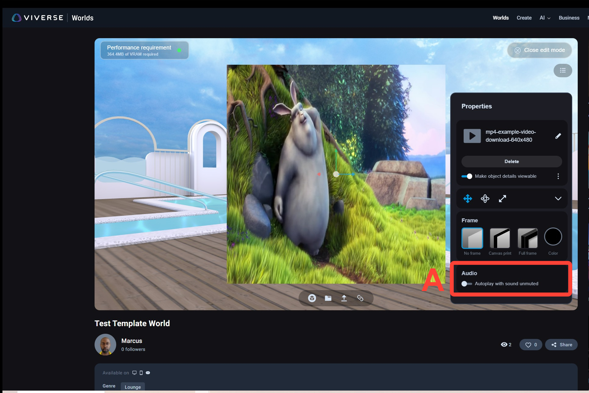

# Publishing to VIVERSE

* Prequisites: You must have installed the VIVERSE CLI Module (link back to previous page if they haven't)
* Description of the manifest.json
* Publishing to VIVERSE
  * Publishing from the command line
  * What are the success messages when publishing has completed
  * Finding your published world on VIVERSE.com & adjusting world settings
* Troubleshooting
  * Using relative vs. absolute paths

***

## Pre-Requisites

* VIVERSE CLI module must be installed. Instructions can be found [here](installing-the-viverse-cli-module.md).


## Manifest.json


**Important:** When you publish content, the CLI automatically creates a `.viverse-cli/manifest.json` file in your target path. This file contains essential metadata about your content, including its deployment ID and URL.

If you need to update the same content later (especially in CI/CD pipelines), **make sure to preserve this folder**. The manifest file is critical for tracking content versions and ensuring proper updates rather than creating new content each time.


**manifest.json**

```json
{
  "name": "my-three-project",
  "description": "Test Viverse-cli project",
  "id": "##########",
  "accountId": "########-####-####-####-############",
  "deploymentUrl": "https://create.viverse.com/SEzTaQg"
}
```


## Publishing to VIVERSE



### Login to VIVERSE platform

A. Open a command prompt and type: **viverse-cli auth login**, then click Enter.

B. Enter VIVERSE **email** and **password**.

C. Confirm login was successful.

<figure><figcaption></figcaption></figure>



### Publish content

A. To publish content to VIVERSE type the following command with the project path to the project's production build folder: **viverse-cli publish \<path>**, then click Enter.

B. Enter an **Application title** and **Application description**.

C. Confirm the content was published successfully.

<div align="center"><figure><figcaption></figcaption></figure></div>



### Re-publishing

A. To re-publish content to VIVERSE when a project is already published, type the following command with the project path to the project's production build folder: **viverse-cli publish \<path>**, then click Enter.

B. Confirm the manifest file is updated.

C. Confirm the content was published successfully.


<figure><figcaption></figcaption></figure>





## Troubleshooting





## Publishing content to VIVERSE







###



### Publish content

A. To publish content to VIVERSE type the following command with the project path to the project's production build folder, which is under the dist/ folder: **viverse-cli publish \<path>**, then click Enter.

B. Confirm the content was published successfully.

<figure><figcaption></figcaption></figure>



### Test project

A. Confirm project was published successfully and working properly in VIVERSE by visiting the **URL**.

<figure><figcaption></figcaption></figure>




## Checking VIVERSE authentication status



### Check authentication status

A. Type the following command inside a command prompt: **viverse-cli auth status**, then click Enter.

B. Confirm the status authentication status.

<figure><figcaption></figcaption></figure>




## Viewing VIVERSE application list



### View list of applications published under the current account logged into VIVERSE

A. Type the following command inside command prompt: **viverse-cli app list**, the click Enter.

B. Confirm the list of published applications is printed.

<figure><figcaption></figcaption></figure>




## Logging out of VIVERSE



### Logout of VIVERSE platform

A. Type the following command inside command prompt: **viverse-cli auth logout**, then click Enter.

B. Confirm the logout was successful.

<figure><figcaption></figcaption></figure>


