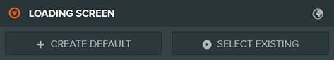

# Custom Loading Screens

### Default Loading Experience

Because web games and assets take time to transfer over the internet and load onto the player's device, user experience during loading is important. If shown a blank or broken-looking screen during this time, users may leave early, and never get to try the full experience.

While creators should [optimize load time as much as possible](https://developer.playcanvas.com/user-manual/optimization/load-time/), it's also somewhat inevitable. As such, VIVERSE provides a default loading experience during the asset pre-load phase:

<figure><figcaption></figcaption></figure>

### Custom Loading Screens

However, some creators may wish to make custom loading screens more in line with the aesthetics of their game or app. This can help sell an overall sense of quality and immediately set the tone for users.

VIVERSE creators can make full use of [PlayCanvas' built-in loading screen feature](https://developer.playcanvas.com/user-manual/editor/launch-page/loading-screen/). Just navigate to PlayCanvas Project Settings > Loading Screen and click "Create Default."

<figure><figcaption></figcaption></figure>

If you have the [VIVERSE-PlayCanvas browser extension](https://docs.viverse.com/playcanvas-sdk/playcanvas-extension-setup#playcanvas-extension-download) installed, this will inject a VIVERSE logo into the loading screen template, **which is required for all projects**.

Other than that, `loading-screen.js` is yours to customize. Add your logo, a tagline in a custom font, or a cool background image, grounding your users in your experience immediately.&#x20;

<figure><figcaption>
The custom loading screen from <em>In Tirol</em>.
</figcaption></figure>

### Control Which Assets Download During the Loading Screen

All assets with the "Preload" box checked in asset settings will be downloaded during the loading screen phase. Limiting pre-loaded assets can help get users to your game view faster, which will result in fewer overall "bounces" from your game (meaning users who quit the game during loading). So only check "Preload" if the asset is immediately needed - otherwise it will stream in behind the scenes as needed, [per PlayCanvas' docs](https://developer.playcanvas.com/user-manual/assets/preloading-and-streaming/).

<figure><figcaption></figcaption></figure>

