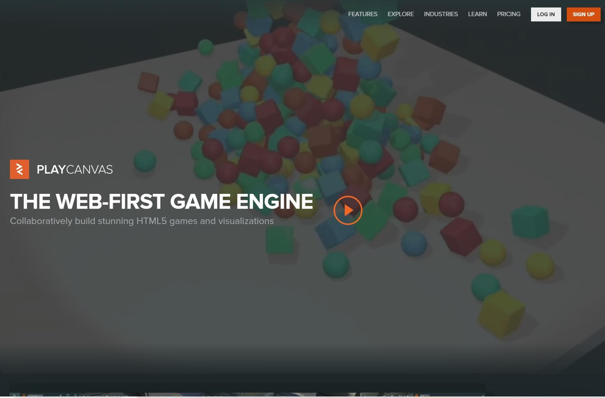
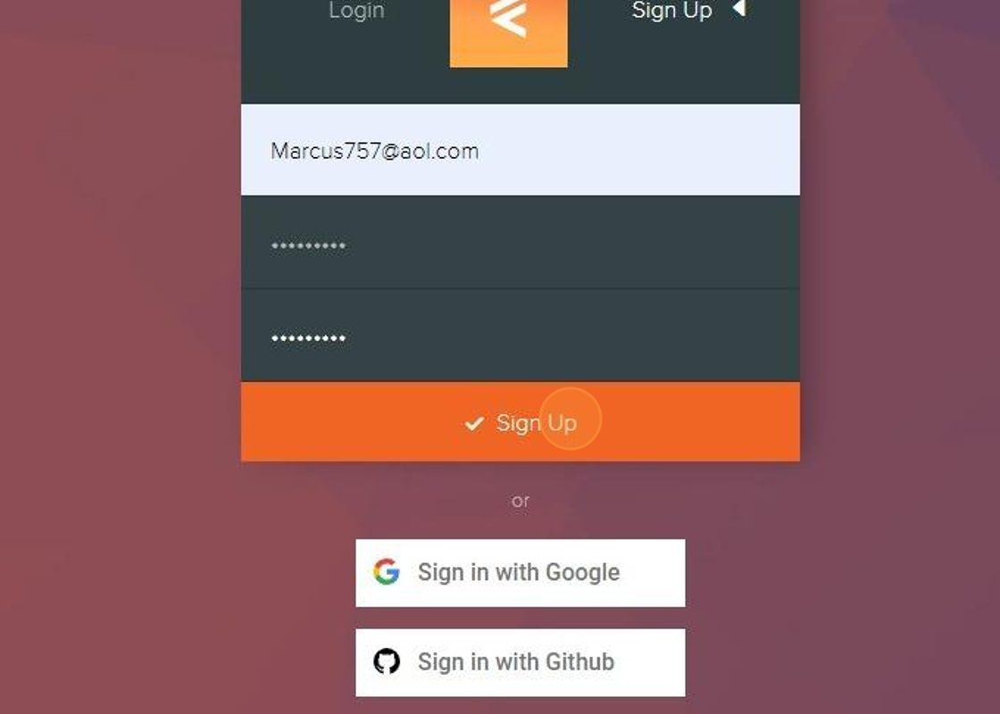
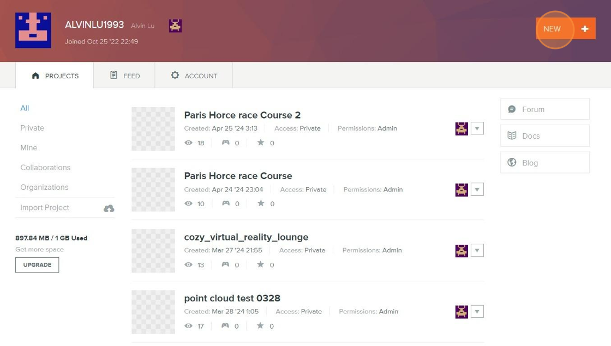
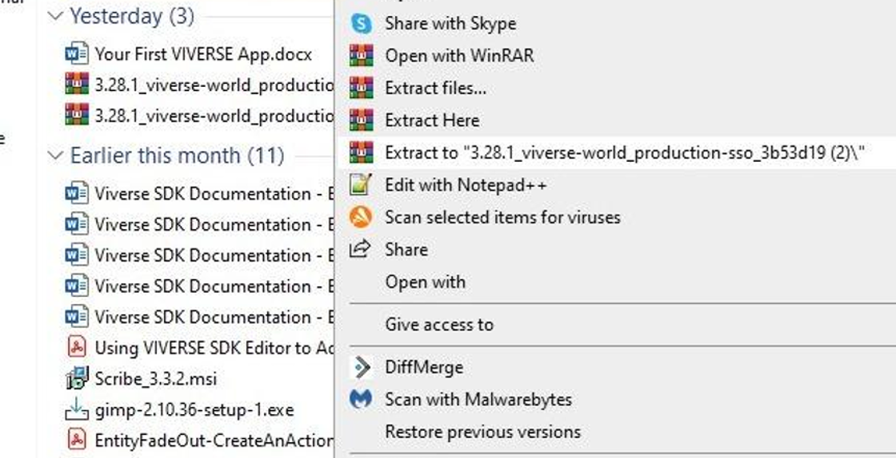
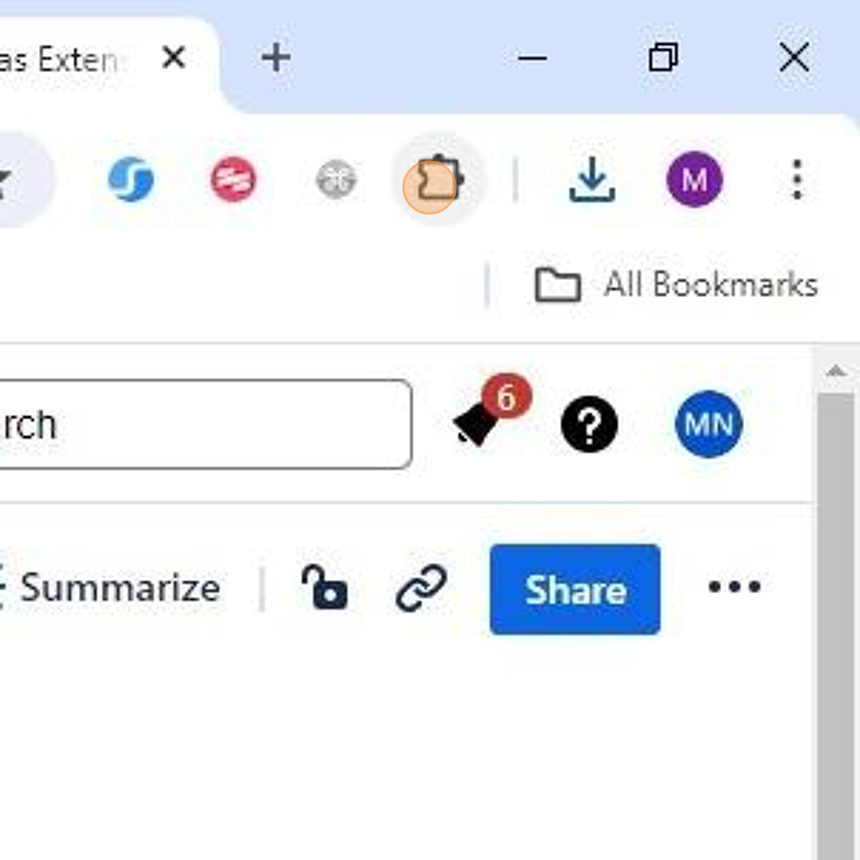
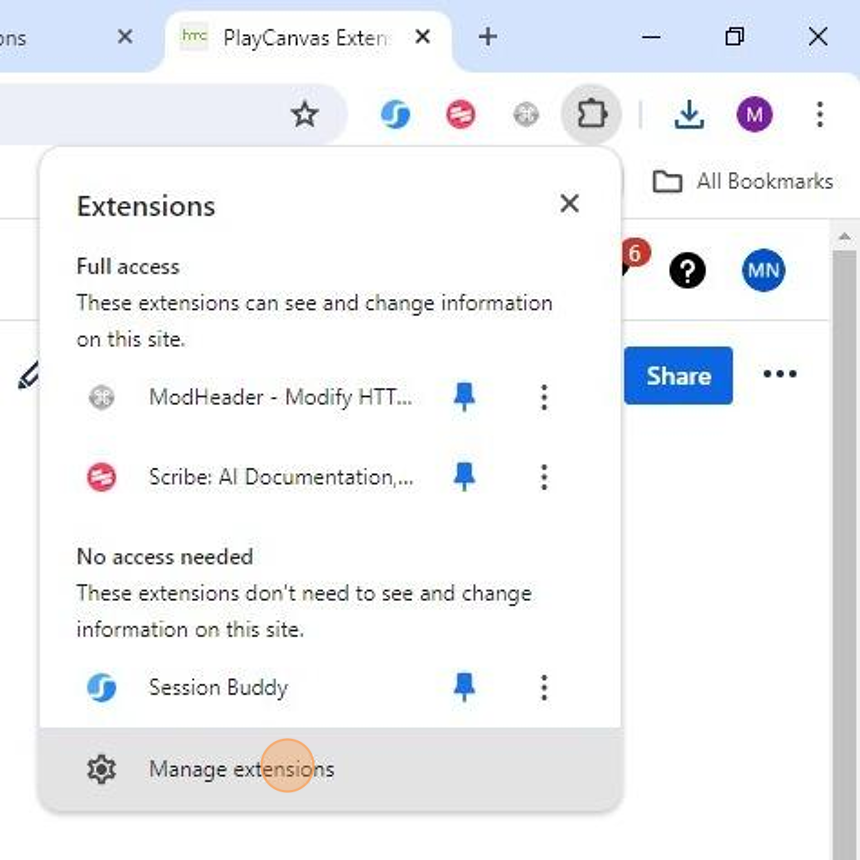
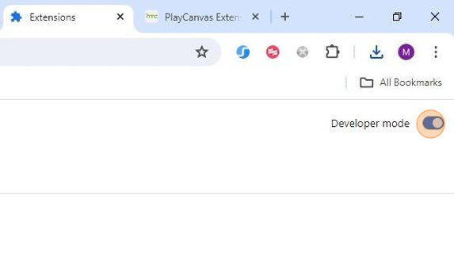
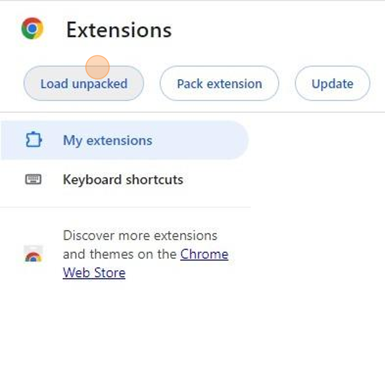
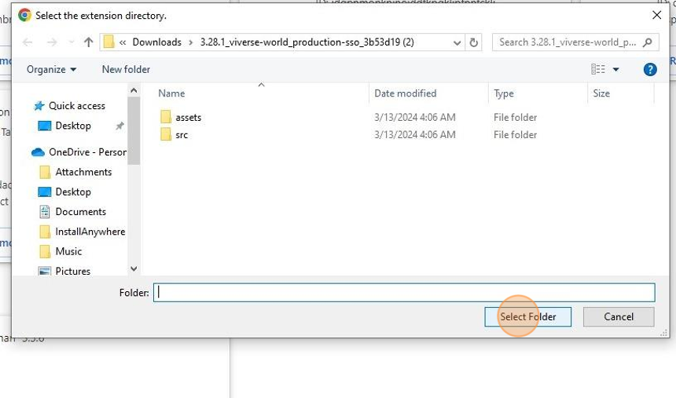
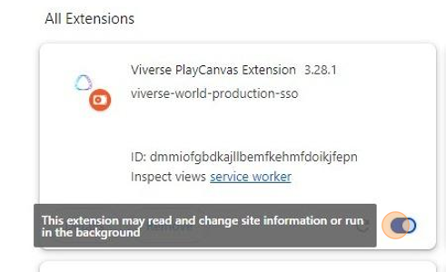

# PlayCanvas Extension Setup

***

## Pre-Requisites

* A VIVERSE Account
* Google Chrome

## Create Your PlayCanvas Account

PlayCanvas is an open-source game engine that we have implemented in the frontend of VIVERSE. Creators will use the PlayCanvas Editor to publish fully-functional worlds to VIVERSE. PlayCanvas has options for both **free** and **paid** accounts. Paid accounts allow for extra storage and private projects.


Be sure to use the same email address to create your PlayCanvas account as you used for your VIVERSE account.




#### Begin PlayCanvas Account Setup

Navigate to [PlayCanvas.com](https://playcanvas.com/) and click the Sign Up button to begin account creation.




#### Sign Up For A PlayCanvas Account

Fill out the Playcanvas Account form with the same email address that was used to create the VIVERSE Account to ensure integration, then click Sign Up.




#### Create A New Project

After logging into Playcanvas, click the **New** button to create a new Playcanvas project.




## Install The PlayCanvas Extension

_This guide is a walkthrough for adding Playcanvas Extension to the Chrome browser and will allow creation and publishing Scene of Playcanvas projects to VIVERSE._



#### Download The Extension

[Download](playcanvas-extension-setup.md#download-the-latest-extension-version) the latest version of the Playcanvas Extension.



#### Unzip The Downloaded File




#### Open Your Chrome Extensions

Click "**Extensions**" in the browser toolbar.




#### Open The Extension Editor

Click "**Manage extensions**" in the menu.




#### Enable Developer Mode

Enable **Developer mode** on the Extensions tab.




#### Load The Extension

Click **Load unpacked** on the Extensions tab.




#### Select The Unzipped Extension

Navigate to the folder where the extension was extracted. Click **Select Folder**.




#### Verify The Extension Set Up

Confirm the extension is enabled on the Extensions tab.




## "Factory Reset" the VIVERSE Extension

At times, issues in the installation process can produce persistent bugs that are only fixed by fully resetting the VIVERSE extension.



#### Sign in & out of VIVERSE

Sign out of your account on viverse.com and then sign back in. **MAKE SURE** you are using the same email account as the one associated with your PlayCanvas account.



#### Delete VIVERSE entities from PlayCanvas project

Go back to your PlayCanvas project and delete:\
a. The Extension Entity from your scene hierarchy\
b. The @viverse folder from your project assets\
c. The extension-image folder from your project assets\
d. The extension-script folder from your project assets



#### Clear storage

Open the [developer tools](https://elfsight.com/blog/how-to-work-with-developer-console/) in Google Chrome, go to "Application", select "Storage" in the left hand toolbar and click the "Delete Site Data" button.



#### Refresh

Refresh your PlayCanvas project with the VIVERSE extension enabled



#### Sign in to PlayCanvas

Sign in to PlayCanvas when prompted. **MAKE SURE** you are using the same email account as the one associated with your VIVERSE account.



#### Sign in to VIVERSE sso

Sign in to VIVERSE from within your PlayCanvas project using the VIVERSE Scene Settings



## Video Walkthrough



## PlayCanvas Extension Download

#### [Download the latest extension version](https://htc-directus-dev-usw2-pc-ui-ext.s3.amazonaws.com/viverse-world/production-sso/3.58/3.58.2_viverse-world_production-sso_248f45e.zip)

#### Change Log

<table><thead><tr><th width="160">Release Date</th><th width="125">Version</th><th>Release Notes</th></tr></thead><tbody><tr><td>8/15/2025</td><td>3.57.1</td><td><ul><li>Adds support for publishing PlayCanvas projects that utilize multiple scenes, as well as an <code>IWorldNavigationService</code> to the Create SDK API to allow for programmatic scene switching.</li><li>Adds the ability to set nearClip and farClip camera configuration: </li></ul></td></tr><tr><td>8/5/2025</td><td>3.55.0</td><td><ul><li>Quest Celebration Event Bug: Fix the issue where quests with celebrations configured are not triggered as completed after the user finishes the task.</li><li>Sync the Trigger Fix: Fix the issue where "Sync the trigger" in Trigger and Action is not working.</li></ul></td></tr><tr><td>7/18/2025</td><td>3.52.0</td><td><ul><li>Flying in VR: switch to Smooth Locomotion using the XRService, then in any World where flying is enabled in World Settings, press down/click the Smooth Locomotion joystick to enter flight mode. Once flying, pressing forward on the joystick will fly forward along the VR camera's forward axis (i.e. wherever you're looking), and vice versa backwards.</li><li>The Enter VR button has been made more reliable.</li></ul></td></tr><tr><td>7/7/2025</td><td>3.51.0</td><td><ul><li>
Fixes most cases where the no-code extension was losing being lost when the PlayCanvas editor disconnects &#x26; reconnects to necessary backend services.
<ul><li>Also now displays a warning modal if the extension does enter a disconnected state.</li></ul></li><li><code>XRService.start()</code>  now accepts a callback so code execution can be paused prior to successful VR entry.</li></ul></td></tr><tr><td>6/23/2025</td><td>3.50.1</td><td><ul><li>
<code>XRService</code>  now includes new locomotion options you can set per controller: smooth, teleport, and none
<ul><li>As a minor optimization, we now hide the VR cursor when its <code>inputSource</code> is lost</li></ul></li><li>1st- and 3rd-person camera FOVs now settable in PlayCanvas: </li></ul></td></tr><tr><td>5/23/2025</td><td>3.49.0</td><td><ul><li>Bug fix: prevent duplicate injection of custom loading screen scripts during publishing.</li><li>Re-enables debugging in the browser by adding publishing modes: <code>Debug</code> mode is designed to assist in development and debugging processes, whereas <code>Standard</code> mode delivers an optimized, minified build intended for distribution.  </li></ul></td></tr><tr><td>4/29/2025</td><td>3.48.0</td><td>
Add SDK support to functions
<ul><li><a href="https://viveportsoftware.github.io/pc-lib/interfaces/IXrService.html">IXrService</a></li></ul>
-Methods: start

-Methods: end

<ul><li>Re-enable debugging in the browser</li></ul>
-Align game_script.js behavior with esm.js to allow setting breakpoints

<ul><li>Enable custom loading screen</li></ul>

</td></tr><tr><td>4/16/2025</td><td>3.46.1</td><td><ul><li>Add 'Enable Flying' option in VIVERSE scene settings</li><li>Fixed turnToward method</li></ul></td></tr><tr><td>4/9/2025</td><td>3.45.3</td><td>
Add SDK support to functions
<ul><li><a href="https://viveportsoftware.github.io/pc-lib/interfaces/IQuest.html">IQuest</a></li></ul>
-Methods: addCheckTask

-Methods: addProgressBarTask

-Methods: fire

-Methods: getTaskById

-Methods: off

-Methods: on

-Methods: reset

-Methods: start
<ul><li><a href="https://viveportsoftware.github.io/pc-lib/interfaces/IQuestService.html">IQuestService</a></li></ul>
-Methods: addQuest

-Methods: fire

-Methods: getQuestById

-Methods: getQuestByName

-Methods: off

-Methods: on

-Methods: resetAllQuests
<ul><li><a href="https://viveportsoftware.github.io/pc-lib/interfaces/ITask.html">ITask</a></li></ul>
-Methods: fire

-Methods: off

-Methods: on
<ul><li><a href="https://viveportsoftware.github.io/pc-lib/interfaces/IProgressBarTask.html">IProgressBarTask</a></li></ul>
-Methods: addProgress

-Methods: fire

-Methods: off

-Methods: on
</td></tr><tr><td>3/27/2025</td><td>3.45.0</td><td>
Add SDK support to functions
<ul><li><a href="https://viveportsoftware.github.io/pc-lib/interfaces/ILocalPlayer.html">ILocalPlayer</a></li></ul>
-Methods: resetToViverseAvatar
<ul><li><a href="https://viveportsoftware.github.io/pc-lib/interfaces/IPlayer.html">IPlayer</a></li></ul>
-Properties: avatar

-Properties: network

-Properties: nametag

-Properties: profile
<ul><li><a href="https://viveportsoftware.github.io/pc-lib/interfaces/IPlayerService.html">IPlayerService</a></li></ul>
-Properties: localPlayer

-Properties: remotePlayers

-Properties: playerCount  Add enable/disable toggle of microphone and microphone permission function in “Player Config > Disable Microphone”
</td></tr><tr><td>3/12/2025</td><td>3.44.12</td><td>
Add SDK support to functions
<ul><li><a href="https://viveportsoftware.github.io/pc-lib/interfaces/IXrController.html">IXrController</a></li></ul>
-Properties: handedness

-Properties: inputSource

-Properties: modelEntity

-Methods: resetModelAsset

-Methods: setModelAsset
<ul><li><a href="https://viveportsoftware.github.io/pc-lib/interfaces/IXrControllerEvents.html">IXrControllerEvents</a></li></ul>
-Properties: add

-Properties: remove
<ul><li><a href="https://viveportsoftware.github.io/pc-lib/interfaces/IXrService.html">IXrService</a></li></ul>
-Properties: controllers
<ul><li><a href="https://viveportsoftware.github.io/pc-lib/interfaces/IXrServiceEvents.html">IXrServiceEvents</a></li></ul>
-Properties: controller:addInput

-Properties: controller:removeInput
<ul><li><a href="https://viveportsoftware.github.io/pc-lib/classes/CameraService.html">CameraService</a></li></ul>
-Properties: canRotate

-Properties: canZoom

-ILocalPlayer

-Methods: scaleAvatar
</td></tr><tr><td>2/26/2025</td><td>3.44.7</td><td><ul><li>Adding switchPov methods to change 1st &#x26; 3rd person POV through code</li></ul></td></tr><tr><td>2/6/2025</td><td>3.43.1</td><td><ul><li>Add 3 features in Trigger &#x26; Action - EntityAssetUnload, EntityAssetReload, EntityAssetDestroy</li></ul></td></tr><tr><td>1/7/2025</td><td>3.40.7</td><td><ul><li>Add post effects settings</li><li>Add scene ownership check on publish tab</li></ul></td></tr><tr><td>12/3/2024</td><td>3.38.0</td><td><ul><li>Handle response err message from PlayCanvas server job api</li><li>Fix service worker error</li></ul></td></tr><tr><td>12/27/2024</td><td>3.36.4</td><td><ul><li>Error handling when publishing the scene</li></ul></td></tr><tr><td>10/21/2024</td><td>3.35.19</td><td><ul><li>Support latest Chrome version</li></ul></td></tr></tbody></table>

We created a PlayCanvas [sample project](https://playcanvas.com/editor/scene/1984713) based on Playcanvas extension 3.40.7, which contains several demos that you can try on your own.

## Next Steps

Now that you have successfully set up your PlayCanvas account and installed the VIVERSE PlayCanvas extension, see the first steps of creating a project [here](tutorials/create-your-first-playcanvas-project.md).
