# Toolkit Setup

***

### Introduction

PlayCanvas is an open-source game engine designed to advance the development of 3D web games, interactive content and rich multimedia. Unlike similar WebGL engines like Three.js or Babylon, PlayCanvas comes with sophisticated in-browser Editor (inspired by early Unity 2.x - 3.x), which provides its users with a rich set of tools — allowing to assemble scenes from imported assets, setup real-time and baked lighting, write custom scripts, create animation graphs, and much much more.

To make creator experience even smoother, VIVERSE has developed a special Extension for Chrome browsers which extends PlayCanvas Editor functionality with additional set of no-code tools and publishing options. It provides common building blocks like Triggers, Actions and Quests, enables Player locomotion and Avatar system in your project, and allows one-click testing and publishing right from the Editor.

Below is a useful set of tutorials to help you get started with VIVERSE PlayCanvas Extension. We assume you're already familiar with PlayCanvas Editor itself and have PlayCanvas account. If not, please feel free to explore [PlayCanvas User Manual](https://developer.playcanvas.com/user-manual/) first!

### Install PlayCanvas Extension


{% column width="66.66666666666666%" %}


#### Get the latest Extension from VIVERSE

* [Download](playcanvas-toolkit-changelog.md) the latest version of Playcanvas Extension
* Unzip downloaded file on your computer



#### Navigate to Chrome Extensions manager

* Click Extensions icon in Chrome toolbar and open the Extensions Popup
* Click Manage Extensions at the bottom and open the Extensions Manager in a new tab



#### Install the Extension

* Enable Developer Mode at the top right corner
* Click Load Unpacked and select the folder with unpacked Extension you downloaded previously
* Verify the Extension is now present in Extensions Manager tab




{% column width="33.33333333333334%" %}
<figure><figcaption></figcaption></figure>

<figure><figcaption></figcaption></figure>

<figure><figcaption></figcaption></figure>

<figure><figcaption></figcaption></figure>

<figure><figcaption></figcaption></figure>




### Create and publish your first project


Before proceeding any further, we assume you're familiar with the basics of PlayCanvas Editor. If you're looking for a comprehensive introduction to it — please refer to a dedicated [PlayCanvas Editor Manual](https://developer.playcanvas.com/user-manual/editor/) first!



{% column width="66.66666666666666%" %}


#### Initialize your new project

* Create a new PlayCanvas project or open an already existing one
* Make sure VIVERSE Extension is properly initialized — you should see **ExtensionEntity** in your scene hierarchy and `@viverse` folder added to your project. Refresh the page if it's not the case
* Login into VIVERSE via dedicated button in the left toolbar. Once logged in, you should see **VIVERSE Scene Settings** button there



#### Setup 3D environment

* First, delete default **Camera** in Scene Hierarchy. The Extension will provide its own Camera system that will be added to your Scene at runtime
* Import **Ammo** physics library and add a Floor plane with **Collision** component and static **Rigidbody**. This is crucial because VIVERSE Player system relies on built-in PlayCanvas physics engine for moving around. Without a floor, your player will be simply falling through
* Add additional geometry and lights if want!



#### Create a Spawn Point

* In order for a Player to appear in your world, it should be spawned somewhere first. VIVERSE Extension provides a convenient way to control that!
* Simply create a new empty **Entity** in your scene and add `spawn-point` tag to it
* Make sure it's positioned at the floor level or above. Feel free to rotate it to change the initial orientation of your Player



#### Preview your project

* Once you have a walkable floor and a spawn point, it's time to test your project live!
* Go to the **Publish / Download** menu and open the **Builds** popup window. In that window, click **Publish to Viverse** button and wait until your project is successfully uploaded
* Once it's uploaded and ready, the **Preview** button should appear. Clicking it will open your project in a new tab, in preview mode. This preview URL is public and you can share it with your friends and colleagues to test the current version of your work
* Return back to PlayCanvas Editor and modify your project as you see fit. Keep publishing and previewing to see your most recent changes live in VIVERSE environment



#### Final: Create a VIVERSE World for your project

* After confirming everything is working correctly in preview mode, you can publish your project to production environment!
* In preview mode, click "**Create World**" button, give your World a name and click the "**Create**" button to publish it to the VIVERSE Create platform
* The resulting URL is the public link to your World. You can return back to your project any time and republish an updated version as you see fit
* Feel free to configure your [World Settings](../publishing-with-your-viverse-account.md#world-settings) as well




{% column width="33.33333333333334%" %}
<figure>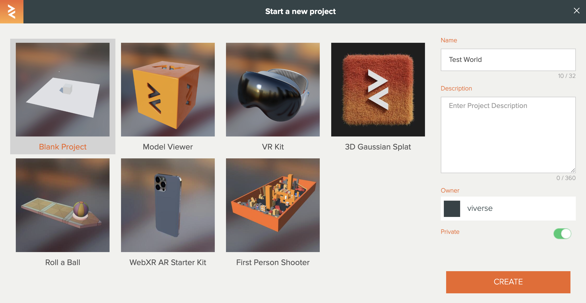<figcaption></figcaption></figure>

<figure>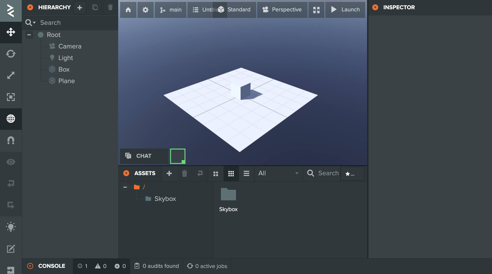<figcaption></figcaption></figure>

<figure>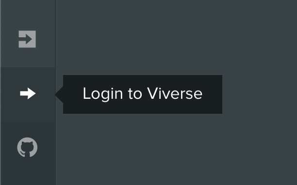<figcaption></figcaption></figure> <figure>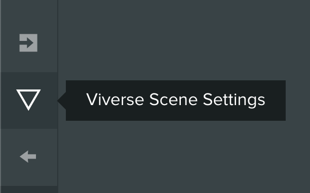<figcaption></figcaption></figure>

<figure>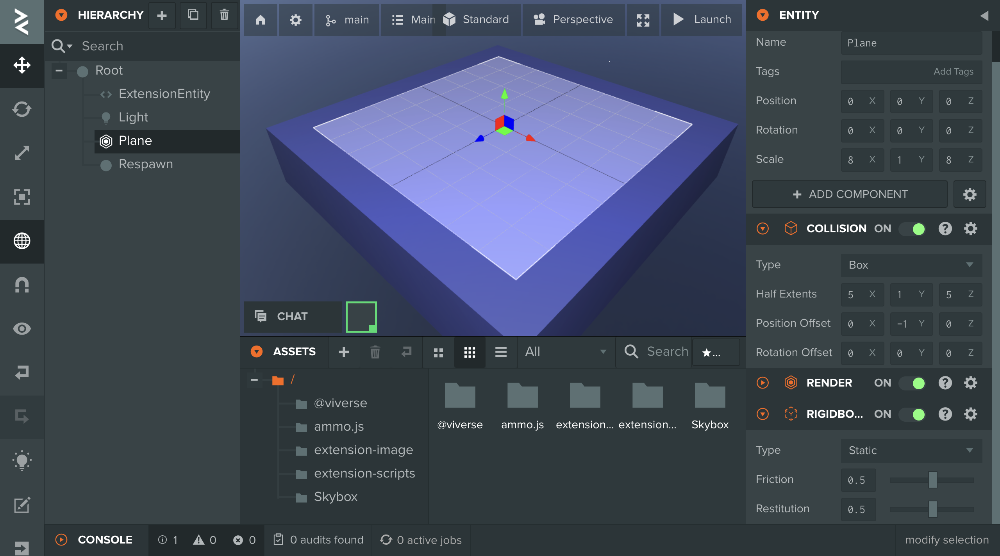<figcaption></figcaption></figure>

<figure>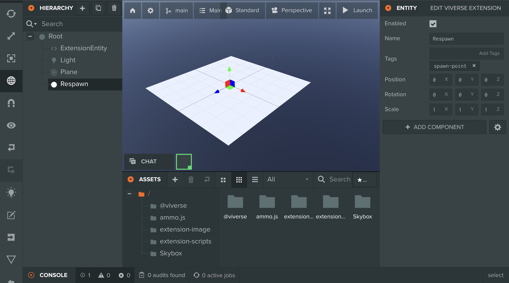<figcaption></figcaption></figure>

<figure>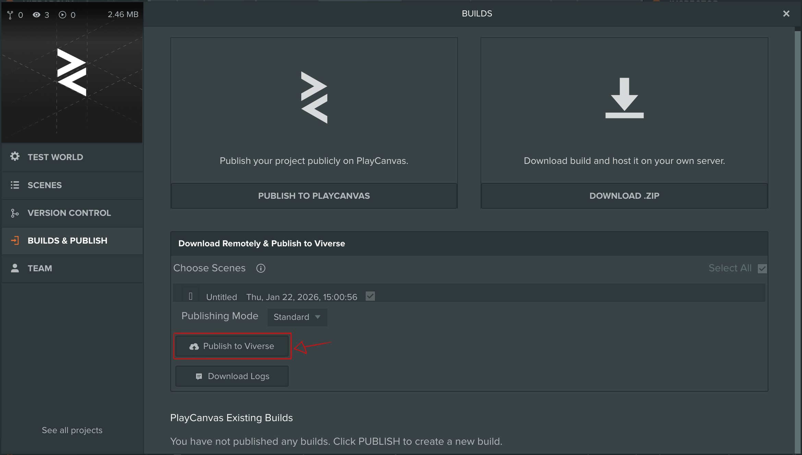<figcaption></figcaption></figure>

<figure>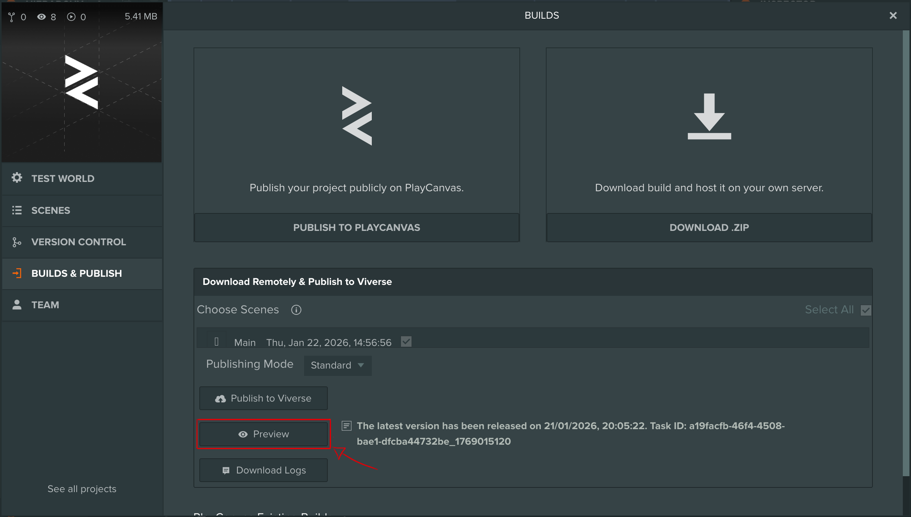<figcaption></figcaption></figure>

<figure>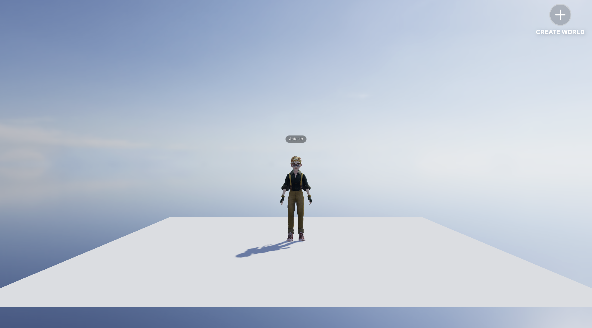<figcaption></figcaption></figure>

<figure>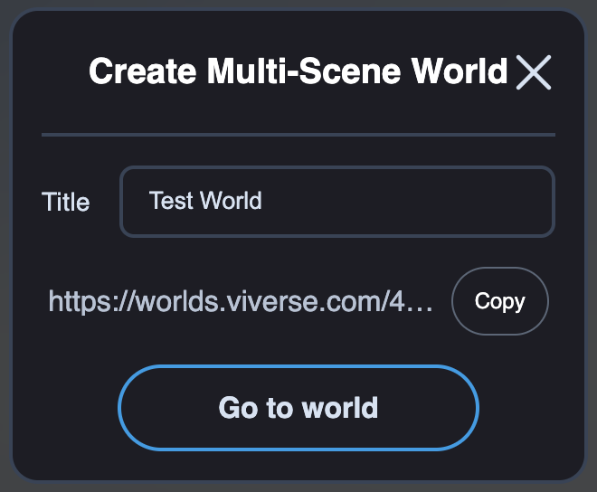<figcaption></figcaption></figure>

<figure>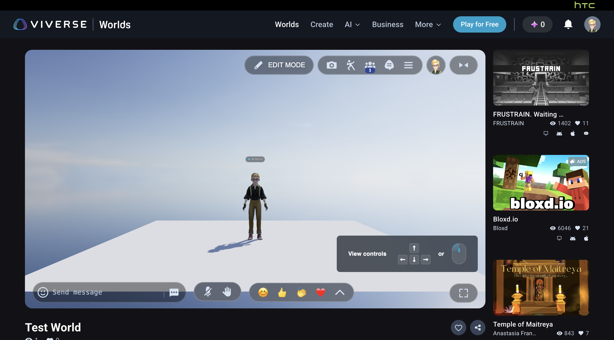<figcaption></figcaption></figure>





### "Factory Reset" PlayCanvas Extension

> Sometimes issues in the installation process can produce persistent bugs that are only fixed by fully resetting the Extension. If you're experiencing these bugs please follow the steps below



#### Sign in and out of VIVERSE

Sign out of your account on viverse.com and then sign back in. **MAKE SURE** you are using the same email account as the one associated with your PlayCanvas account



#### Delete VIVERSE entities from PlayCanvas project

Go back to your PlayCanvas project and delete:

* The `Extension` Entity from your scene hierarchy
* The `@viverse` folder from your project assets
* The `extension-image` folder from your project assets
* The `extension-script` folder from your project assets



#### Clear Application Storage

Open the [Developer Tools](https://elfsight.com/blog/how-to-work-with-developer-console/) in your Chrome brower, go to "Application", select "Storage" in the left hand toolbar and click the "Delete Site Data" button



#### Refresh the page

Refresh your PlayCanvas project page with the VIVERSE extension enabled



#### Sign in back to PlayCanvas

Sign in to PlayCanvas when prompted. **MAKE SURE** you are using the same email account as the one associated with your VIVERSE account



#### Sign in back to VIVERSE

Sign in to VIVERSE from within your PlayCanvas project using the VIVERSE Scene Settings


