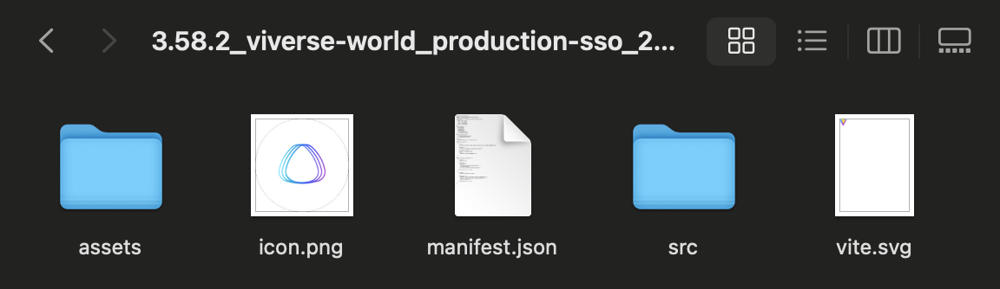
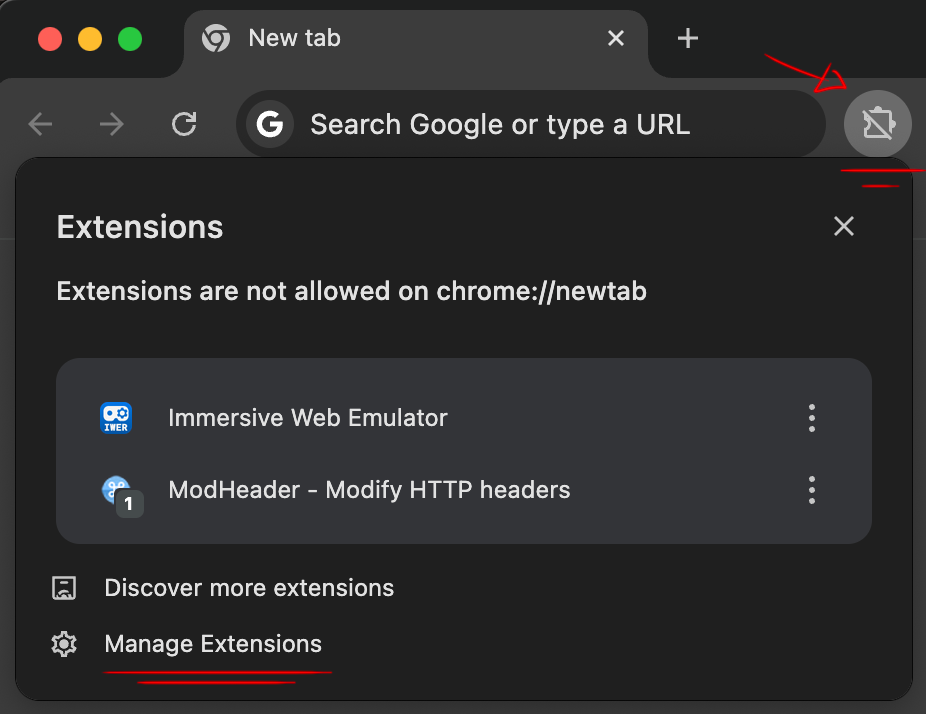
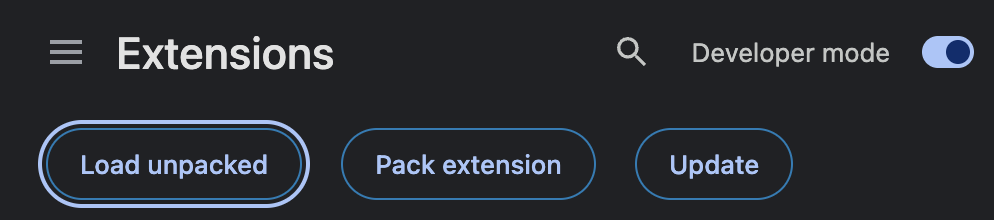
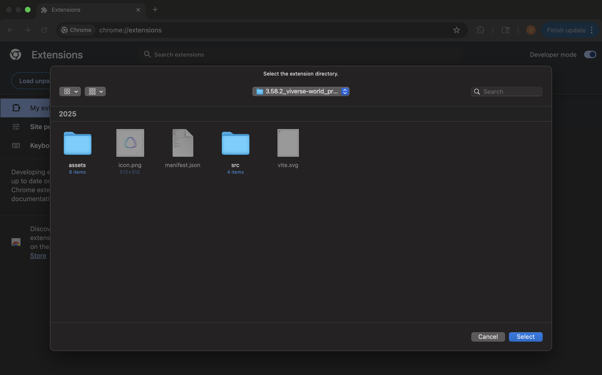
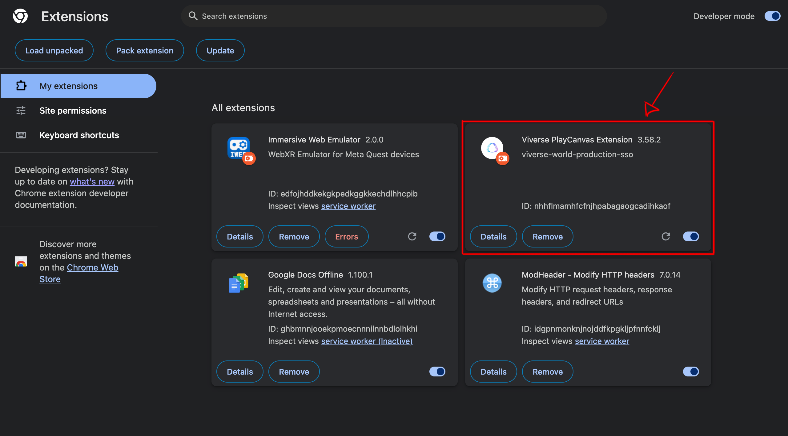

# Toolkit Setup

***


This documentation covers building with v4 and newer of the VIVERSE PlayCanvas Toolkit. [See here](toolkit-setup-legacy-v3.md) for legacy documentation on v3 setup.


## Introduction

[PlayCanvas](https://playcanvas.com/) is an open-source game engine designed to advance the development of 3D web games, interactive content and rich multimedia. Unlike similar WebGL engines like Three.js or Babylon, PlayCanvas comes with sophisticated in-browser Editor (inspired by early [Unity 2.x - 3.x](https://www.elmundotech.com/2010/09/27/unity-3-game-dev-platform-available-now/)), which provides its users with a rich set of tools — allowing to assemble scenes from imported assets, setup real-time and baked lighting, write custom scripts, create animation graphs, and much much more.

To make creator's experience even richer, VIVERSE has developed a special Toolkit, which consists of two parts complementing each other — the Extension and the Framework:

* **The Extension** lives in your Chrome browser, and its main goal is to add extra functionality to vanilla PlayCanvas Editor, not achievable otherwise — like initializing your project, creating new VIVERSE projects, setting up Local Player, Quests and Post Effects, and of course providing convenient ways to Publish to VIVERSE!
* **The Framework** is a collection of scripts and assets that the Extension adds to your project during initialization, under the `.viverse` folder. It provides important runtime systems for Avatars, Player Locomotion, Networking and so forth, and common building blocks like Triggers and Actions, that you can use to create custom no-code logic in your Worlds


Please see [the full collection of documents](building-with-playcanvas-toolkit/) to help you get started with the Toolkit. We assume you're already familiar with PlayCanvas Editor itself and have PlayCanvas account. If not, please feel free to explore [PlayCanvas User Manual](https://developer.playcanvas.com/user-manual/) first!


## Install PlayCanvas Extension


{% column width="66.66666666666666%" %}


### Get the latest Extension from VIVERSE

* [Download](playcanvas-toolkit-changelog.md) the latest version of Playcanvas Extension
* Unzip downloaded file on your computer



### Navigate to Extensions manager

* Click **Extensions** icon in Chrome toolbar and open the Extensions Popup
* Click **Manage Extensions** at the bottom and open the Extensions Manager in a new tab



### Install the Extension

* Enable **Developer Mode** at the top right corner
* Click **Load Unpacked** and select the folder with unpacked Extension you downloaded previously
* Verify the Extension is now present in Extensions Manager tab




{% column width="33.33333333333334%" %}
<figure><figcaption></figcaption></figure>

<figure><figcaption></figcaption></figure>

<figure><figcaption></figcaption></figure>

<figure><figcaption></figcaption></figure>

<figure><figcaption></figcaption></figure>




## Create, Test, and Publish your first project


Before proceeding any further, we assume you're familiar with the basics of PlayCanvas Editor. If you're looking for a comprehensive introduction to it — please refer to a dedicated [PlayCanvas Editor Manual](https://developer.playcanvas.com/user-manual/editor/) first!



{% column width="66.66666666666666%" %}


### Enter a PlayCanvas Project

* Enter the editor of an existing PlayCanvas project or create a new one




### Enable the extension

* Click **Extensions** icon in Chrome toolbar and open the Extensions Popup
* Select the **VIVERSE PlayCanvas Toolkit** button




### Sign In to VIVERSE

* Select the **Log In to VIVERSE** button that is now in the left-hand toolbar
* **Complete the VIVERSE SSO process** to sign in to your account



### Create VIVERSE Application

* Select the **VIVERSE PlayCanvas Toolkit Settings** button in your left-hand toolbar
* Select **Create New World** and wait for the toolkit to upload all scripts to your project.




### Test Scene Locally

* After creating an application, you will notice that a number of files and entities have been added to your project, including a template for VIVERSE avatars.
* Make sure to **add a collidable object** for the VIVERSE avatar to interact with. This process will **import** **ammo.js**, which is the required default for the VIVERSE toolkit.
* Select **Launch** in the PlayCanvas editor. This will start a local session where you can test all features, including multiplayer audio.




### Export and Upload

* When you are ready to upload, you must first create a new build in PlayCanvas. This can be completed in **Publish and Download** in the left-hand toolbar.
* Once you have generated a build, **download its .zip file**.
* **Navigate to studio.viverse.com** and [complete the upload process](../how-to-publish.md#publishing-apps-with-viverse-studio). PLEASE NOTE, when you created your VIVERSE application, a project was automatically generated in studio.viverse.com under your account. You should use this project when uploading your files.




{% column width="33.33333333333334%" %}
<figure><figcaption></figcaption></figure>

<figure><figcaption></figcaption></figure>

<figure><figcaption></figcaption></figure>

<figure><figcaption></figcaption></figure>

<figure><figcaption></figcaption></figure>

<figure><figcaption></figcaption></figure>

<figure><figcaption></figcaption></figure>

<figure><figcaption></figcaption></figure>

<figure><figcaption></figcaption></figure>

<figure><figcaption></figcaption></figure>

<figure><figcaption></figcaption></figure>




