# Actions

***

## About

Actions is another fundamental part of VIVERSE Framework, allowing creators to devise a wide range of possible "verbs" that their experience can do, without writing a single line of code. The typical examples are:

* Enable / Disable / Toggle Entity or a group of Entities
* Teleport Player to a new location
* Fade In or Fade Out some Entity
* Play Animation / Particle Effect or Sound
* Initialize Quest or advance particular Quest Task
* And so on, and so forth

## Usage

Actions are typically paired with Triggers, where one Trigger can execute multiple Actions in parallel, or one Action can be executed by any Trigger matching its name. It's also possible to execute Actions from your Custom Scripts, opens up even more possibilities for interactivity!

\[...Example]

## Reference

***


{% column width="25%" %}
`Toggle`\
`Entities`


{% column width="50%" %}
Enables or disables a given Entity according to desired `State` parameter. Supported states:

* `Enable` / `Disable` / `Toggle`&#x20;

What Entity is enabled or disabled can be controlled by **Entity Filter** selector:

* `Self` - current Entity (default)
* `Tag` - all Entities with specific Tag
* `TargetEntity` - particular Entity in the Scene


{% column width="24.999999999999986%" %}
<figure>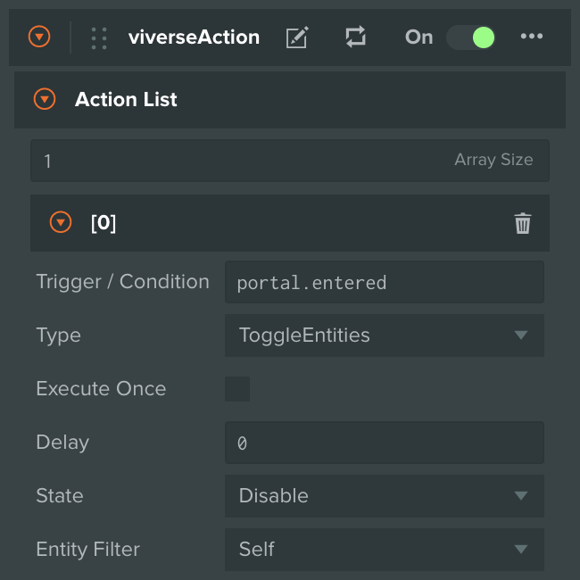<figcaption></figcaption></figure>

<figure>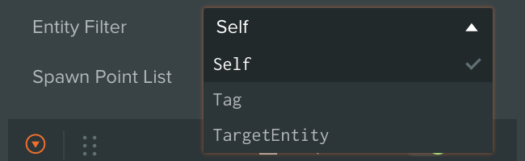<figcaption></figcaption></figure>



***


{% column width="25%" %}
`Toggle`\
`Component`


{% column width="50%" %}
Enables or disables particular Component on a given Entity according to desired `State` parameter. Supported states:

* `Enable` / `Disable` / `Toggle`&#x20;

Supported Components to destroy:

* `Collision` / `Rigidbody`

As with `ToggleEntities` type, **Entity Filter** selector controls what Entity is affected by this Action


{% column width="24.999999999999986%" %}
<figure>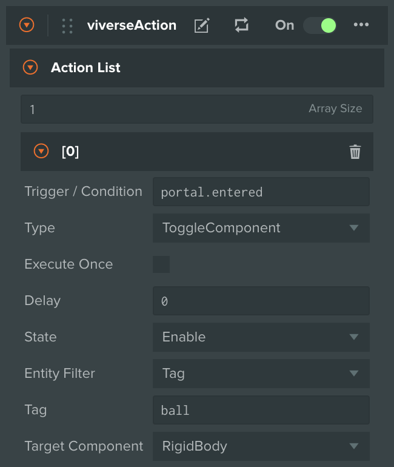<figcaption></figcaption></figure>



***


{% column width="25%" %}
`Destroy`\
`Entities`


{% column width="50%" %}
Destroys a given Entity based on **Entity Filter** selector. See `ToggleEntities` above for available filter options


{% column width="24.999999999999986%" %}
<figure>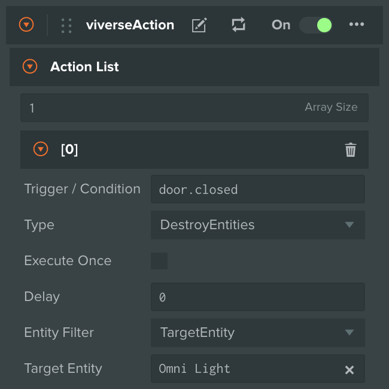<figcaption></figcaption></figure>



***


{% column width="25%" %}
`Fade`\
`Transition`


{% column width="50%" %}
Fades In or Out a given Entity over `Duration` period. Supported Fade Types:

* `FadeIn` / `FadeOut`&#x20;

The Entity should have **Mesh** or **Render Component** attached, with transparent Materials.

As with `ToggleEntities` type, **Entity Filter** selector controls what Entity is affected by this Action


{% column width="24.999999999999986%" %}
<figure>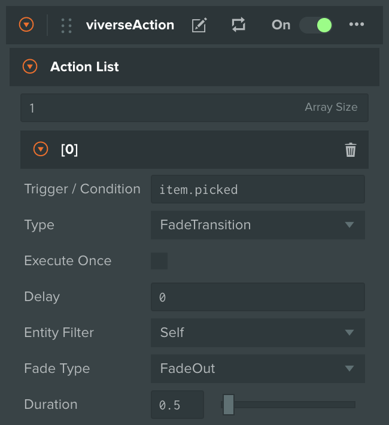<figcaption></figcaption></figure>

<figure>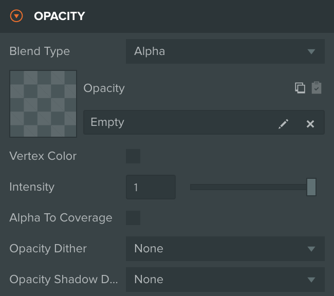<figcaption></figcaption></figure>



***


{% column width="25%" %}
`Push`\
`Notification`


{% column width="50%" %}
Fires a Notification Event with a given `Event Name`. This event can be picked up by another Trigger Entity of type `OnNotificationEvent`. You can use it to send / receive custom Notification Events between different Entities in your Scene


{% column width="24.999999999999986%" %}
<figure>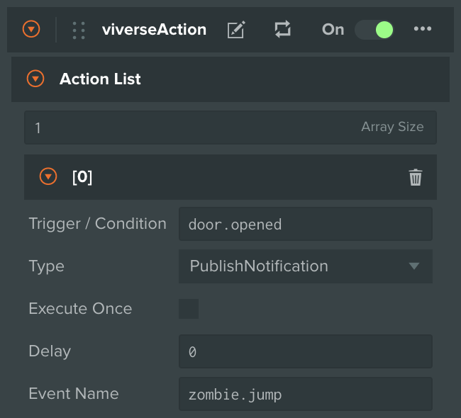<figcaption></figcaption></figure>



***


{% column width="25%" %}
`Teleport`\
`Player`


{% column width="50%" %}
Teleports the Player to a given 3D point in your Scene


{% column width="24.999999999999986%" %}
<figure>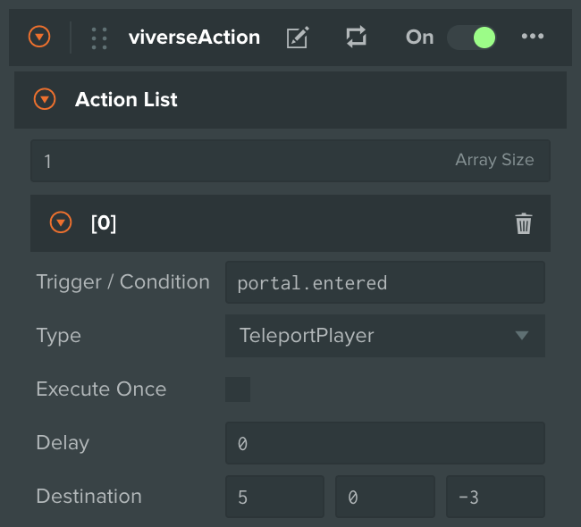<figcaption></figcaption></figure>



***


{% column width="25%" %}
`Push`\
`Entity`


{% column width="50%" %}
Applies a 3D impulse to a given Entity, provided this Entity has **Rigidbody Component** attached. As with `ToggleEntities` type, **Entity Filter** selector controls what Entity is affected by this Action


{% column width="24.999999999999986%" %}
<figure>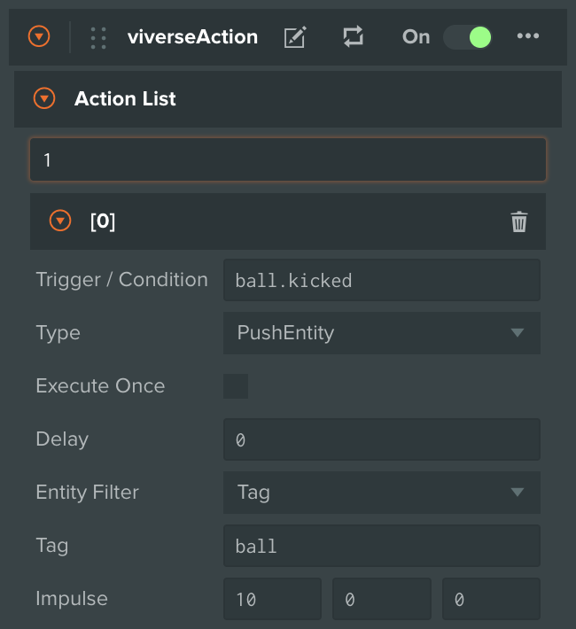<figcaption></figcaption></figure>



***


{% column width="25%" %}
`Sound`\
`Control`


{% column width="50%" %}
Plays or stops a Sound on a given Entity, provided this Entity has **Sound Component** attached. `Audio Name` refers to a **Sound Slot** name. Supported actions:

* `Play` / `Stop`

As with `ToggleEntities` type, **Entity Filter** selector controls what Entity is affected by this Action


{% column width="24.999999999999986%" %}
<figure>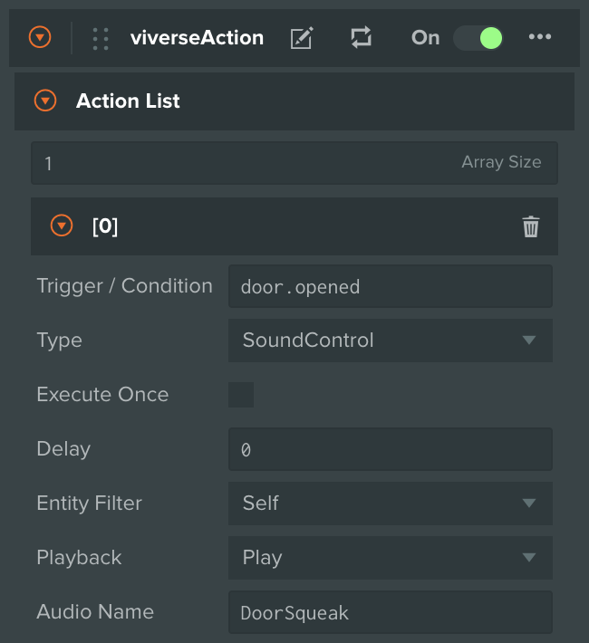<figcaption></figcaption></figure>



***


{% column width="25%" %}
`Animation`\
`Control`


{% column width="50%" %}
Plays an Animation on a given Entity with `Duration` blend time, provided this Entity has **Animation Component** attached. `Animation Name` refers to an **Animation Clip**. As with `ToggleEntities` type, **Entity Filter** selector controls what Entity is affected by this Action


{% column width="24.999999999999986%" %}
<figure>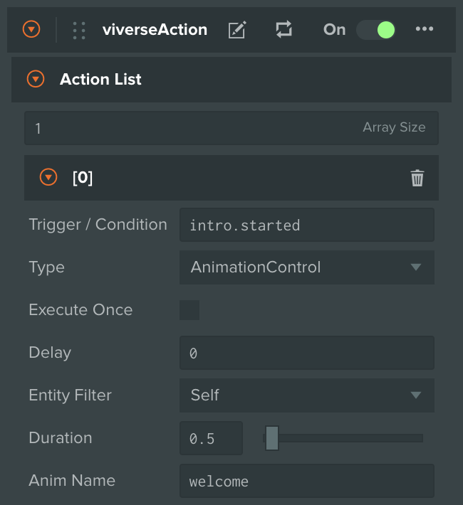<figcaption></figcaption></figure>



***


{% column width="25%" %}
`Particle`\
`System` \
`Control`


{% column width="50%" %}
Plays a Particle Effect on a given Entity, provided this Entity has **Particle System Component** attached. As with `ToggleEntities` type, **Entity Filter** selector controls what Entity is affected by this Action


{% column width="24.999999999999986%" %}
<figure>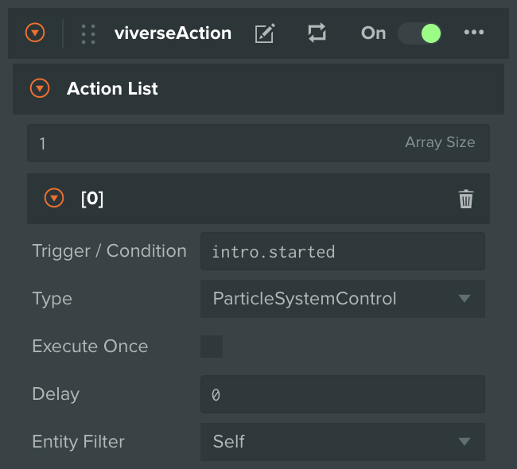<figcaption></figcaption></figure>



***


{% column width="25%" %}
`Quest`


{% column width="50%" %}
Updates state of Quest with a given `Quest Name`, based on `Command` provided. Supported commands:

* `Start Quest` / `Reset Quest`
* `AddTaskProgress` / `CompleteTask`&#x20;


{% column width="24.999999999999986%" %}
<figure>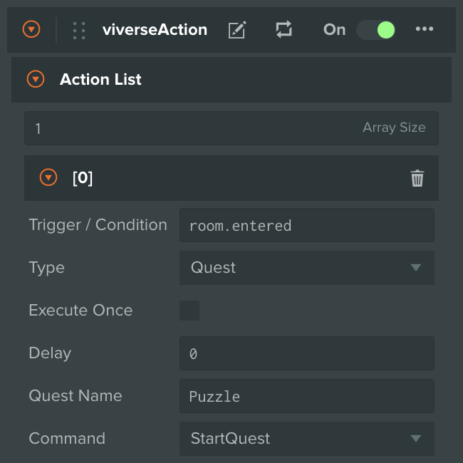<figcaption></figcaption></figure>



***


{% column width="25%" %}
`Set` \
`Spawn`\
`Point`


{% column width="50%" %}
Sets the next Spawn Point for the Player to a 3D point from provided list. If the list contains multiple options - the point will be selected randomly out of them


{% column width="24.999999999999986%" %}
<figure>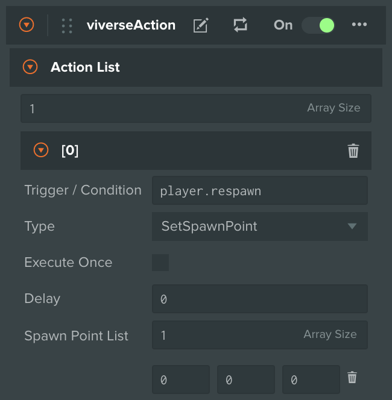<figcaption></figcaption></figure>



***


{% column width="25%" %}
`Seat`&#x20;


{% column width="50%" %}
Executes Player sitting mechanic for a given Seat Entity, according to provided `Command`. The Entity should have **Seat Component** attached. Supported commands:

* `Sit` / `Leave`


{% column width="24.999999999999986%" %}
<figure>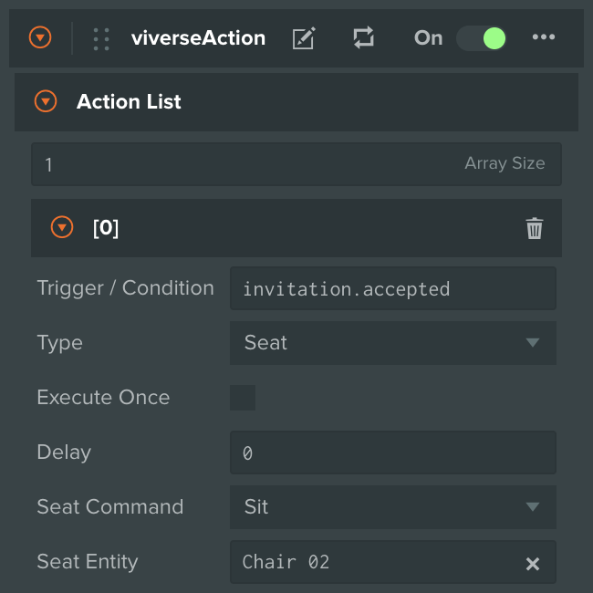<figcaption></figcaption></figure>



***


{% column width="25%" %}
`Open` \
`Link`


{% column width="50%" %}
Open a URL with a given `Link`


{% column width="24.999999999999986%" %}
<figure>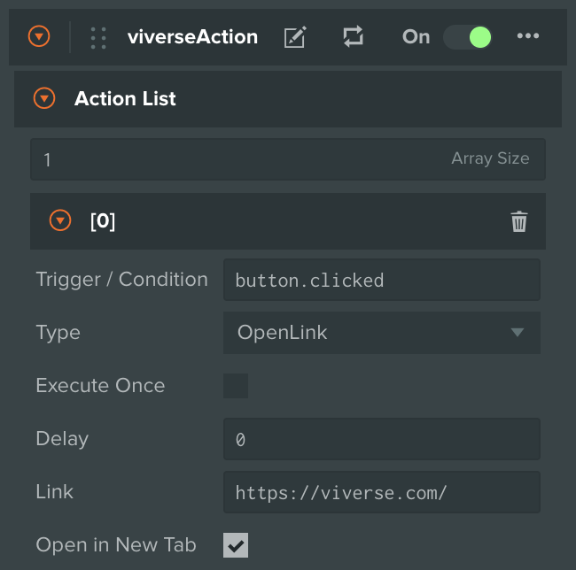<figcaption></figcaption></figure>



***
