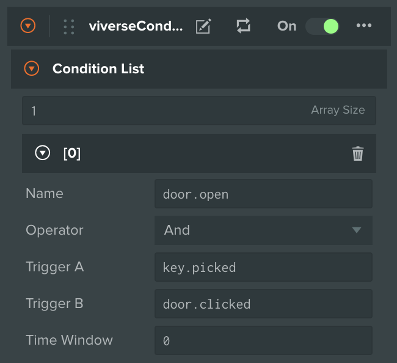
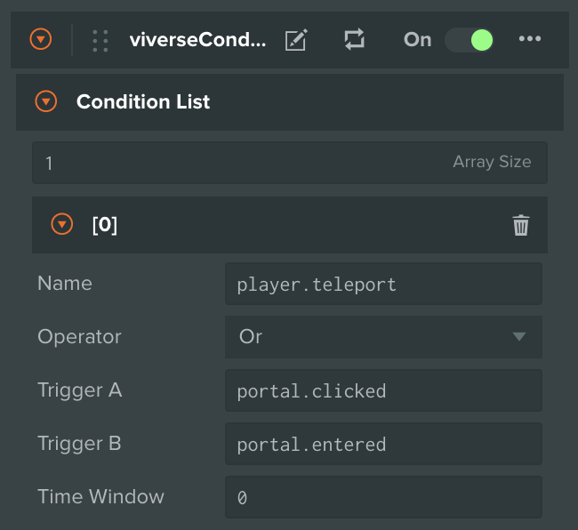

# Conditions

***

## About

Conditions is additional convenience layer on top of Triggers, allowing creators to string multiple Triggers together, either in parallel or in sequential mode. Conditions can be used with Triggers interchangeably, for example when linking them to Actions.

## Usage

Conditions support 2 types of configuration:

* **Sequential (AND)** — creates an activation only when **both** input Triggers were activated within a given **Time Window**
* **Parallel (OR)** — creates an activation when at **any** input Trigger is activated. The **Time Window** here helps to prevent or control **double activation** when both inputs are triggered one after another

For practical usage examples, please refer to [Triggers](triggers.md#usage) or [Actions](actions.md#usage) respectively!

## Reference

***


{% column width="25%" %}
`And`


{% column width="50%" %}
Activates when both **Trigger A** and **Trigger B** are activated within a given `Time Window`. Leaving time window at 0 (default) means no time restriction is applied


{% column width="24.999999999999986%" %}
<figure><figcaption></figcaption></figure>



***


{% column width="25%" %}
`Or`


{% column width="50%" %}
Activates when either **Trigger A** or **Trigger B** is activated within a given `Time Window`. Leaving time window at 0 (default) means no time restriction is applied


{% column width="24.999999999999986%" %}
<figure><figcaption></figcaption></figure>



***
