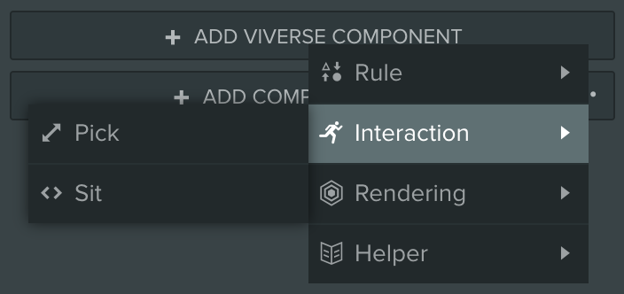
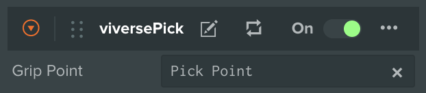
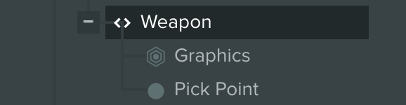
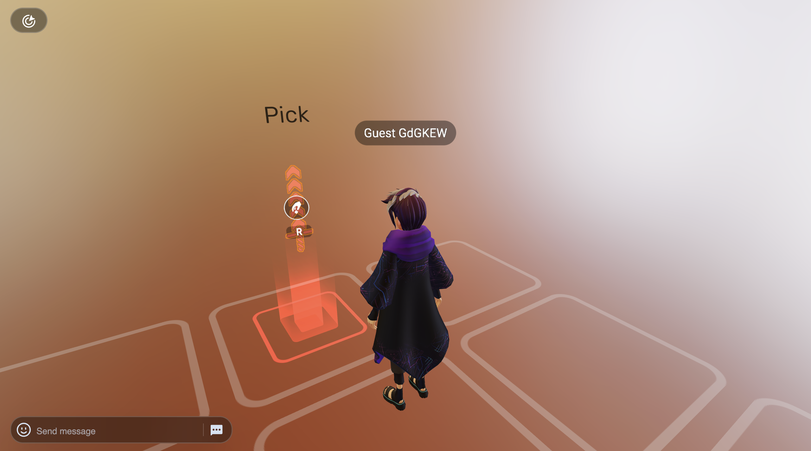
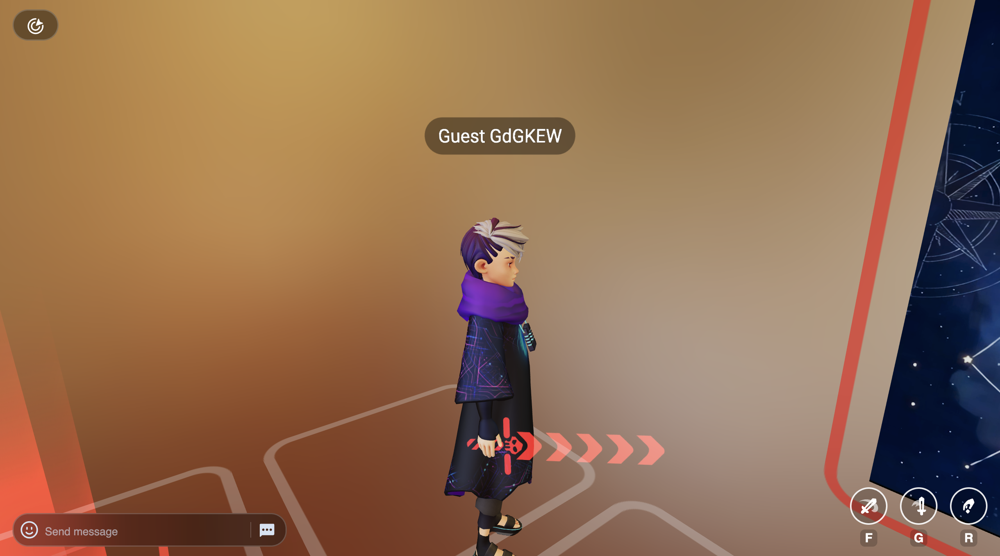

# Picking

***

## About

PlayCanvas Toolkit provides no-code solutions for various modes of interactivity, and one of those modes is Entity Picking. It allows the Player to grab an object by particular local point, and use it as a melee weapon, with corresponding attack animations. In addition to that, when the Entity is possessed by the Player, a special UI Overlay is displayed, showing basic controls for melee attack or droping the Entity.

## Usage

All picking functionality is implemented by a single `viversePick` component. Here is how you can add a Pickable Object to your Scene:


{% column width="66.66666666666666%" %}


### Create Pickable Entity

* Create a new Entity in your Scene, or use an already existing one with 3D mesh attached to it
* Click **Add Viverse Component** button and select **Interaction > Pick**
* Add a **Grip Point** as a child of your Pickable Entity. This point will be used to attach your Entity to Avatar's hand bone



### Launch and Test

* Adjust Entity position and rotation in your Scene, and hit Launch
* When approaching Pickable Entity you should see **Hint Icon**. Click it to grab the Entity!
* Once it's picked, you should see UI Overlay at the bottom right corner, featuring 3 buttons — Attack `F`, Attack `G` and Drop `R`
* The way that Entity is located in Player's hand depends on internal orientation of **Grip Point** inside your Pickable Entity. Adjust its position and rotation to make your Entity look better when it's carried in Player's hand
* Don't forget to relaunch your Scene for any changes to take an effect!




{% column width="33.33333333333334%" %}
<figure><figcaption></figcaption></figure>

<figure><figcaption></figcaption></figure>

<figure><figcaption></figcaption></figure>

<figure><figcaption></figcaption></figure>

<figure><figcaption></figcaption></figure>


