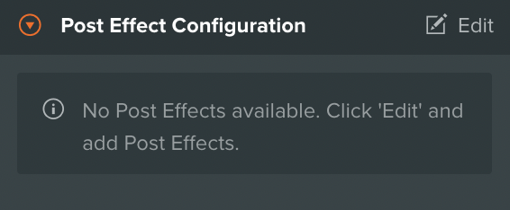
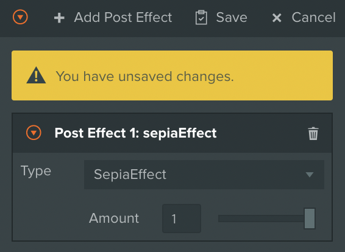
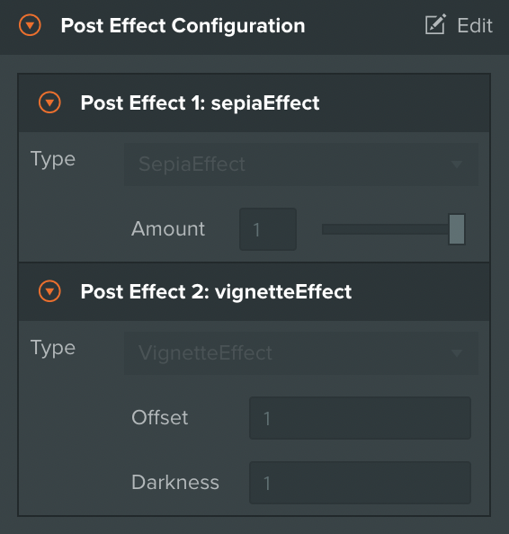
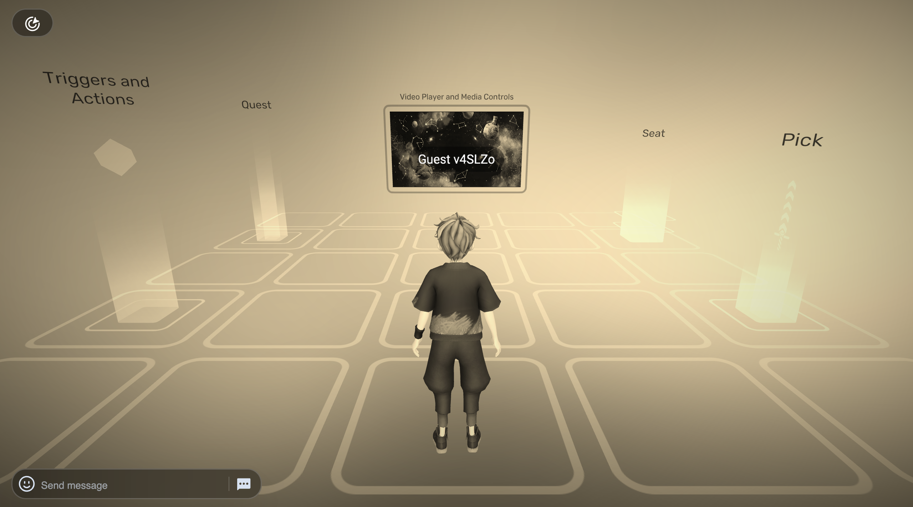

# Post Effects

***

## About

PlayCanvas Toolkit offers a rich collecion of Post Effects, allowing creators to customize look and feel of their Worlds without touching any shader code! Below is a list of Post Effect you can add to your experience:

* Overlays and vignettes
* Bloom, Depth of Field (Bokeh) and Tilt Shift
* Hue / Saturation and Brightness / Contrast
* Sepia and Luminosity (Black and White)
* Screen Space Ambient Occlusion

## Usage

The Post Effects section can be found under  VIVERSE Menu, which is located in the left sidebar. You can stack multiple effects on top of each other, but please be mindful of possible performance impact! Here is an example of adding two effects to your Scene — Sepia and Vignette:


{% column width="66.66666666666666%" %}


### Effect 01: Sepia

* Navigate to Post Effects section and click **Edit**, then **Add Post Effect**
* Click on **Type** selector and find `Sepia`
* You'll see bright yellow prompt informing you about unsaved changes. Click **Save** button to save your current Post Effect configuration
* Launch your Scene — you should see it in Sepia tone now!



### Effect 02: Vignette

* Go through the same steps and add another **Post Effect** on top your current one, but this time choose `Vignette` at the end of the list
* As previously, save your changes and launch your Scene. Now you have both Sepia and Vignette applied!
* Try adding more if you like! You can have as much effects as you like, as long as rendering performance is not hindered




{% column width="33.33333333333334%" %}
<figure><figcaption></figcaption></figure>

<figure><figcaption></figcaption></figure>

<figure><figcaption></figcaption></figure>

<figure><figcaption></figcaption></figure>



## Reference

***


{% column width="25%" %}
`Blend` \
`Effect`


{% column width="50%" %}
Adds a fullscreen transparent overlay on top of your experience. Typically used for vignettes, dirty camera effects, and so on


{% column width="24.999999999999986%" %}
<figure><figcaption></figcaption></figure>



***


{% column width="25%" %}
`Bloom` \
`Effect`


{% column width="50%" %}
Adds soft fringe of light around bright areas in your world, simulating imaging artefacts of real world cameras


{% column width="24.999999999999986%" %}
<figure><figcaption></figcaption></figure>



***


{% column width="25%" %}
`Bokeh` \
`Effect`


{% column width="50%" %}
Adds Depth of Field effect, blurring out of focus areas, similar to how cinematic cameras behave in the real world


{% column width="24.999999999999986%" %}
<figure><figcaption></figcaption></figure>



***


{% column width="25%" %}
`Brighness` \
`Contrast`\
`Effect`


{% column width="50%" %}
Adjusts Brightness and Contrast of your experience, similar to Photoshop image adjustment with the same name


{% column width="24.999999999999986%" %}
<figure><figcaption></figcaption></figure>



***


{% column width="25%" %}
`Edge` \
`Detect`\
`Effect`


{% column width="50%" %}
Extracts edges from rendered frame and draws them on top of your experience in an overlay


{% column width="24.999999999999986%" %}
<figure><figcaption></figcaption></figure>



***


{% column width="25%" %}
`Fxaa` \
`Effect`


{% column width="50%" %}
Applies Fast Approximate Anti-Aliasing to your rendering pipeline. Particularly useful when your world has a lot of alpha blending and per-pixel shader effects


{% column width="24.999999999999986%" %}
<figure><figcaption></figcaption></figure>



***


{% column width="25%" %}
`Horizontal` \
`TiltShift`\
`Effect`


{% column width="50%" %}
Adds subtle Horizontal Tilt Shift to Depth of Field effect, blurring out left and right portions of the screen


{% column width="24.999999999999986%" %}
<figure><figcaption></figcaption></figure>



***


{% column width="25%" %}
`Hue`\
`Saturation`\
`Effect`


{% column width="50%" %}
Adjusts Hue and Saturation of your experience, similar to Photoshop image adjustment with the same name


{% column width="24.999999999999986%" %}
<figure><figcaption></figcaption></figure>



***


{% column width="25%" %}
`Luminosity`\
`Effect`


{% column width="50%" %}
Renders your experience in black and white mode, based on per-pixel luminosity values


{% column width="24.999999999999986%" %}
<figure><figcaption></figcaption></figure>



***


{% column width="25%" %}
`Sepia`\
`Effect`


{% column width="50%" %}
Applies Sepia filter to your experience, similar to Photoshop filter with the same name


{% column width="24.999999999999986%" %}
<figure><figcaption></figcaption></figure>



***


{% column width="25%" %}
`SSAO`\
`Effect`


{% column width="50%" %}
Adds Screen-Space Ambient Occlusion to your scene. This is a computationally expensive effect, so consider using it in desktop-only experiences


{% column width="24.999999999999986%" %}
<figure><figcaption></figcaption></figure>



***


{% column width="25%" %}
`Vertical`\
`TiltShift`\
`Effect`


{% column width="50%" %}
Adds subtle Vertical Tilt Shift to Depth of Field effect, blurring out top and bottom portions of the screen


{% column width="24.999999999999986%" %}
<figure><figcaption></figcaption></figure>



***


{% column width="25%" %}
`Vignette`\
`Effect`


{% column width="50%" %}
Adds subtle darkening to screen corners, simulating real world camera lenses


{% column width="24.999999999999986%" %}
<figure><figcaption></figcaption></figure>



***
