# Post Effects

***

## Reference

About Post Effects

## Post Effects Types

***


{% column width="25%" %}
`Blend` \
`Effect`


{% column width="50%" %}
Adds a fullscreen transparent overlay on top of your experience. Typically used for vignettes, dirty camera effects, and so on

\[...Doesn't do anything]


{% column width="24.999999999999986%" %}
<figure><figcaption></figcaption></figure>



***


{% column width="25%" %}
`Bloom` \
`Effect`


{% column width="50%" %}
Adds soft fringe of light around bright areas in your world, simulating imaging artefacts of real world cameras


{% column width="24.999999999999986%" %}
<figure>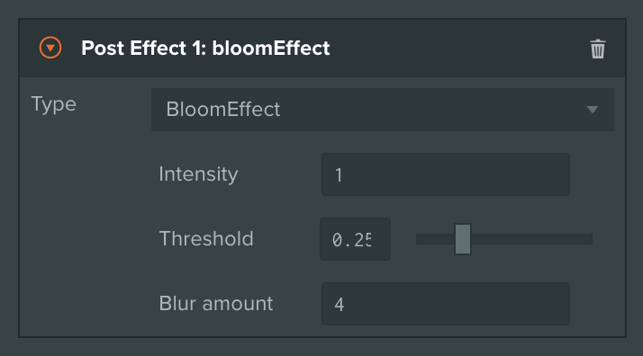<figcaption></figcaption></figure>



***


{% column width="25%" %}
`Bokeh` \
`Effect`


{% column width="50%" %}
Adds Depth of Field effect, blurring out of focus areas, similar to how cinematic cameras behave in the real world

\[...Hard to adjust, focus not working properly?]


{% column width="24.999999999999986%" %}
<figure>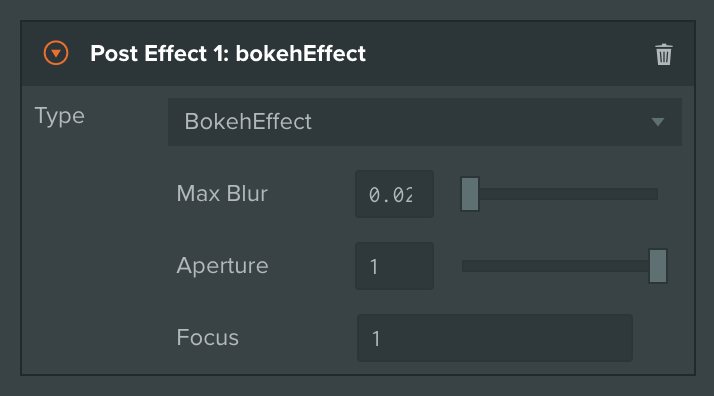<figcaption></figcaption></figure>



***


{% column width="25%" %}
`Brighness` \
`Contrast`\
`Effect`


{% column width="50%" %}
Adjusts Brightness and Contrast of your experience, similar to Photoshop image adjustment with the same name

\[...Very harsh at extremes]


{% column width="24.999999999999986%" %}
<figure>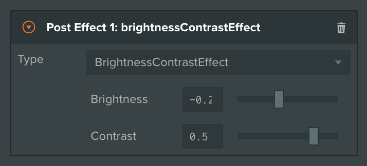<figcaption></figcaption></figure>



***


{% column width="25%" %}
`Edge` \
`Detect`\
`Effect`


{% column width="50%" %}
Extracts edges from rendered frame and draws them on top of your experience in an overlay

\[...Error: this.color.toArray is not a function]


{% column width="24.999999999999986%" %}
<figure>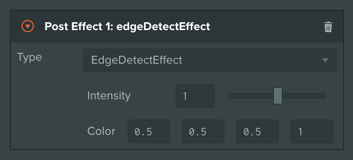<figcaption></figcaption></figure>



***


{% column width="25%" %}
`Fxaa` \
`Effect`


{% column width="50%" %}
Applies Fast Approximate Anti-Aliasing to your rendering pipeline. Particularly useful when your world has a lot of alpha blending and per-pixel shader effects


{% column width="24.999999999999986%" %}
<figure>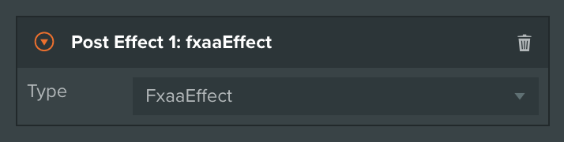<figcaption></figcaption></figure>



***


{% column width="25%" %}
`Horizontal` \
`TiltShift`\
`Effect`


{% column width="50%" %}
\[...Barely noticeable]


{% column width="24.999999999999986%" %}
<figure>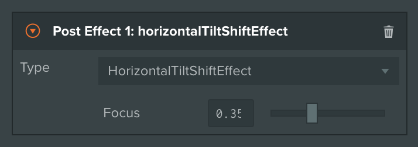<figcaption></figcaption></figure>



***


{% column width="25%" %}
`Hue`\
`Saturation`\
`Effect`


{% column width="50%" %}
Adjusts Hue and Saturation of your experience, similar to Photoshop image adjustment with the same name


{% column width="24.999999999999986%" %}
<figure>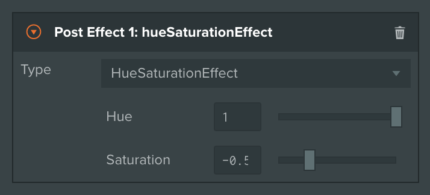<figcaption></figcaption></figure>



***


{% column width="25%" %}
`Luminosity`\
`Effect`


{% column width="50%" %}
Renders your experience in black and white mode, based on per-pixel luminosity values

\[...Not needed, can be replaced with 0 saturation]


{% column width="24.999999999999986%" %}
<figure>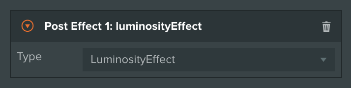<figcaption></figcaption></figure>



***


{% column width="25%" %}
`Sepia`\
`Effect`


{% column width="50%" %}
Applies Sepia filter to your experience, similar to Photoshop filter with the same name

\[...Should be general colorization]


{% column width="24.999999999999986%" %}
<figure>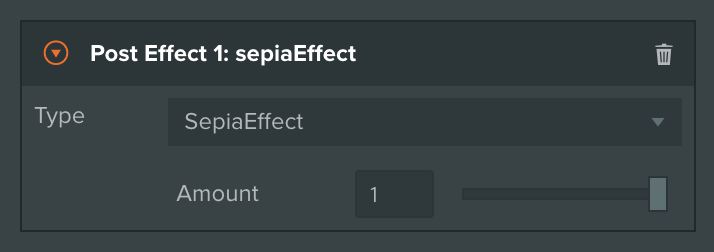<figcaption></figcaption></figure>



***


{% column width="25%" %}
`SSAO`\
`Effect`


{% column width="50%" %}
Adds Screen-Space Ambient Occlusion to your scene. This is a computationally expensive effect, so consider using it in desktop-only experiences

\[...Very unoptimized]


{% column width="24.999999999999986%" %}
<figure><figcaption></figcaption></figure>



***


{% column width="25%" %}
`Vertical`\
`TiltShift`\
`Effect`


{% column width="50%" %}
\[...Barely noticeable]


{% column width="24.999999999999986%" %}
<figure>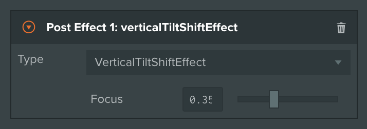<figcaption></figcaption></figure>



***


{% column width="25%" %}
`Vignette`\
`Effect`


{% column width="50%" %}
Adds subtle darkening to screen corners, simulating real world camera lenses


{% column width="24.999999999999986%" %}
<figure>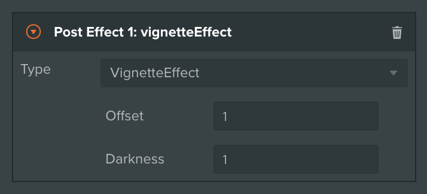<figcaption></figcaption></figure>



***

