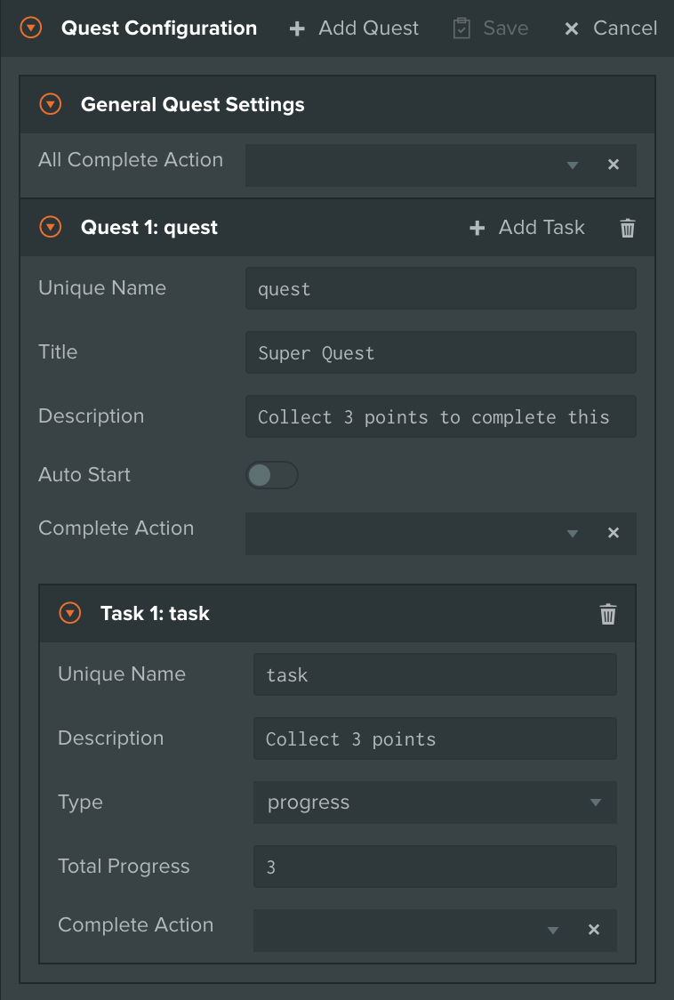
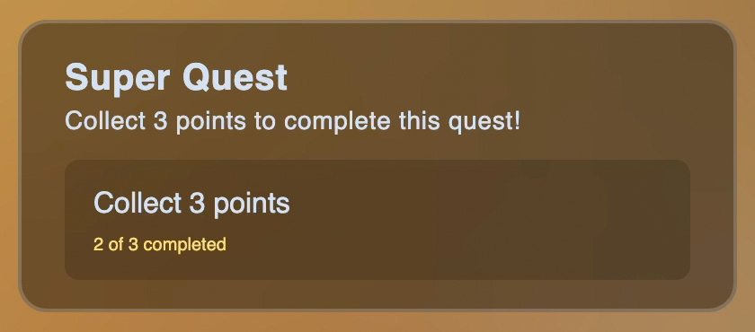
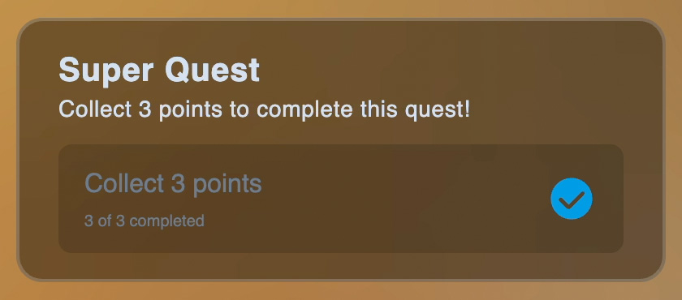
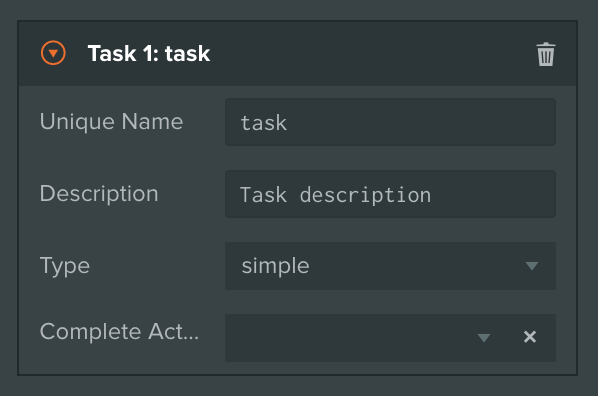
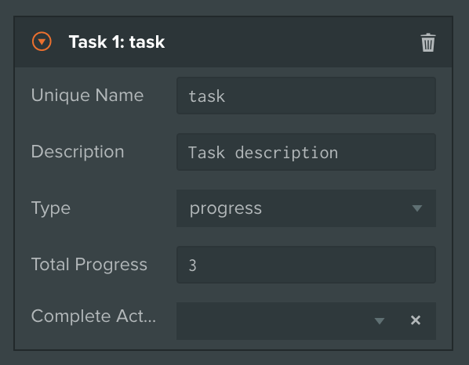

# Quests

***

## About

PlayCanvas Toolkit comes with an integrated Quest System, unlocking a new dimension of interactive storytelling for creators. Each Quest can feature multiple Tasks, which can be completed by the Player in any order. Once all Tasks for a given Quest are completed, the Quest is marked as done, which can advance the experience further by triggering some Action — for example opening a locked door in your World, or granting the Player a new weapon.

## Usage

The Quest Configurator can be found under  VIVERSE Menu, which is located in the left sidebar. You can have multiple Quests, each featuring multiple dedicated Tasks, as long as you devise unique names for all of them.

In order to control Quest flow in your experience, you should use [Actions](actions.md#usage) of type `Quest`, which provide a useful set of commands:


{% column width="75%" %}
* **Start Quest** — start a particular Quest with a given `Quest Name`. Starting the Quest will display Quest UI Overlay in your experience, showing current Quest Title, Description, and a list of Tasks that Player should complete in order to resolve this Quest. If you're already running another Quest while starting a new one, this Action will be ignored
* **Complete Task** — mark Simple Task with a given `Task Name` as completed. This leads to crossing off that Task in Quest UI todo list. Once Task is completed, it cannot be completed again until the entire Quest is reset
* **Add Task Progress** — advance Progress Task with a given `Task Name` by 1 step. This leads to incrementing a counter related that Task in Quest UI todo list. Once the counter reaches `Total Progress`, the Task is marked as completed and is crossed off todo list
* **Reset Quest** — reset a particular Quest with a given `Quest Name`. Resetting the Quest will erase its current progress if any. If Quest is already marked as completed — this property will be reset as well


{% column width="25%" %}
<figure><figcaption></figcaption></figure>

<figure><figcaption></figcaption></figure>

<figure><figcaption></figcaption></figure>

<figure><figcaption></figcaption></figure>



## Task Reference

***


{% column width="16.666666666666664%" %}
`Simple` 


{% column width="50%" %}
The Simple Task represents a single activity, like collecting an item or opening a door. To complete it, the Player should trigger an **Action** of type `Quest` with `CompleteTask` command


{% column width="33.33333333333332%" %}

<figure><figcaption></figcaption></figure> <figure><figcaption></figcaption></figure>




***


{% column width="16.666666666666664%" %}
`Progress` 


{% column width="50%" %}
The Progress Task represents sequential activity, where multiple actions can contribute to task's progress — like collecting 3 gems, or killing 10 zombies. To advance a Progress Task, the Player should trigger an **Action** of type `Quest` with `AddTaskProgress` command


{% column width="33.33333333333332%" %}

<figure><figcaption></figcaption></figure> <figure><figcaption></figcaption></figure>




***
