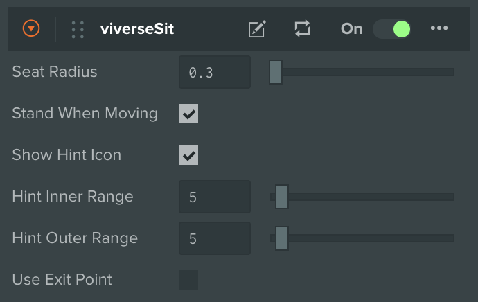
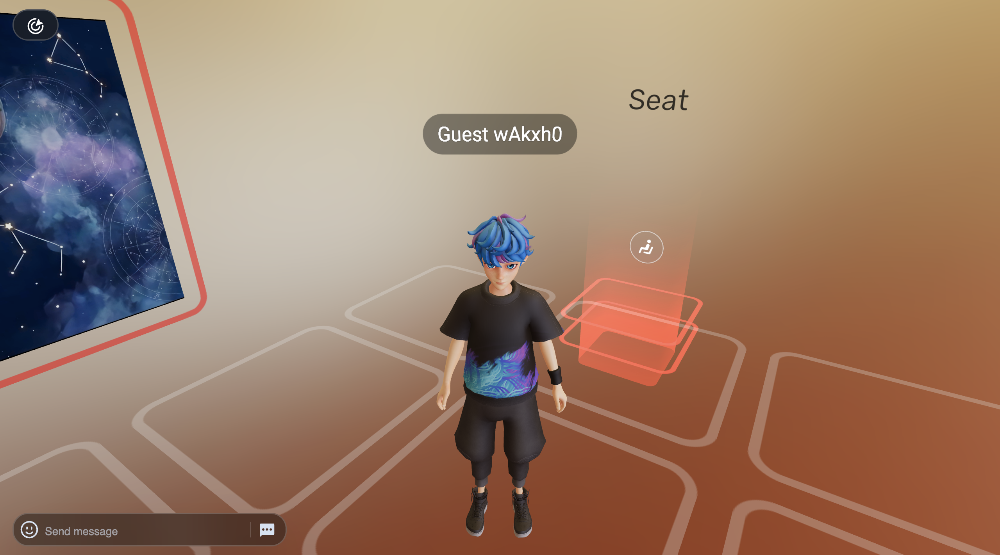
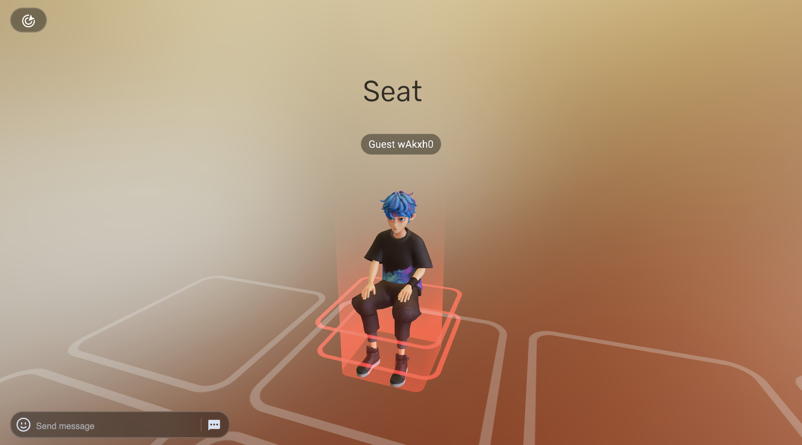

# Sitting

***

## About

PlayCanvas Toolkit comes with no-code solutions for all sorts of interactive experiences, and one of those types is virtual conference rooms. The promising idea of VIVERSE is that interactive 3D Worlds can be used not only for entertainment, but as lush 3D environments for virtual meetings as well!

The Seat is a concept designed to facilitate that. It's a special trigger that shows a dedicated Seat Icon, which upon click results in Player taking a seat at particular spot of the world.

## Usage

All Sitting functionality is implemented by a single `viverseSit` component. Here is how you can integrate it into your project:


{% column width="66.66666666666666%" %}


### Create Seat Entity

* Create a new Entity in your Scene
* Click **Add Viverse Component** button and select **Interaction > Sit**
* If you did everything correctly - you should see a **viverseSit** script attached to your Entity, and a green trigger indicating Seat area



### Launch and Test

* Adjust Seat position and rotation in your Scene, and hit Launch
* When approaching Seat Entity you should see **Hint Icon.** If it's not the case — please check whether `Show Hint Icon` is enabled
* Adjust `Inner` and `Outer Range` to control at what distance the **Hint Icon** starts fading in or out. Don't forget to relaunch your Scene for any changes to take an effect!




{% column width="33.33333333333334%" %}
<figure><figcaption></figcaption></figure>

<figure><figcaption></figcaption></figure>

<figure><figcaption></figcaption></figure>

<figure><figcaption></figcaption></figure>




While **Hint Icon** is a convenient way to interact with Seat Entities, it's not the only way! You can disable Hint Icon and use your custom Trigger / Action pair instead, for example `Trigger (OnSelect)` → `Action (Seat)`. For more details, please refer to [Actions](actions.md) usage.

