# Triggers

***

## About

Triggers is a fundamental part of VIVERSE Framework, allowing creators to handle a wide range of player- and game-specific events without writing a single line of code! Whenever Player interacts with some Entity — be it a click, or collision, or seat taking — a corresponding event is generated, and any Trigger, associated with this event, also gets activated.

## Usage

Triggers don't do anything on their own — they're typically paired with [Actions](actions.md) or [Custom Scripts](custom-scripts.md) to produce desired effects of their activations.

Here is a simple example of using Trigger with an Action:


{% column width="66.66666666666666%" %}


### Setup Trigger

* Create a new empty Entity in your Scene
* Add **3D > Render Component** of type `Box`. Your Entity should be visible in your Scene now
* Add **Physics > Collision Component** of type `Box` as well. Adjust its params if necessary
* Click **Add Viverse Component** button and select **Rule > Trigger**. The `viverseTrigger` script will be added to your Entity
* In Trigger Component, add a new entry to the Trigger List, by entering 1
* Leave Trigger type at `OnSelect` (default), and give it a unique `Name`, for example `box.clicked`



### Setup Action

* With your Entity selected, click **Add Viverse Component** button once again, and select **Rule > Action**. The `viverseAction` script will be added to your Entity
* In Action Component, add a new entry to the Action List, by entering 1
* Populate `Trigger / Condition` field with your Trigger Name, which is `box.clicked` in our case
* Leave all other params at their defaults - `ToggleEntities`, `Toggle`, `Self`&#x20;



### Test and verify

* Now we can test our Trigger / Action pair!
* Launch your Scene in a new tab, walk towards white box Entity and click it
* If you set up everything correctly — the Entity should disappear on your click




{% column width="33.33333333333334%" %}
<figure>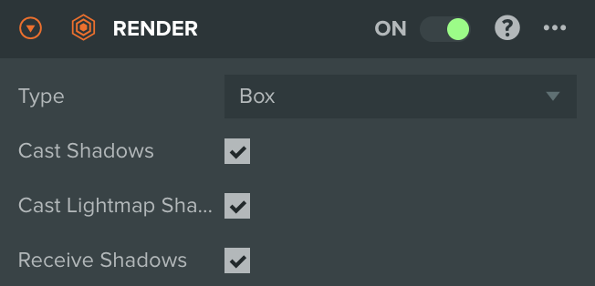<figcaption></figcaption></figure>

<figure>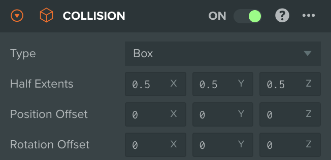<figcaption></figcaption></figure>

<figure>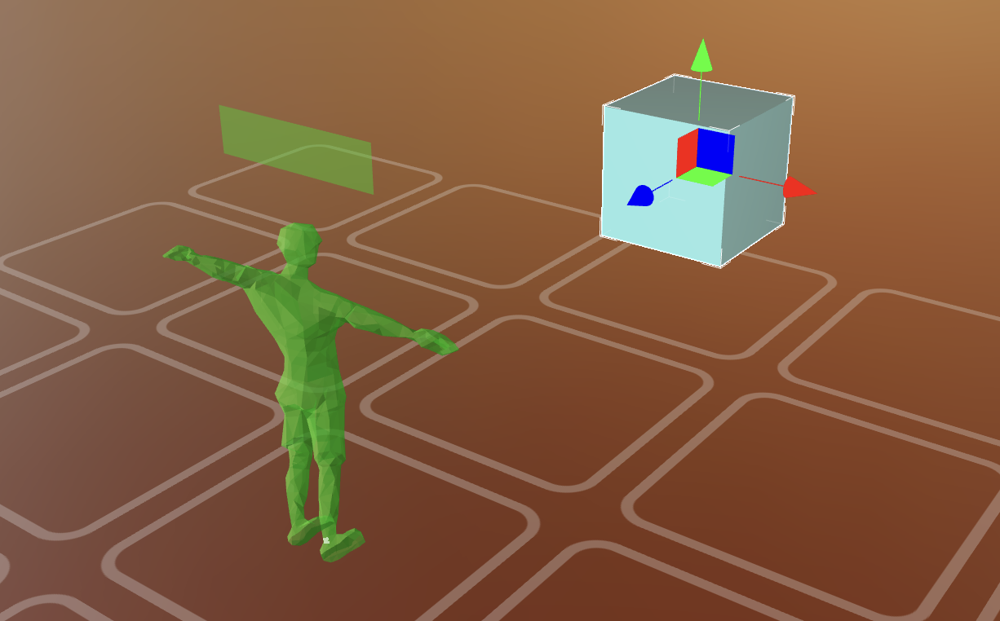<figcaption></figcaption></figure>

<figure>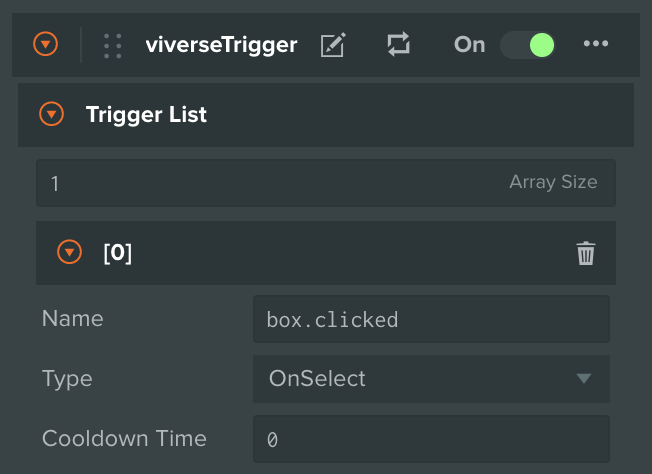<figcaption></figcaption></figure>

<figure>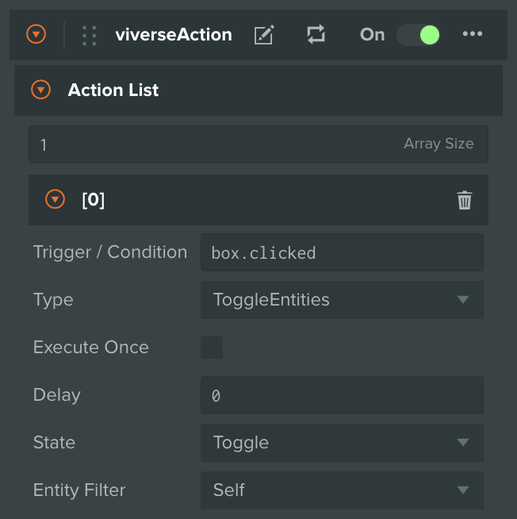<figcaption></figcaption></figure>

<figure>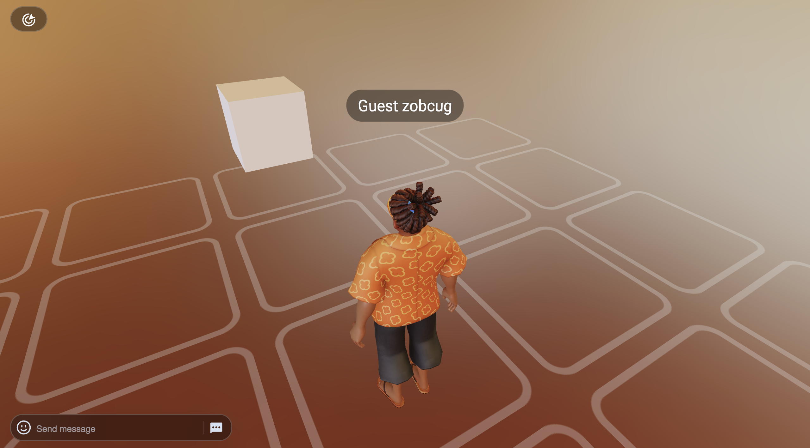<figcaption></figcaption></figure>




It's not really necessary to have both **Trigger** and **Action** Components on the same Entity! For the purpose of your experience you can have as many Entities as you like, each with its own Trigger or Action, or a combination of those.

The only important rule is that Trigger's `Name` param should match an Action's `Trigger / Condition` one if you want them to be linked together


## Reference

***


{% column width="25%" %}
`OnSelect` 


{% column width="50%" %}
Activates when the Player points and clicks on this Trigger. Requires **Collision Component** to be attached to the Entity


{% column width="24.999999999999986%" %}
<figure>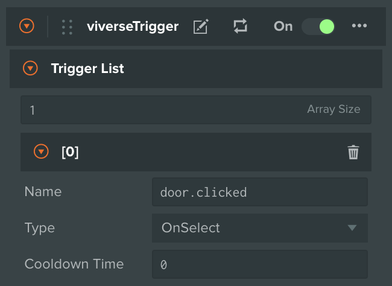<figcaption></figcaption></figure>



***


{% column width="25%" %}
`OnCollision` 


{% column width="50%" %}
Activates when another **Rigidbody** interacts with this Trigger. Supported interactions:

* `TriggerEnter` / `TriggerLeave` \
  Requires **Collision Component** to be attached
* `CollisionStart` / `CollisionEnd` \
  Requires both **Collision** and **Rigidbody Components**

You can allow interactions with only the Player and / or some Entity with specific Tag. See **Collision Filter** for available options


{% column width="24.999999999999986%" %}
<figure>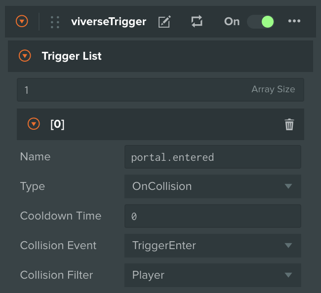<figcaption></figcaption></figure>

<figure><figcaption></figcaption></figure>



***


{% column width="25%" %}
`OnAnimation` 


{% column width="50%" %}
Activates when animation state changes for this Trigger entity. Requires **Animation Component** to be attached. Supported animation events:

* `Start` / `End` / `CustomEvent`


{% column width="24.999999999999986%" %}
<figure>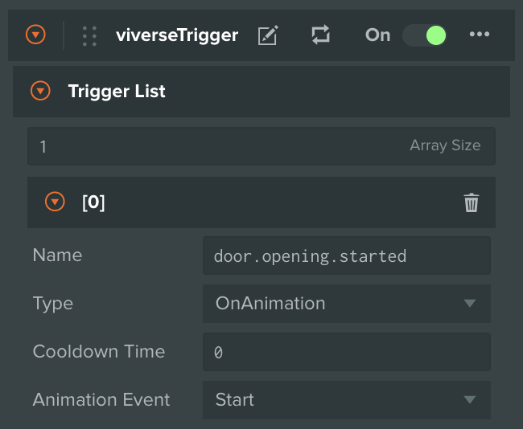<figcaption></figcaption></figure>



***


{% column width="25%" %}
`On`\
`SeatState`\
`Changed` 


{% column width="50%" %}
Activates when this Seat Entity changes its state. Works in tandem with **Seat Component**, therefore requires **viverseSeat** script to be attached to this Entity. Supported events:

* `Occupied` / `Vacated`


{% column width="24.999999999999986%" %}
<figure>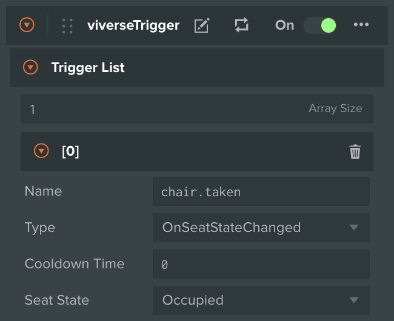<figcaption></figcaption></figure>



***


{% column width="25%" %}
`On`\
`Notification`\
`Event` 


{% column width="50%" %}
Activates when another Entity with **Action Component** fires `PublishNotification` event with particular `Event Name` matching the one in this Trigger. You can use it to send / receive custom Notification Events between different Entities in your Scene


{% column width="24.999999999999986%" %}
<figure>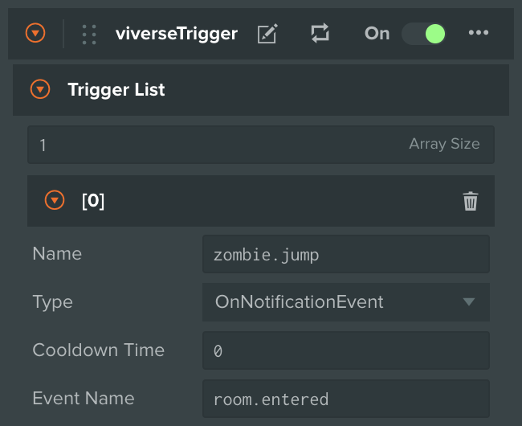<figcaption></figcaption></figure>



***


{% column width="25%" %}
`On`\
`Action`\
`Executing` 


{% column width="50%" %}
Activates when another Entity with **Action Component** starts executing an Action with a given `Action Name`. You can use it to sequentially chain multiple Triggers and Actions together, for example `Trigger A` → `Action A` → `Trigger B` → `Action B`


{% column width="24.999999999999986%" %}
<figure><figcaption></figcaption></figure>



***
