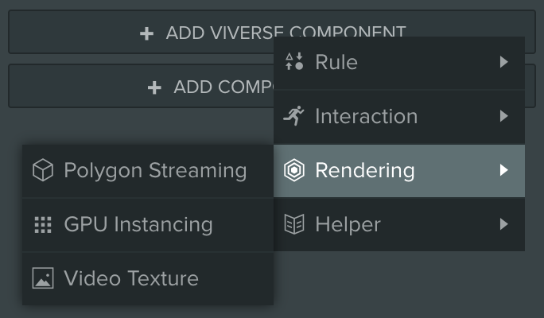
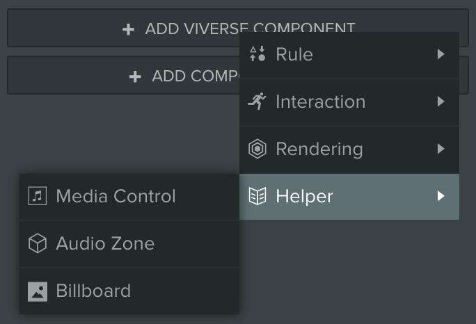
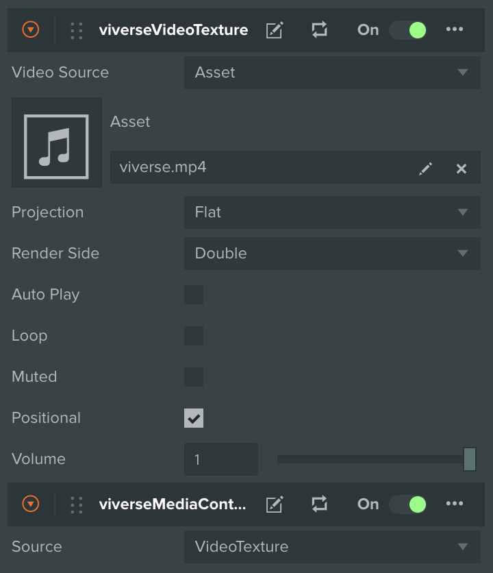

# Video Playback

***

## Setting Up


{% column width="66.66666666666666%" %}


### Create Video Entity

* Create a new empty Entity in your Scene
* Click **Add Viverse Component** button and select **Rendering > Video Texture**
* If you did everything correctly - you should see a **viverseVideoTexture** script attached to your Entity



### Setup Video asset or URL

* Upload Video asset to your PlayCanvas project
* Drag and drop it into **Asset** attribute of **viverseVideoTexture** script
* Now you should see the first frame of your Video in PlayCanvas Editor!
* As alternative, you can use public URL as a Video source



### Adjust and Test

* Adjust your Entity's **Position**, **Rotation** and **Scale** to match Video's aspect ratio and desired position / orientation in your Scene
* Launch your Scene and confirm that the Video is playing as expected
* Please note that muted Videos can play automatically, but unmuted ones requires user's interaction with the page to start playing
* Feel free to adjust other attributes like **Render Side**, **Auto Play**, **Loop**, **Muted**, **Volume** and **Positional Sound**, as you see fit
* Also feel free to experiment with **Projection** attribute, since it allows playing 360 videos on a spherical surface!



### Optional: Add Controls

* With your Entity selected, click **Add Viverse Component** button and choose **Helper > Media Control**
* Relaunch your Scene once again — now when you hover over your Video Entity you can see Media Controls and interact with them!




{% column width="33.33333333333334%" %}
<figure><figcaption></figcaption></figure>

<figure><figcaption></figcaption></figure>

<figure><figcaption></figcaption></figure>

<figure><figcaption></figcaption></figure>

<figure><figcaption></figcaption></figure>



