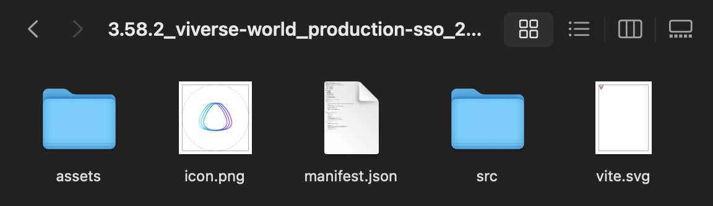
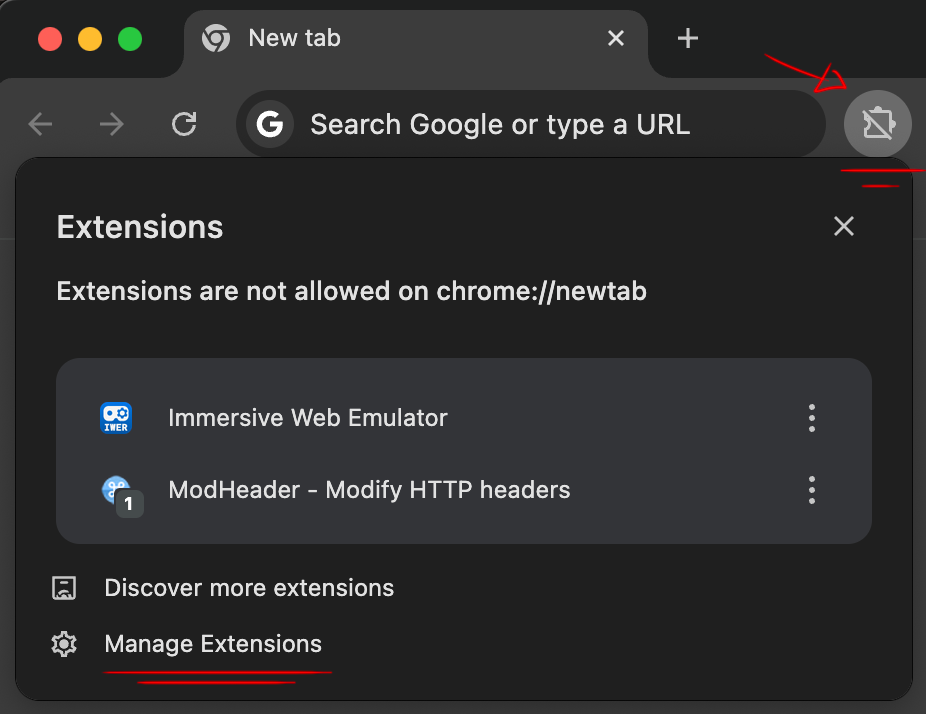
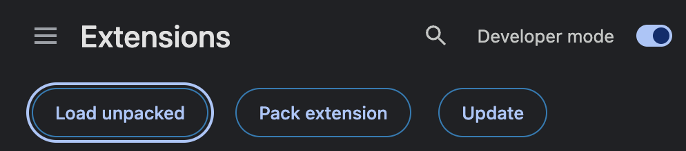
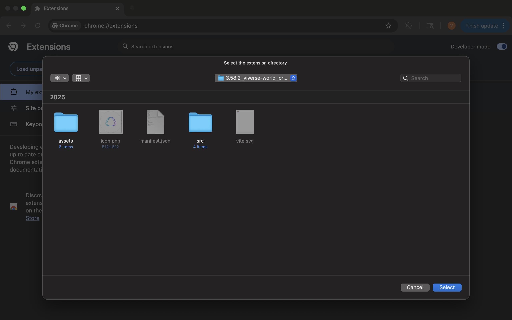
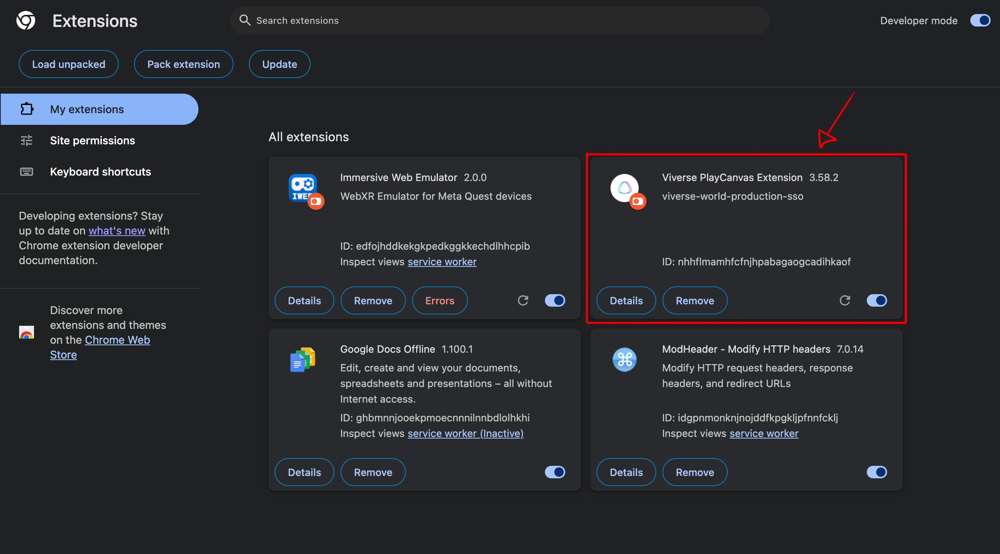

# \[V4] Starting with PlayCanvas Toolkit

***

## Introduction

[PlayCanvas](https://playcanvas.com/) is an open-source game engine designed to advance the development of 3D web games, interactive content and rich multimedia. Unlike similar WebGL engines like Three.js or Babylon, PlayCanvas comes with sophisticated in-browser Editor (inspired by early [Unity 2.x - 3.x](https://www.elmundotech.com/2010/09/27/unity-3-game-dev-platform-available-now/)), which provides its users with a rich set of tools — allowing to assemble scenes from imported assets, setup real-time and baked lighting, write custom scripts, create animation graphs, and much much more.

To make creator's experience even richer, VIVERSE has developed a special Toolkit, which consists of two parts complementing each other — the Extension and the Framework:

* **The Extension** lives in your Chrome browser, and its main goal is to add extra functionality to vanilla PlayCanvas Editor, not achievable otherwise — like initializing your project, creating new VIVERSE World, setting up Local Player, Quests and Post Effects, and of course providing convenient ways to Publish to VIVERSE!
* **The Framework** is a collection of scripts and assets that Extension adds to your project during initialization, under `.viverse` folder. It provides important runtime systems for Avatars, Player Locomotion, Networking and so forth, and common building blocks like Triggers and Actions, that you can use to create custom no-code logic for your worlds

\[...Please welcome this collection of essential tutorials to help you get started with the Toolkit. We assume you're already familiar with PlayCanvas Editor itself and have PlayCanvas account. If not, please feel free to explore [PlayCanvas User Manual](https://developer.playcanvas.com/user-manual/) first!]

## Install PlayCanvas Extension


{% column width="66.66666666666666%" %}


### Get the latest Extension from VIVERSE

* [Download](playcanvas-toolkit-changelog.md) the latest version of Playcanvas Extension
* Unzip downloaded file on your computer



### Navigate to Extensions manager

* Click **Extensions** icon in Chrome toolbar and open the Extensions Popup
* Click **Manage Extensions** at the bottom and open the Extensions Manager in a new tab



### Install the Extension

* Enable **Developer Mode** at the top right corner
* Click **Load Unpacked** and select the folder with unpacked Extension you downloaded previously
* Verify the Extension is now present in Extensions Manager tab




{% column width="33.33333333333334%" %}
<figure><figcaption></figcaption></figure>

<figure><figcaption></figcaption></figure>

<figure><figcaption></figcaption></figure>

<figure><figcaption></figcaption></figure>

<figure><figcaption></figcaption></figure>




## Create and publish your first World


Before proceeding any further, we assume you're familiar with the basics of PlayCanvas Editor. If you're looking for a comprehensive introduction to it — please refer to a dedicated [PlayCanvas Editor Manual](https://developer.playcanvas.com/user-manual/editor/) first!


\[...Stepper]

## Update PlayCanvas Toolkit

\[...Stepper]
