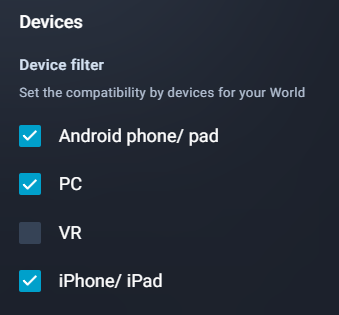

# VIVERSE Studio

***

## Introduction

The [VIVERSE studio](https://studio.viverse.com/) is the one-stop-shop for managing all content associated with your VIVERSE account and profile. Studio includes analytics about the performance of your content and tools to manage both video and application content.

## Studio Dashboard

The main dashboard of the VIVERSE studio includes metrics on how users engage with your content. With an adjustable timeframe and content filer, you may explore the number of visitors, both new and unique, as well as the number of views and likes your content receives.

<figure><figcaption></figcaption></figure>

## Worlds

The worlds page includes tabs for managing existing content and uploading new content. The **Content Management** page contains links to edit a project's settings, including its visibility, description, and associated media. The **Upload** tab allows you to create new Worlds, upload and update files for existing worlds.&#x20;

<figure><figcaption></figcaption></figure>

When updating content through the **Upload** tab, you will see a new, testable version with a unique link that can be merged into the main version/link for your content after submitting for review. You may also delete or hide Worlds through these settings.

<figure><figcaption></figcaption></figure>

## Videos

The **Videos** tab allows you to explore, upload, and manage settings of uploaded videos. Currently, it is not possible to upload a new version of a video to an existing link; you must delete the current version and upload a new file.

<figure><figcaption></figcaption></figure>

## Content Settings

Your content's settings can be edited by clicking the kebab menu next to your world/video.

<figure><figcaption>
Image showing to open a world's settings
</figcaption></figure>



<figure><figcaption>
The world settings configuration panel
</figcaption></figure>

Worlds can be assigned a genre, which impacts curation and discovery on the VIVERSE webpages.

<figure><figcaption></figcaption></figure>



With the world settings, you can configure your world's name, description, thumbnail, and accessibility settings. Both Genre and Access will influence how your world is categorized and displayed on the VIVERSE world discovery page.

<figure><figcaption></figcaption></figure>

Worlds can also be assigned a device filter, regulating which user devices are intended to experience the world based on its optimization.



Worlds can be set to one of three accessibility states and can be password protected to add an additional level of security.

|                                                                                                  |                                                                                             |
| ------------------------------------------------------------------------------------------------ | ------------------------------------------------------------------------------------------- |
|  |  |

## Review & Content Moderation

After uploading, your content will be viewable in preview mode only. To submit your world for curation on our webpages, please select "Submit for Review" and select whether you would like iframe support for your experience.


Since VIVERSE content is iframed by default on our landing pages, several web features require requesting permissions, such as `xr-spatial-tracking`, `camera`, or `allow-pointer-lock`. These can be applied to preview links in the "iframe Support for Preview" menu, and must be set when you "Submit for Review," as well.


All content must comply with the standards outlined in the VIVERSE Platform Terms of Use: [https://www.viverse.com/terms-of-use](https://www.viverse.com/terms-of-use) While not an exhaustive list, we will not tolerate content which...

* Depicts graphic or disturbing nudity, gore, sexual acts, violence, whether legal or illegal
* Incites violence/hatred against or exposes personal information of individuals or groups
* Includes malware, inappropriately collects user data, or inappropriately solicits money/information from users
* Includes unauthorized connections with technologies that go against the VIVERSE terms of use
