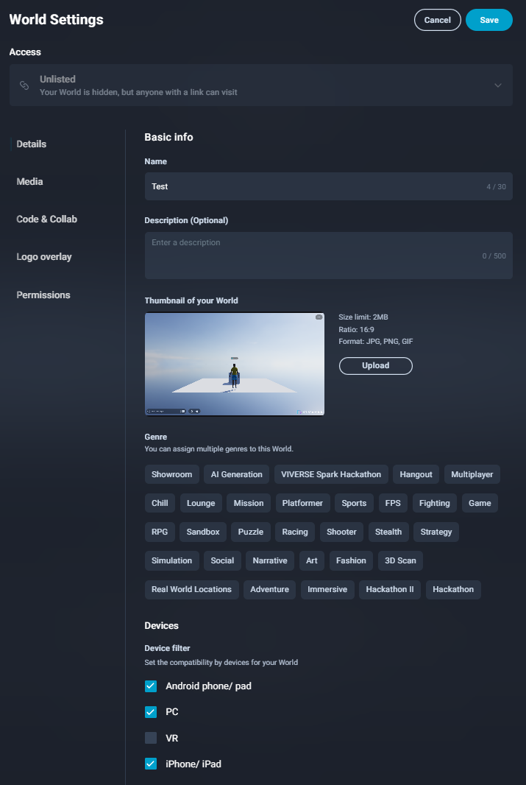

# VIVERSE Studio

***

## Publishing to Your VIVERSE Account

All creations published to your VIVERSE account are known as "Worlds" and can be accessed on the "My Worlds" tab of [the account page](https://worlds.viverse.com/profile) or the [VIVERSE Studio](https://studio.viverse.com/). Here, you can also see any creators that you are following or worlds that you have favorited.

<figure><figcaption>
The VIVERSE account page showing "My Worlds"
</figcaption></figure>

Currently, Worlds can only be associated with, owned and managed by one VIVERSE account. The owner's account name will display under the world on the VIVERSE world discovery page.

## Video Overview



## The VIVERSE Studio Interface

The [VIVERSE studio](https://studio.viverse.com/) is the one-stop-shop for managing all content associated with your VIVERSE account and profile.&#x20;

### Dashboard

The main dashboard of the VIVERSE studio includes metrics on how users engage with your content. Currently, this includes the number of views, unique viewers, new viewers, and likes. You may update the date range to filter for specific sections of metrics.

<figure><figcaption></figcaption></figure>

### Content

The content page lists all of the worlds you have published on VIVERSE. Each tile displayes the world's name, discoverability setting, and engagement metrics with controls to access its settings. You may search or filter for specific categories of worlds using the toolbars.

<figure><figcaption></figcaption></figure>

### Upload

The upload page allows you to manage and add specific content to your VIVERSE account. For each world, you can see its status, visibility setting, and an area to edit its settings.

<figure><figcaption></figcaption></figure>

The upload page can also be used to create and upload new worlds to VIVERSE.&#x20;



### Select "Create New World"

Enter a title and description for your world and select "Create".

<figure><figcaption></figcaption></figure>



### Upload Content

Navigate to the "Content Versions" tab and select the file you would like to use.

<figure><figcaption></figcaption></figure>



### Submit Content For review

After uploading, your content will be viewable in preview mode only. To submit your world for curation on our webpages, please select "Submit for Review" and select whether you would like iframe support for your experience.


Since VIVERSE content is iframed by default on our landing pages, several web features require requesting permissions, such as `xr-spatial-tracking`, `camera`, or `allow-pointer-lock`. These can be applied to preview links in the "iframe Support for Preview" menu, and must be set when you "Submit for Review," as well.


<figure><figcaption></figcaption></figure> <figure><figcaption></figcaption></figure>




### (Optional) Iterate on your build

After uploading the first build and adding iframe settings, you can continue uploading iterative builds by clicking the "Upload" section in the sidebar, then "Manage Content" next to the world in question. This will bring up the same upload and permissions screen shown in Step 3.

<figure><figcaption></figcaption></figure>



### (Optional) Add an SDK \[Beta]

Navigate to the "SDK Settings" tab and use the interface to configure any new SDKs for your world.

<figure><figcaption></figcaption></figure>



### Profile Settings

The settings page can be used to manage and update your profile information which is displayed for any viewers looking at your creator page.

<figure><figcaption></figcaption></figure>

## Scene vs World URLs

When publishing to VIVERSE, creations will be given a **single-player Scene URL** and a **multi-player World URL.**

The Scene URL, such as https://create.viverse.com/scenes/1234567, is designed as a preview for creators to quickly iterate on their project's visuals and mechanics without worrying about networked gameplay. The Scene URL can be shared and accessed by anyone with access to the URL, however you will not be able to see or hear other networked avatars.

The World URL, such as https://create.viverse.com/aBCdEfG, is the fully published, multiplayer environment that may be made discoverable by other VIVERSE users on the world discovery page. The World URL's accessibility is determined by the World's settings. Here you will be able to see and hear other networked avatars who have access to the World URL

## World Settings

A world's settings can be edited by clicking the kebab menu next to your world on your account page.

<figure><figcaption>
Image showing to open a world's settings
</figcaption></figure>

With the world settings, you can configure your world's name, description, thumbnail, and accessibility settings. Both Genre and Access will influence how your world is categorized and displayed on the VIVERSE world discovery page.

<figure><figcaption>
The world settings configuration panel
</figcaption></figure>

Worlds can be set to one of three accessibility states and can be password protected to add an additional level of security.

|                                                                                                     |                                                                                                |
| --------------------------------------------------------------------------------------------------- | ---------------------------------------------------------------------------------------------- |
|  |  |

Worlds can be assigned a genre, which impacts curation and discovery on the VIVERSE webpages.

<figure><figcaption></figcaption></figure>

Worlds can also be assigned a device filter, regulating which user devices are intended to experience the world based on its optimization.

<figure><figcaption></figcaption></figure>

## Discovery

Worlds that are made "Public" are discoverable on the VIVERSE world discovery page. Worlds are categorized automatically by genre settings and device compatibility (corresponding to file size and optimization level), as well as manually by the VIVERSE curation team.

<figure><figcaption>
The VIVERSE world discovery page
</figcaption></figure>
