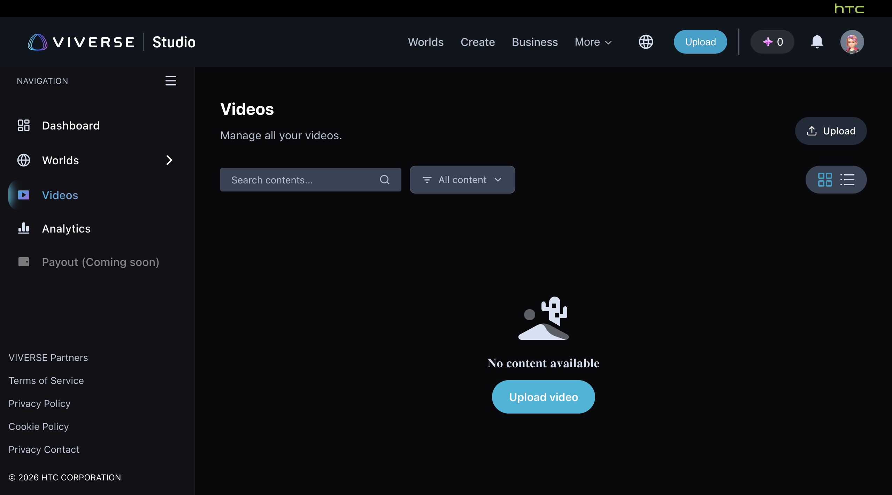
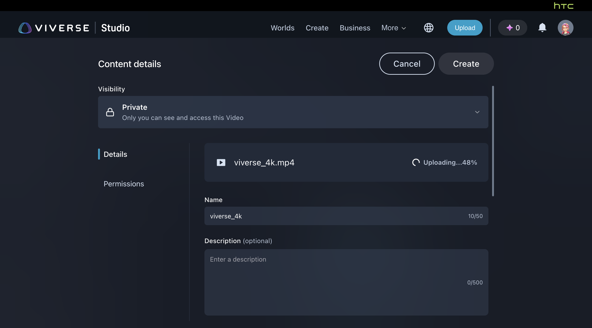
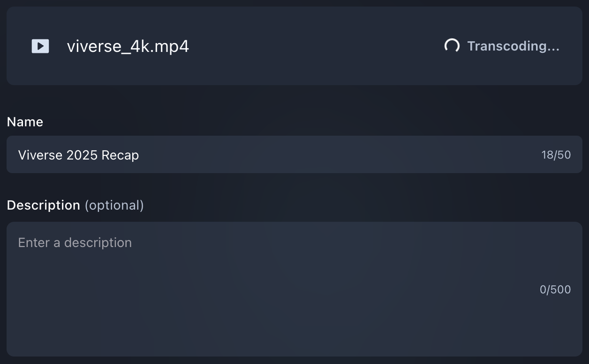
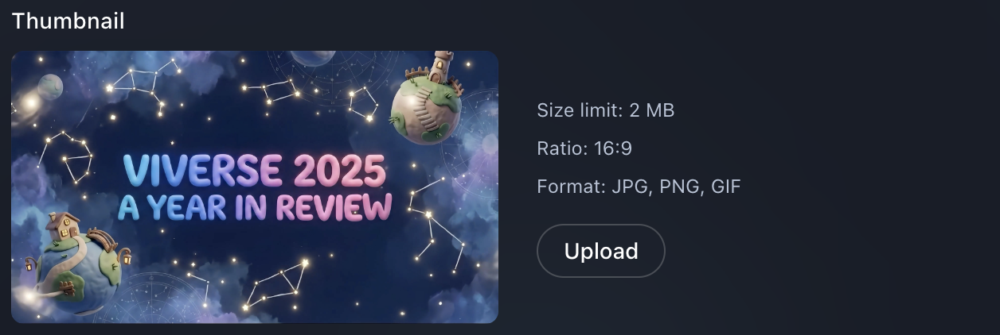
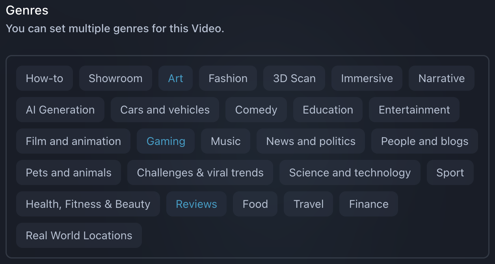
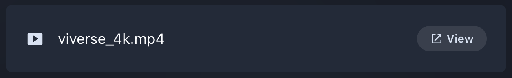
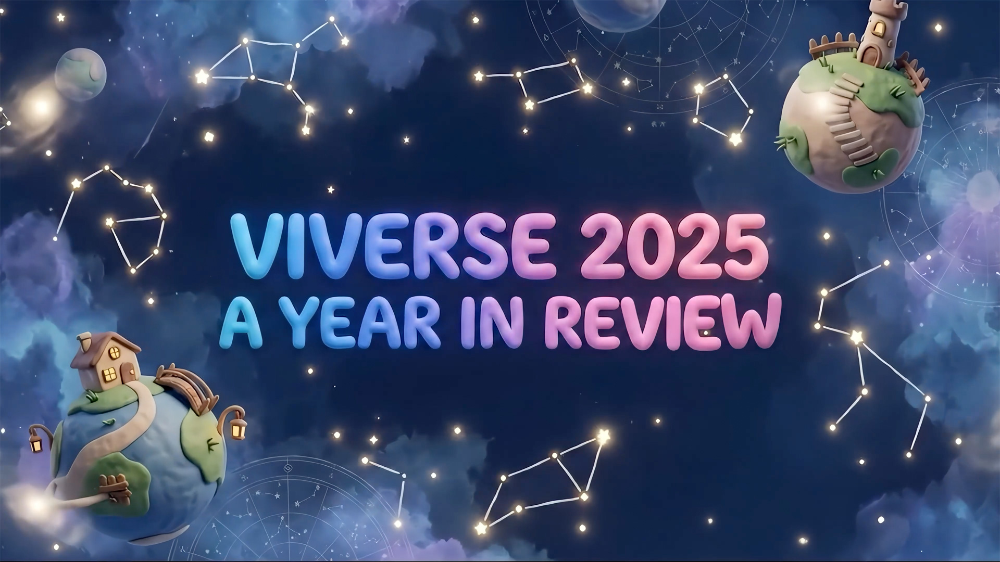
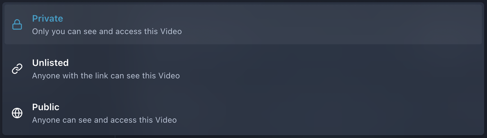
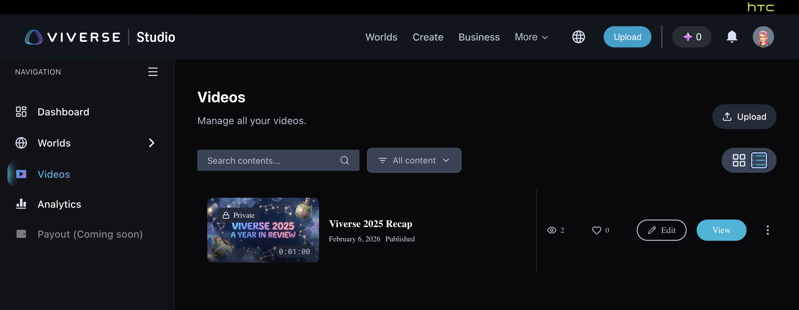

# \[TEMP] Video Content

### Uploading video content


{% column width="66.66666666666666%" %}


### Upload your video file

Open **VIVERSE Studio**, navigate to **Videos** section, and drag-n-drop your video file to start uploading. As alternative, click **Upload** button at the right upper corner.

Please make sure your video is authored in [correct format](temp-video-content.md#input-specifications), otherwise the uploading process will return an error



### Fill in content details

While the video is processing, feel free to fill in content details:

* Video title
* Description (optional)
* Thumbnail image
* Genre tags



### Preview your content

Once the video is uploaded and processed, it is available for preview!

Click **View** button to see your video in a new tab. You can adjust **Quality Settings** on the fly to check how it was [transcoded](temp-video-content.md#transcoding-matrix) into different resolutions.



### Adjust visibility

The visibility is set to **Private** by default, but you can always set it to **Public** or **Unlisted** in the dropdown at the top of the page



### Save and publish

When you're happy with everything, click **Create** button at the top right corner — this will save your video with the **Visibility Settings** you adjusted earlier.

And when you're ready to publish — just click **Edit** and set your video to **Public.** Congratulations, it's now live and can be viewed by entire VIVERSE community!

Please note that you can always hide your video later by setting its **Visibility** back to **Private**




{% column width="33.33333333333334%" %}
<figure><figcaption></figcaption></figure>

<figure><figcaption></figcaption></figure>

<figure><figcaption></figcaption></figure>

<figure><figcaption></figcaption></figure>

<figure><figcaption></figcaption></figure>

<figure><figcaption></figcaption></figure>

<figure><figcaption></figcaption></figure>

<figure><figcaption></figcaption></figure>

<figure><figcaption></figcaption></figure>



### Input video specifications

<table><thead><tr><th width="264.40625">Feature</th><th>Supported Formats and Types</th></tr></thead><tbody><tr><td>File Format</td><td><ul><li>Audio Video Interleave (.avi)</li><li>MPEG-1 (.mpg)</li><li>MPEG-4 (.mp4, .m4v)</li><li>MPEG transport stream (.ts)</li><li>MPEG-2 Transport Stream (.ts, .m2ts)</li><li>QuickTime Movie (.mov)</li><li>Matroska (.mkv)</li><li>Windows Media Video (.wmv)</li><li>Blu-ray Disc Audio-Video (.m2ts)</li></ul></td></tr><tr><td>File Size</td><td><ul><li>Max: 30 GB</li></ul></td></tr><tr><td>Video Codec</td><td><ul><li>MPEG-1/2/4</li><li>AVC (H.264)</li><li>HEVC (H.265)</li><li>Apple ProRes</li><li>AV1</li></ul></td></tr><tr><td>Video Resolution</td><td><ul><li>Max: 4096x2304</li><li>Min: 128x128</li></ul></td></tr><tr><td>Video Duration</td><td><ul><li>Max: 120 min</li></ul></td></tr><tr><td>Video Bitrate</td><td><ul><li>Max: 60 Mbps (H.264)</li><li>Max: 45 Mbps (H.265)</li><li>Min: 60 Kbps</li></ul></td></tr><tr><td>Audio Codec</td><td><ul><li>AAC</li><li>AC-3</li><li>MPEG Audio</li><li>MP3</li></ul></td></tr><tr><td>Audio Bitrate</td><td><ul><li>Max: 576 Kbps</li><li>Min: 24 Kbps</li></ul></td></tr></tbody></table>

### Output video specifications

<table><thead><tr><th width="118.80078125">Resolution</th><th width="144.62109375">Codec / Bitrate</th><th width="169.1484375">Audio Specs</th><th>Description</th></tr></thead><tbody><tr><td><code>3840x2160</code></td><td>H.265 (HEVC) 15 - 30 Mbps</td><td>AAC-LC 384 kbps / 48kHz</td><td>High efficiency for VR/Desktop clarity</td></tr><tr><td><code>2560x1440</code></td><td>H.265 (HEVC) 8 - 14 Mbps</td><td>AAC-LC 384 kbps / 48kHz</td><td>The sweet spot for quality / speed</td></tr><tr><td><code>1920x1080</code></td><td>H.264 (AVC) 4 - 6 Mbps</td><td>AAC-LC 192 kbps / 48kHz</td><td>Fallback for compatibility</td></tr><tr><td><code>1280x720</code></td><td>H.264 (AVC) 2 - 3 Mbps</td><td>AAC-LC 192 kbps / 48kHz</td><td>Mobile optimization</td></tr><tr><td><code>720x480</code></td><td>H.264 (AVC) 1 - 1.5 Mbps</td><td>AAC-LC 128 kbps / 48kHz</td><td>Data saver mode</td></tr><tr><td><code>640x360</code></td><td>H.264 (AVC) 0.8 - 1.0 Mbps</td><td>AAC-LC 128 kbps / 48kHz</td><td>Legacy mobile support</td></tr><tr><td><code>400x240</code></td><td>H.264 (AVC) 0.4 - 0.6 Mbps</td><td>AAC-LC 128 kbps / 48kHz</td><td>Restricted bandwidth</td></tr></tbody></table>

### Transcoding matrix

<table><thead><tr><th width="147.10546875">If You Upload (Input)</th><th width="340.53515625">Your Viewers Get These Resolutions and Frame Rates</th><th width="160.1171875">Max Audio Quality</th><th width="97.3828125" align="center">Quality Badge</th></tr></thead><tbody><tr><td>4K @ 60fps <code>3840x2160</code></td><td><strong>2160p60</strong>, 1440p60, 1080p60, 720p60, <em>480p30</em>, <em>360p30, 240p30</em></td><td><strong>384 kbps</strong> (Hi-Fi)</td><td align="center"><code>4K</code></td></tr><tr><td>4K @ 30fps <code>3840x2160</code></td><td><strong>2160p30</strong>, 1440p30, 1080p30, 720p30, 480p30, 360p30, 240p30</td><td><strong>384 kbps</strong> (Hi-Fi)</td><td align="center"><code>4K</code></td></tr><tr><td>2K @ 60fps <code>2560x1440</code></td><td><strong>1440p60</strong>, 1080p60, 720p60, <em>480p30</em>, <em>360p30, 240p30</em></td><td><strong>384 kbps</strong> (Hi-Fi)</td><td align="center"><code>HD</code></td></tr><tr><td>2K @ 30fps <code>2560x1440</code></td><td><strong>1440p30</strong>, 1080p30, 720p30, 480p30, 360p30, 240p30</td><td><strong>384 kbps</strong> (Hi-Fi)</td><td align="center"><code>HD</code></td></tr><tr><td>1080p @ 60fps <code>1920x1080</code></td><td><strong>1080p60</strong>, 720p60, <em>480p30</em>, <em>360p30, 240p30</em></td><td><strong>192 kbps</strong> (Stereo)</td><td align="center"><code>HD</code></td></tr><tr><td>1080p @ 30fps <code>1920x1080</code></td><td><strong>1080p30</strong>, 720p30, 480p30, 360p30, 240p30</td><td><strong>192 kbps</strong> (Stereo)</td><td align="center"><code>HD</code></td></tr><tr><td>720p @ 60fps <code>1280x720</code></td><td><strong>720p60</strong>, <em>480p30</em>, <em>360p30, 240p30</em></td><td><strong>128 kbps</strong> (Standard)</td><td align="center"><code>HD</code></td></tr><tr><td>720p @ 30fps <code>1280x720</code></td><td><strong>720p30</strong>, 480p30, 360p30, 240p30</td><td><strong>128 kbps</strong> (Standard)</td><td align="center"><code>HD</code></td></tr><tr><td>480p (Any FPS) <code>720x480</code></td><td><strong>480p30</strong>, 360p30, 240p30</td><td><strong>128 kbps</strong> (Standard)</td><td align="center"><code>SD</code></td></tr></tbody></table>
