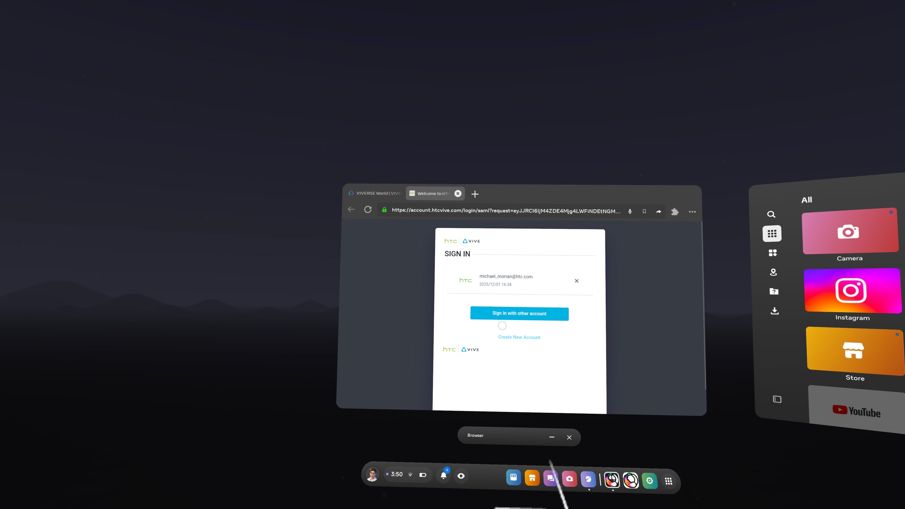

# Open Brush

***

### Introduction

In December 2025, VIVERSE and the Icosa Foundation, Open Brush's steward, teamed up with digital artist SUTU to create a publishing pipeline for Open Brush creators to host, distribute, and monetize their work on VIVERSE. When publishing to VIVERSE, creators are able to share their work on Mobile, Desktop, and VR through the web browser, complete with networked VRM avatars and real-time chat. The publishing process is a simple and powerful way for Open Brush creators to expand their audiences and make their work more accessible!

### Publishing Tutorial



#### Sign into VIVERSE from Open Brush

Within the Open Brush application in VR, navigate to the "Accounts" toolbar and select "VIVERSE" to open the browser window. Enter your VIVERSE account credentials and complete the sign in process, closing the browser window when prompted.

<figure><figcaption></figcaption></figure>



#### Upload to VIVERSE

Navigate to the "Upload" tab and select VIVERSE. Wait for the uploading process to complete.

<figure><figcaption></figcaption></figure>



#### Test and Finish Publishing on VIVERSE Studio

After uploading, a web browser window will open with studio.viverse.com. From here, sign into VIVERSE if necessary, and finish accessing and testing your world.

<figure><figcaption></figcaption></figure>



### Tips & Troubleshooting

What should I do after publishing?

After publishing, we encourage all creators to curate their [world settings](../publishing-with-your-viverse-account.md#world-settings) and [creator profile](../publishing-with-your-viverse-account.md#profile-settings). These help with discoverability on VIVERSE.&#x20;

We also encourage creators to take advantage of the easy sharing of your work on VIVERSE. You can quickly share your VIVERSE url with anyone and even embed it on your artistic website. If you post your world, tag @VIVERSEOfficial on all platforms and we will help share!

How can I monetize my Open Brush work?

We want to help Open Brush creators earn from their awesome work on VIVERSE! Consult our [Monetization Docs](../monetization.md) and contact our team if you have any questions.

How can I get help or request a new feature?

In the [VIVERSE Discord Server](https://discord.gg/viversecreators), we have a dedicated #open-brush channel where we want to hear your feedback, bug reports, and feature requests!

Are there any content restrictions on VIVERSE?

All Open Brush content must abide by the [VIVERSE Terms and Conditions](https://www.viverse.com/terms-of-use). In general, these terms restrict the depiction of NSFW content.

