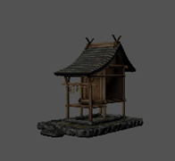

# NIRVANA GROVE by Thorium Labs

***

## Project Overview

Nirvana Grove is a bamboo forest developed with Unity 6. The Terrain tool was used to create the\
landscape, we carefully chose the vegetation, composed of bamboo, grass, ferns and flowers, the\
correct textures and a set of Japanese decorative elements to compose the environment.

### Project Resources

Nirvana Grove can be experienced here: [https://create.viverse.com/FPJWhRP](https://create.viverse.com/FPJWhRP)

An overview of this project can be found here: {Link TBD}

### Core Concepts and Techniques

* Mountainous terrain, intersected by paths and a large lake
* Lush and varied vegetation
* Soundtrack composed of three special nature effects and a calming song
* Japanese decorative elements with special meanings.

***

## Project Creation

### Terrain Generation

We have used Unity’s Terrain tool to build the landscape, a mountainous terrain, intersected by paths\
with a huge lake as a backdrop.

#### 1 - Topology

The terrain is a 1000 by 1000 meters square, and up to 600 meters high. Here is the overview of the\
terrain and the main settings:

<figure><figcaption></figcaption></figure>

<figure><figcaption></figcaption></figure>

#### 2 - Textures

We have used only four textures to depict each detail of the terrain as follows:

| Texture                                         | Name   | Description                                                                                                                                      |
| ----------------------------------------------- | ------ | ------------------------------------------------------------------------------------------------------------------------------------------------ |
|    | Soil   | 
This is where you’ll find all the plants of the terrain.
                                                                               |
|    | Dirt   | 
It’s used to separate the planted area from the paving.
                                                                                |
|  | Paving | 
The pathway area used by the avatars to walk through.
                                                                                  |
|    | Sand   | 
Used for the bottom of the water bodies. This area can’t be accessed by the avatars. It’s only seen through the water shader.
 |

#### 3 - Vegetation

The vegetation plays the most prominent role in the space, but even so, we were very concerned\
about performance and minimized the use of prefabs. The plant textures have a crucial role, as\
avatars can walk among them too.

| Plant                                        | Name        | Type    | Description                                                                                                                            |
| -------------------------------------------- | ----------- | ------- | -------------------------------------------------------------------------------------------------------------------------------------- |
|     | Bamboo 1    | Prefab  | 
Mainly used in the boundary area between the ground and the pavement to create the “tunnel” effect.
              |
|     | Bamboo 2    | Prefab  | 
It’s the core element of the bamboo forest, covering all the main bamboo groves.
                                       |
|          | Grass       | Texture | 
The main element of the soil, filling the gaps between the bamboo tree, ferns and flowers.
                          |
|       | Fern 1      | Texture | 
Ferns are randomly distributed through the soil.
                                                                          |
|       | Fern 2      | Texture | 
Ferns are randomly distributed through the soil.
                                                                          |
|       | Fern 3      | Texture | 
Ferns are randomly distributed through the soil.
                                                                          |
|         | Flower      | Texture | 
Used to create areas of emphasis, interrupting the sequence of green areas with its white tones.
                 |
|  | Bamboo Leaf | Texture | 
Used in the particles systems to simulate the bamboo falling leaves, working in tune with the wind sound effect.
 |

### Sound Elements

The soundtrack is composed of three special nature effects and a calming song to compose the\
landscape and immerse the avatar.

| Sound                          | Type         | Description                                                               |
| ------------------------------ | ------------ | ------------------------------------------------------------------------- |
| Cosmic Breaths of the Universe | Music        | 
A low frequency music that inspires relaxation and calmness.
 |
| Birds                          | Sound Effect | Several chirping birds                                                    |
| Wind                           | Sound Effect | 
Wind blowing over the forest and gently swaying the leaves
      |
| Water                          | Sound Effect | A gentle water flow.                                                      |

### Decoration

The decoration is another important part of the space as it makes the user know that he’s in a\
japanese garden.

| Item                                              | Name             | Description                                                                                                                                                                                                                                                                                                                                                                                                                                                       |
| ------------------------------------------------- | ---------------- | ----------------------------------------------------------------------------------------------------------------------------------------------------------------------------------------------------------------------------------------------------------------------------------------------------------------------------------------------------------------------------------------------------------------------------------------------------------------- |
|        | Torii Gate       | 
A Torii gate is a traditional Japanese gate most commonly found at the entrance of or within a Shinto shrine, marking the transition from the mundane to the sacred. It symbolizes the boundary between the human world and the world of the kami (spirits or deities). Passing through a torii signifies entering a sacred space.
                                                                                                    |
|       | Dog Statues      | 
In Japanese gardens, dog statues, often called Komainu, symbolize protection and are meant to ward off evil spirits. They are typically placed in pairs at the entrance of shrines, temples, and sometimes even homes, acting as guardians. One statue has its mouth open (Agyo), representing the beginning, while the other has its mouth closed (Un-gyo), representing the end, together symbolizing the totality of existence.
 |
|              | Shrine           | 
In a Japanese garden, a small shrine (or hokora) is a miniature representation of a Shinto shrine, serving as a sacred space for venerating kami, spirits or deities associated with nature, ancestors, or historical figures. These shrines are often integrated into the garden's design to connect the physical space with the spiritual realm and foster a sense of harmony and respect for nature.
                            |
|            | Lanterns         | 
Japanese lanterns, or tōrō, are more than just decorative elements; they symbolize light, hope, and are deeply connected to Japanese culture and spirituality. They often appear in gardens, temples, and during festivals, guiding spirits and creating a serene atmosphere.
                                                                                                                                                               |
|  | Stairs and Walls | 
These elements are merely decorative and help to drive the avatar through the scene. They don’t have any special meaning besides the structural one.
                                                                                                                                                                                                                                                                                              |

### Lighting, Skybox and Cloud System

These are the final elements that wrap up the scene. They create the dramatic backdrop to create an\
even more immersive experience.

| Item                                                               | Type              | Description                                                                                                                                                                              |
| ------------------------------------------------------------------ | ----------------- | ---------------------------------------------------------------------------------------------------------------------------------------------------------------------------------------- |
|       | Directional Light | 
This is the main light source of the scene and the one that creates the whole sunset atmosphere. It’s aligned with the sun at the Skybox.
                             |
| .png>) | Directional Light | 
This is the second light source of the scene and it helps to create more lighting and shadows against the main light source.
                                          |
|                               | Skybox            | 
A sunset Skybox with a distant moon and stars.
                                                                                                                                 |
|                       | Cloud System      | 
One of my favorite items to compose a scene. It has two levels of clouds, low and high, with separate settings like cloud format, density, amount, speed and color
 |

***

## Publish to VIVERSE

Here are the next steps in order to have your space published to VIVERSE.



### Login to VIVERSE

Open a terminal session and type `viverse-cli auth login` and provide your\
credentials. 

<figure><figcaption></figcaption></figure>




### Change directory

Change to the directory where your build is located `cd D:\Unity\4 - HTC Viverse\Viverse`\
`Test\WebGL Builds`



### Create App

Create the VIVERSE app by typing `viverse-cli app create`. You’ll get the App ID of your space to be used when publishing it.



### Publish

Publish to VIVERSE by typing viverse-cli app publish `D:\Unity\4 - HTC Viverse\Viverse`\
`Test\WebGL Builds\Build --app-id c47rbqg6v8`, with the full path or `viverse-cli app publish --app-id c47rbqg6v8` if you are already located in the right directory

<figure><figcaption></figcaption></figure>




### Preview Content

Navigate to the preview url created for the world. You can also access the world and its settings in studio.viverse.com/content

<figure><figcaption></figcaption></figure>



### Submit for Approval

By default, worlds uploaded will only be accessible via preview urls. For placement and curation on our webpages, meaning your experience will be easier to share, please submit for review.

<figure><figcaption></figcaption></figure>


