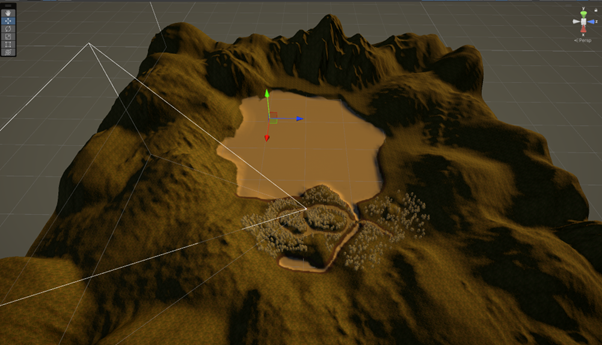
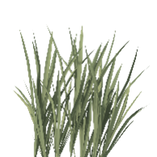
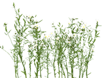
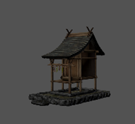
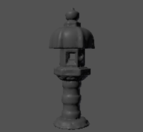
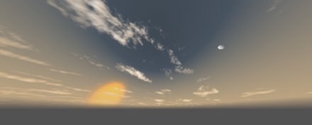

# NIRVANA GROVE por Thorium Labs | PT

***

## Visão Geral do Projeto

Nirvana Grove é uma floresta de bambu desenvolvida com Unity 6. A ferramenta Terrain foi usada\
para criar a paisagem, escolhemos cuidadosamente a vegetação, composta por bambu, grama,\
samambaias e flores, as texturas corretas e um conjunto de elementos decorativos japoneses para\
compor o ambiente.

### Recursos do Projeto

O Nirvana Grove pode ser vivenciado aqui: [https://create.viverse.com/FPJWhRP](https://create.viverse.com/FPJWhRP)

Uma visão geral deste projeto pode ser encontrada aqui: {Link TBD}

### Conceitos e Técnicas Essencials

* Terreno montanhoso, entrecortado por trilhas e um grande lago.
* Vegetação exuberante e variada.
* Trilha sonora composta por três efeitos especiais da natureza e uma música relaxante.
* Elementos decorativos japoneses com significados especiais

***

## Criação de Projeto

### Geração de Terreno

Usamos a ferramenta Terrain do Unity para construir a paisagem, um terreno montanhoso,\
interseccionado por caminhos com um enorme lago como pano de fundo.

#### 1 - Topologia

O terreno tem 1.000 por 1.000 metros quadrados e chega a 600 metros de altura. Aqui está uma\
visão geral do terreno e dos principais cenários:

<figure><figcaption></figcaption></figure>

<figure><figcaption></figcaption></figure>

#### 2 - Texturas

Utilizamos apenas quatro texturas para representar cada detalhe do terreno da seguinte maneira:

| Textura                                      | Nome      | Descrição                                                                                                                                 |
| -------------------------------------------- | --------- | ----------------------------------------------------------------------------------------------------------------------------------------- |
|    | Solo      | 
É aqui que você encontrará todas as plantas do terreno.
                                                                         |
|    | Barro     | É utilizado para separar a área plantada da pavimentação.                                                                                 |
|  | Pavimento | A área do caminho usada pelos avatares para caminhar.                                                                                     |
|    | Areia     | 
Usado para o fundo dos corpos d'água. Esta área não pode ser acessada pelos avatares. Ela só é vista através do shader de água.
 |

#### 3 - Vegetação

A vegetação desempenha o papel mais proeminente no espaço, mas mesmo assim, nos\
preocupamos muito com o desempenho e minimizamos o uso de pré-fabricados. As texturas das\
plantas têm um papel crucial, pois os avatares também podem caminhar entre elas.

| Planta                                                                                                      | Nome           | Tipo    | Descrição                                                                                                                                     |
| ----------------------------------------------------------------------------------------------------------- | -------------- | ------- | --------------------------------------------------------------------------------------------------------------------------------------------- |
| 
<figure><figcaption></figcaption></figure>
 | Bambu 1        | Prefab  | 
Usado principalmente na área de divisa entre o solo e o pavimento para criar o efeito “túnel”
                                 |
| 
<figure><figcaption></figcaption></figure>
 | Bambu 2        | Prefab  | 
É o elemento central da floresta de bambu, cobrindo todos os principais bosques de bambu
                                         |
| 
<figure><figcaption></figcaption></figure>
        | Grama          | Textura | 
O principal elemento do solo, preenchendo as lacunas entre o bambu, as samambaias e as flores
                              |
| 
<figure><figcaption></figcaption></figure>
       | Samambaia 1    | Textura | 
As samambaias estão distribuídas aleatoriamente pelo solo.
                                                                       |
| 
<figure><figcaption></figcaption></figure>
       | Samambaia 2    | Textura | 
As samambaias estão distribuídas aleatoriamente pelo solo.
                                                                       |
| 
<figure><figcaption></figcaption></figure>
       | Samambaia 3    | Textura | 
As samambaias estão distribuídas aleatoriamente pelo solo.
                                                                       |
| 
<figure><figcaption></figcaption></figure>
       | Flor           | Textura | 
Usado para criar áreas de destaque, interrompendo a sequência de áreas verdes com seus tons brancos.
                       |
| 
<figure><figcaption></figcaption></figure>
  | Folha de Bambu | Textura | 
Usado nos sistemas de partículas para simular a queda das folhas de bambu, trabalhando em sintonia com o efeito sonoro do vento.
 |

### Sound Elements

The soundtrack is composed of three special nature effects and a calming song to compose the\
landscape and immerse the avatar.

| Som                            | Tipo          | Descrição                                                                       |
| ------------------------------ | ------------- | ------------------------------------------------------------------------------- |
| Cosmic Breaths of the Universe | Música        | 
Uma música de baixa frequência que inspira relaxamento e calma.
    |
| Pássaros                       | Efeito Sonoro | Vários pássaros cantando.                                                       |
| Vento                          | Efeito Sonoro | 
Vento soprando sobre a floresta e balançando suavemente as folhas.
 |
| Água                           | Efeito Sonoro | Um fluxo suave de água.                                                         |

### Decoração

A decoração é outro ponto importante do espaço, pois faz com que o usuário se sinta em um jardim\
japonês.

| Item                                                                                                            | Nome              | Descrição                                                                                                                                                                                                                                                                                                                                                                                                                                                                                               |
| --------------------------------------------------------------------------------------------------------------- | ----------------- | ------------------------------------------------------------------------------------------------------------------------------------------------------------------------------------------------------------------------------------------------------------------------------------------------------------------------------------------------------------------------------------------------------------------------------------------------------------------------------------------------------- |
| 
<figure><figcaption></figcaption></figure>
       | Portão Torii      | 
Um portão Torii é um portão tradicional japonês, mais comumente encontrado na entrada ou dentro de um santuário xintoísta, marcando a transição do mundano para o sagrado. Simboliza a fronteira entre o mundo humano e o mundo dos kami (espíritos ou divindades). Passar por um torii significa entrar em um espaço sagrado.
                                                                                                                                              |
| 
<figure><figcaption></figcaption></figure>
      | Estátuas de Cães  | 
Nos jardins japoneses, estátuas de cães, frequentemente chamadas de Komainu, simbolizam proteção e servem para afastar espíritos malignos. Elas são normalmente colocadas aos pares na entrada de santuários, templos e, às vezes, até mesmo de casas, atuando como guardiões. Uma estátua tem a boca aberta (A-gyo), representando o início, enquanto a outra tem a boca fechada (Un-gyo), representando o fim, simbolizando, juntas, a totalidade da existência.
 |
| 
<figure><figcaption></figcaption></figure>
           | Santuário         | 
Em um jardim japonês, um pequeno santuário (ou hokora) é uma representação em miniatura de um santuário xintoísta, servindo como um espaço sagrado para venerar kami, espíritos ou divindades associadas à natureza, ancestrais ou figuras históricas. Esses santuários são frequentemente integrados ao projeto do jardim para conectar o espaço físico com o reino espiritual e promover um senso de harmonia e respeito pela natureza.
                             |
| 
<figure><figcaption></figcaption></figure>
         | Lanternas         | 
As lanternas japonesas, ou tōrō, são mais do que meros elementos decorativos; elas simbolizam luz, esperança e estão profundamente conectadas à cultura e espiritualidade japonesas. Elas costumam aparecer em jardins, templos e durante festivais, guiando espíritos e criando uma atmosfera serena.
                                                                                                                                                                            |
| 
<figure><figcaption></figcaption></figure>
 | Escadas e Paredes | 
Esses elementos são meramente decorativos e ajudam a conduzir o avatar pela cena. Não têm nenhum significado especial além do estrutural.
                                                                                                                                                                                                                                                                                                                                               |

### Illuminação, Skubox e Sistem de Nuvens

Esses são os elementos finais que encerram a cena. Eles criam o cenário dramático para criar uma\
experiência ainda mais imersiva

| Item                                                                                                                             | Tipo              | Descrição                                                                                                                                                                                   |
| -------------------------------------------------------------------------------------------------------------------------------- | ----------------- | ------------------------------------------------------------------------------------------------------------------------------------------------------------------------------------------- |
| 
<figure><figcaption></figcaption></figure>
      | Directional Light | 
Esta é a principal fonte de luz da cena e a que cria toda a atmosfera do pôr do sol. Ela está alinhada com o sol no Skybox.
                                              |
| 
<figure><figcaption></figcaption></figure>
 | Directional Light | 
Esta é a segunda fonte de luz da cena e ajuda a criar mais iluminação e sombras contra a fonte de luz principal.
                                                               |
| 
<figure><figcaption></figcaption></figure>
                            | Skybox            | 
Um Skybox de pôr do sol com uma lua distante e estrelas.
                                                                                                                          |
| 
<figure><figcaption></figcaption></figure>
                      | Sistema de Nuvens | 
Um dos meus itens favoritos para compor uma cena. Possui dois níveis de nuvens, baixo e alto, com configurações separadas, como formato, densidade, quantidade, velocidade e cor.
 |

***

## Publicar para a VIVERSE

Aqui estão os próximos passos para que seu espaço seja publicado no VIVERSE.



### Login no VIVERSE

Abra uma sessão de terminal e digite `viverse-cli auth login` e forneça suas\
credenciais.

<figure><figcaption></figcaption></figure>




### Mude para o directório

Mude para o diretório onde sua compilação está localizada `cd D:\Unity\4 - HTC Viverse\Viverse Test\WebGL Builds`



### Crie o aplicativo

Crie o aplicativo VIVERSE digitando `viverse-cli app create`. Você receberá o ID do aplicativo do seu espaço para ser usado ao publicá-lo.



### Publique

Publique no VIVERSE digitando `viverse-cli app publish D:\Unity\4 - HTC Viverse\Viverse Test\WebGL Builds\Build --app-id c47rbqg6v8`, com o caminho completo ou `viverse-cli app publish --app-id c47rbqg6v8` se você já estiver localizado no diretório correto.

<figure><figcaption></figcaption></figure>




### Visualização

Navegue até a URL de visualização criada para o mundo. Você também pode acessar o mundo e suas configurações em studio.viverse.com/content

<figure><figcaption></figcaption></figure>



### Envie-os para análise

Por padrão, os mundos enviados só serão acessíveis por meio de URLs de pré-visualização. Para posicionamento e curadoria em nossas páginas, facilitando o compartilhamento da sua experiência, envie-os para análise.

<figure><figcaption></figcaption></figure>


