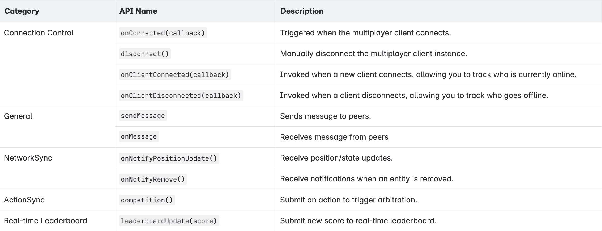

# Matchmaking & Networking SDK

***

> **BEFORE GETTING STARTED:** you must [authenticate with VIVERSE](login-and-authentication-for-the-sdk/), including App ID creation in VIVERSE Studio, before requesting Play SDK services.

## Initialize the \`playClient\` instance

Before using any Play SDK features, you must initialize the client instance. This global reference ensures that the Play SDK is available throughout your application.

Example Code:

<pre><code>globalThis.playClient = new globalThis.viverse.play();
</code></pre>

## Matchmaking API

The matchmaking and networking APIs must then be initialized individually.

Example Code:

<pre><code>globalThis.matchmakingClient = await playClient.newMatchmakingClient(appId);
</code></pre>

<figure><figcaption></figcaption></figure>

> **NOTE:** Support for random and ticket-based matchmaking is under development.

### Disconnect

Disconnect multiplayer client connection

<pre><code>matchmakingClient.disconnect();
</code></pre>

### Setup Actor Info

Set the player’s session ID, name, and custom properties in the current room.

This API should be called before creating or joining a room. The SDK will store the actor information and automatically attach it to the player upon entering the room.

Example Code:

<pre><code>await matchmakingClient.setActor({
    session_id: session_id,
    name: name,
    properties: {"level": 8,"skill": 8}
});

// Return values:
{
    "session_id": session_id,
    "name": "name",
    "properties": {"level": 8,"skill": 8},
    "is_master_client": false
}

//Failed Value:
{
    "success": false,
    "message": "error message"
}
</code></pre>

### Setup Actor Properties
Update the player’s properties.

<figure><figcaption></figcaption></figure>

Example code:

<pre><code>await matchmakingClient.setActorProperties({"level": 8,"skill": 8, "team": "A"});

// Return values:
{
    "level": 8,
    "skill": 8,
    "team": "A"
}

//Failed Value:
{
    "success": false,
    "message": "error message"
}
</code></pre>

### Create & Configure a Room

Call `createRoom()` with a configuration object like so:

<figure><figcaption></figcaption></figure>

Example code:

<pre><code>await matchmakingClient.createRoom({
    name: 'Casey's room',
    mode: 'team',
    maxPlayers: 4,
    minPlayers: 2,
    properties: {
        "level": 13,
        "skill": 21
    }
});

// Return values:
{
    "id": "a3c1f45e-ef7e-45b9-a0e2-60aea50dfc16",
    "app_id": "app-29375017",
    "mode": "Room",
    "name": "Actor962's room55",
    "actors": [
        {
            "session_id": "cc3d2a1c-34de-4b4e-9a57-f05ec6210b9c",
            "name": "Actor962",
            "properties": {
                "level": 0,
                "levelThreshold": 0
            },
            "is_master_client": true
        }
    ],
    "max_players": 4,
    "min_players": 2,
    "is_closed": false,
    "is_game_started": false,
    "properties": {},
    "master_client_id": "cc3d2a1c-34de-4b4e-9a57-f05ec6210b9c",
    "game_session": "a3c1f45e-ef7e-45b9-a0e2-60aea50dfc16",
    "created_by_me": true
}

//Failed Value:
{
    "success": false,
    "message": "error message"
}
</code></pre>

### Set Room Properties
Set the room’s custom properties.

<figure><figcaption></figcaption></figure>

Example code:
<pre><code>await matchmakingClient.setRoomProperties({"custom_value": "custom_value"});

// Return values:
{
    "custom_value": "custom_value"
}

//Failed Value:
{
    "success": false,
    "message": "error message"
}
</code></pre>

### Join Room by RoomID

Join an existing room by its room ID.

<figure><figcaption></figcaption></figure>

Example code:

<pre><code>await matchmakingClient.joinRoom(room_id);

//Return Value
{
    "id": "a3c1f45e-ef7e-45b9-a0e2-60aea50dfc16",
    "mode": "Room",
    "name": "Actor962's room55",
    "actors": [
        {
            "session_id": "cc3d2a1c-34de-4b4e-9a57-f05ec6210b9c",
            "name": "Actor962",
            "properties": {
                "level": 0,
                "levelThreshold": 0
            },
            "is_master_client": true
        },
        {
            "session_id": "85733119-ef17-4cd5-a02e-421f16bb5c28",
            "name": "Actor34",
            "properties": {
                "level": 8,
                "levelThreshold": 8
            },
            "is_master_client": false
        }
    ],
    "max_players": 4,
    "min_players": 2,
    "is_closed": false,
    "properties": {},
    "master_client_id": "cc3d2a1c-34de-4b4e-9a57-f05ec6210b9c",
    "game_session": "a3c1f45e-ef7e-45b9-a0e2-60aea50dfc16",
    "created_by_me": false,
    "playerCount": 2
}

//Failed Value:
{
    "success": false,
    "message": "error message"
}
</code></pre>

### Leave Room

Leave the current room that the player has joined.

Example Code:

<pre><code>await matchmakingClient.leaveRoom();

//Return Value
{
  "success": true
}

//Failed Value:
{
  "success": false,
  "message": "error message"
}
</code></pre>

### Close Room

Close the current room. Only the room creator can perform this action.

Example Code:

<pre><code>await matchmakingClient.closeRoom();

//Return Value
{
  "success": true
}

//Failed Value:
{
  "success": false,
  "message": "error message"
}
</code></pre>

### Get Available Rooms

Retrieve the current list ofavailable rooms that can be joined.

Example Code:

<pre><code>matchmakingClient.getAvailableRooms();

//Return Value
{
  "success": true,
  "rooms": [
    {
      "id": "78e4c44a-4d3f-433c-820f-805c0b915dfb",
      "app_id": "app_id",
      "mode": "team",
      "name": "Alex's room",
      "actors": [
        {
          "session_id": "7dc0bf85-ff81-4bcd-907d-1ad35d4aad1f",
          "name": "Alex",
          "properties": {
            "level": 24,
            "skill": 90
          },
          "is_master_client": true
        }
      ],
      "max_players": 4,
      "min_players": 2,
      "is_closed": false,
      "properties": {},
      "master_client_id": "7dc0bf85-ff81-4bcd-907d-1ad35d4aad1f",
      "game_session": "78e4c44a-4d3f-433c-820f-805c0b915dfb"
    }
  ]
}

//Failed Value:
{
  "success": false,
  "message": "error message"
}
</code></pre>

### Get My Room Actors

Get the latest list of all actors (players) currently in the room.

Example Code:

<pre><code>matchmakingClient.getMyRoomActors();

//Return Value
{
  "success": true,
  "actors": [
    {
      "session_id": "76192ade-5bb5-4937-835d-c936b7e9e6df",
      "name": "Alex",
      "properties": {
        "level": 22,
        "skill": 33
      },
      "is_master_client": true
    }
  ]
}

//Failed Value:
{
  "success": false,
  "message": "error message"
}
</code></pre>

### Start Game

The room master starts the game and notify all clients to begin. Room info update(is_game_started=true)

<pre><code>await matchmakingClient.startGame();

//Return Value
{
    "success": true,
    "message": "Room game start notify"
}

//Failed Value:
{
    "success": false,
    "message": "error message"
}
</code></pre>

## Matchmaking Event Listeners

You can listen to matchmaking events using `matchmakingClient.on(eventName, callback)` . These events help you track lobby status, room lifecycle, and player activity in real time.

<figure><figcaption></figcaption></figure>

### onConnect Event

Triggered when the client successfully connects to the SDK.

<pre><code>matchmakingClient.on("onConnect", () => {
  console.log("SDK connected.");
});</code></pre>

### onJoinedLobby Event

Triggered when client joins the lobby.

<pre><code>matchmakingClient.on("onJoinedLobby", () => {
  console.log("Joined lobby.");
});</code></pre>

### onJoinRoom Event

Triggered when the client joins a room.

<pre><code>matchmakingClient.on("onJoinRoom", (room) => {
  console.log("Joined room:", room);
});

//Return Value:
{
    "id": "5478c615-f067-4d1e-ba9a-ea44c628189c",
    "mode": "team",
    "name": "Jordan's room",
    "actors": [
        {
            "session_id": "212187e3-a11a-4bbb-8325-9dafd895f1cb",
            "name": "Jordan",
            "properties": {
                "level": 22,
                "skill": 5
            },
            "is_master_client": true
        }
    ],
    "max_players": 4,
    "min_players": 2,
    "is_closed": false,
    "properties": {},
    "master_client_id": "212187e3-a11a-4bbb-8325-9dafd895f1cb",
    "game_session": "5478c615-f067-4d1e-ba9a-ea44c628189c",
    "created_by_me": true,
    "playerCount": 1
}
</code></pre>

### onRoomListUpdate Event

Triggered when the list of rooms in the lobby is updated.

<pre><code>matchmakingClient.on("onRoomListUpdate", (rooms) => {
  console.log("Updated room list:", rooms);
});

//Return Value:
[
    {
        "id": "7c6fd350-2187-4a63-94ff-6955c40612da",
        "app_id": "app-29375025",
        "mode": "Room",
        "name": "Actor488's room52",
        "actors": [
            {
                "session_id": "035f6e43-e73c-4a08-aa5a-35662691928a",
                "name": "Actor488",
                "properties": 
                    "level": 8,
                    "levelThreshold": 7
                },
                "is_master_client": true
            }
        ],
        "max_players": 4,
        "min_players": 2,
        "is_closed": false,
        "is_game_started": false,
        "properties": {},
        "master_client_id": "035f6e43-e73c-4a08-aa5a-35662691928a",
        "game_session": "7c6fd350-2187-4a63-94ff-6955c40612da"
    }
]
</code></pre>

### onRoomActorChange Event

Triggered when the list of actors in the current room changes.

<pre><code>matchmakingClient.on("onRoomActorChange", (actors) => {
  console.log("Current room actors:", actors);
});

//Return Value:
[
    {
        "session_id": "035f6e43-e73c-4a08-aa5a-35662691928a",
        "name": "Actor488",
        "properties": {
            "level": 8,
            "levelThreshold": 7
        },
        "is_master_client": true
    },
    {
        "session_id": "5079cf88-1f8e-470b-9513-54edb38188d3",
        "name": "Actor183",
        "properties": {
            "level": 5,
            "levelThreshold": 6
        },
        "is_master_client": false
    }
]
</code></pre>

### onRoomClosed Event

Triggered whe nthe room is successfully closed by the client.

<pre><code>matchmakingClient.on("onRoomClosed", (room : Room) => {
  console.log("Room closed: ", room);
});
</code></pre>

### onError Event

Triggered when an error occurs with a client request.

<pre><code>matchmakingClient.on("onError", (error) => {
  console.error("Matchmaking error:", error.message);
});</code></pre>

### stateChange Event

Triggered when the client connection state changes.

<pre><code>matchmakingClient.on("stateChange", (state) => {
  console.log("Connection state changed to:", state);
});</code></pre>

### onGameStartNotify Event

Trigger when the room master starts the game, notifying all clients to begin.

<pre><code>matchmakingClient.on("onGameStartNotify", async () => {
   console.log("Game has started! You have been assigned to a room. Preparing to join the game!");
});
</code></pre>

## Multiplayer APIs

### Prerequisites

Before using any Multiplayer APIs, you must:

* Initialize the [Play client instance](matchmaking-and-networking-sdk.md#initialize-the-playclient-instance)
* Construct a `MultiplayerClient` instance with a valid room ID and app ID
* Call `init()` to establish the multiplayer session

### Initialize Multiplayer Client

<figure><figcaption></figcaption></figure>

Example Code:

<pre><code>//initialize multiplayer client instance
const roomId = 'example_room'; //obtained from matchmaking
const appId = 'example_game'; //App ID from VIVERSE Studio
const userSessionId = 'cutom_userSessionID' // optional, set user session id

// init options, optional
const options = {
  'modules': {
    'networkSync': { enabled: true, desc: 'networkSync description'},
    'actionSync': { enabled: true, desc: 'actionSync description'},
    'leaderboard': { enabled: true, desc: 'leaderboard description'}
  }
}

globalThis.multiplayerClient = new globalThis.play.MultiplayerClient(roomId, appId, userSessionId);

const info = await globalThis.multiplayerClient.init(options);
//Return Value:
{
    "session_id": "user_session_id",
    "room_id": "example_room",
    "app_id": "example_game"
    "modules": [
        {
            "type": "network_sync",
            "desc": "network sync description"
        },
        {
            "type": "action_sync",
            "desc": "action sync description"
        },
        {
            "type": "leaderboard",
            "desc": "leaderboard description"
        }
    ]
}
</code></pre>


`MultiplayerClient` is a global class under `play` namespace and is not created via `playClient`. However, Play SDK must still be initialized first.


<figure><figcaption></figcaption></figure>

### Connection Control

Handles the multiplayer client's connection lifecycle. Use these APIs to detect when the client is ready and to manually disconnect when needed.

#### Connect Event

Triggered when the multiplayer client establishes a connection. Use this to perform setup logic after the session is ready.

Example Code:

<pre><code>globalThis.multiplayerClient.onConnected(() => {
  console.log("Multiplayer client connected.");
});
</code></pre>

#### Disconnect

Manually disconnects the multiplayer client instance. Useful for cleanup or leaving the session before navigating away.

Example Code:

<pre><code>globalThis.multiplayerClient.disconnect();
</code></pre>

#### Client Connect Event

Invoked when a new client connects, allowing you to track who is currently online.

Example Code:

<pre><code>globalThis.multiplayerClient.onClientConnected(userSessionID => 
   appendLog(`onClientConnected, userSessionID: ${userSessionID}`)
);
</code></pre>

#### Client Disconnect Event

Invoked when a client disconnects, allowing you to track who goes offline.

Example Code:

<pre><code>globalThis.multiplayerClient.onClientDisconnected(userSessionID => 
   appendLog(`onClientDisconnected, userSessionID: ${userSessionID}`)
);
</code></pre>

### General

The `General` module lets creators send and receive custom messages between peers in multiplayer scenes. Use this flexible channel when you need to define your own data format for syncing data, triggering events, or implementing custom game logic.

#### sendMessage

Sends message to peers.

<figure><figcaption></figcaption></figure>
<pre><code>globalThis.multiplayerClient.general.sendMessage(message);
</code></pre>

#### onMessage

Receives message from peers.

<pre><code>globalThis.multiplayerClient.general.onMessage((message) => {
   console.log(`📩 onMessage: ${message}`);
});</code></pre>

### NetworkSync

This module synchronizes real-time position and entity state across players. This module is commonly used to update user or object positions in multiplayer scenes.

#### updateMyPosition

Sends my position request to the server.

<figure><figcaption></figcaption></figure>

Example Code:

<pre><code>const positionData = {x: 1, y: 2, z: 3, w: 4}
globalThis.multiplayerClient.networksync.updateMyPosition(positionData);
</code></pre>

#### updateEntityPosition

Sends entity's position request to the server.

<figure><figcaption></figcaption></figure>

<pre><code>const positionData = {x: 1, y: 2, z: 3, w: 4}
globalThis.multiplayerClient.networksync.updateEntityPosition('entity_id', positionData);
</code></pre>

#### onNotifyPositionUpdate

Triggered when a user or entity's position or state is updated in the scene.

- Callback Payload: (data: NetworkSyncEvent)
<pre><code>globalThis.multiplayerClient.networksync.onNotifyPositionUpdate((data: NetworkSyncEvent) => {
   if  (data.entity_type == 1) { // User
      console.log("networksync/notify_position/ update user: ", data.user_id, data.data);
   } else if (data.entity_type == 2) { // Enity
      console.log("networksync/notify_position/ update entity: ", data.entity_id, data.data);
   } 
});
</code></pre>

#### onNotifyRemove

Tirggered when a user or an entity is removed from the scene.

Example Code:

<pre><code>globalThis.multiplayerClient.networksync.onNotifyRemove((data: NetworkSyncEvent) => {
   if (data.entity_type == 1) {
      console.log("networksync/notify_remove/ remove user: ", data.user_id);
   }
   else if (data.entity_type == 2) {
      console.log("networksync/notify_remove/ remove user: ", data.user_id ," entityId: ", data.entity_id);
   }
});
</code></pre>

### ActionSync

This module handles action-level communication and arbitration between players. Use this module when multiple players may trigger the same event (e.g. interacting with an object), and only one action should take effect — a process known as competition.

#### competition

Sends an action request to the server for arbitration.


All parameters must match across clients to be recognized as the same competition event.


<figure><figcaption></figcaption></figure>

Example Code:

<pre><code>globalThis.multiplayerClient.actionsync.competition(actionName, actionMsg, actionId);
</code></pre>

#### onCompetition

Triggered when a competition result is returned from the server.


Use this to determine which player won the arbitration and proceed accordingly in your game logic (e.g. only the winner picks up the item).


- Callback Payload: (data: ActionSyncCompetitionEvent)
  
Example Code:

<pre><code>globalThis.multiplayerClient.actionsync.onCompetition((data) => {
  console.log("actionsync/competition:", data);
});

//Return Value:
{
    "competition": {
        "successor": "7794e184-9e3c-48f4-866d-9dc6e197ea42",
        "action_name": "pickupExtinguisher",
        "action_id": "4ac20fa1-a8a8-4b7a-90ad-571b89c6a10b",
        "action_msg": "viverse",
        "update_time": 1747645510990
    }
}
</code></pre>

### Real-time Leaderboard

This module handles real-time score reporting and live leaderboard updates across players during gameplay. Use this module to update a player's score and receive ranking changes in real time.

#### leaderboardUpdate

Submits a new score to the real-time leaderboard.

<figure><figcaption></figcaption></figure>

<pre><code>globalThis.multiplayerClient.leaderboard.leaderboardUpdate(score);
</code></pre>

#### onLeaderboardUpdate

Triggered when the leaderboard is updated and a new score ranking is available.

Example Code:

<pre><code>globalThis.multiplayerClient.leaderboard.onLeaderboardUpdate((data) => {
  console.log("leaderboard/update_record:", data);
});

// Return Value:
{
    "leaderboard": [
        {
            "user_id": "72f3a185-fbc0-4fdb-b64d-4e147de893e3",
            "score": 92,
            "rank": 1
        },
        {
            "user_id": "a1c5faad-87ab-4b6e-a5e8-b9ae723fce78",
            "score": 22,
            "rank": 2
        }
    ]
}
</code></pre>
