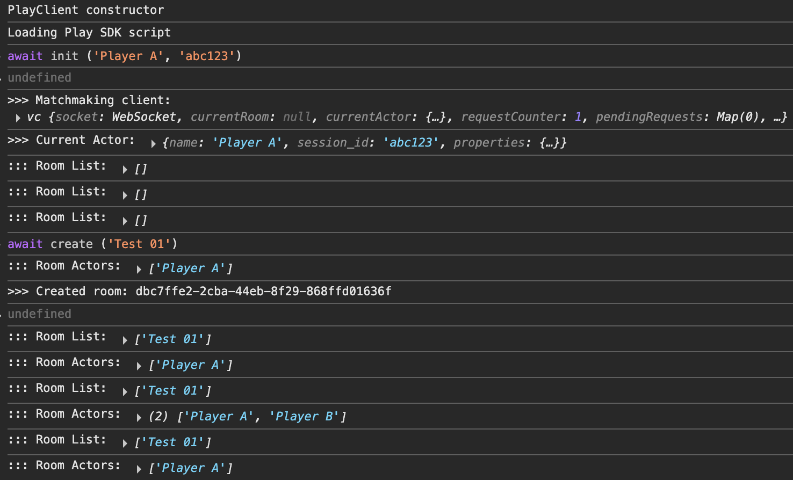
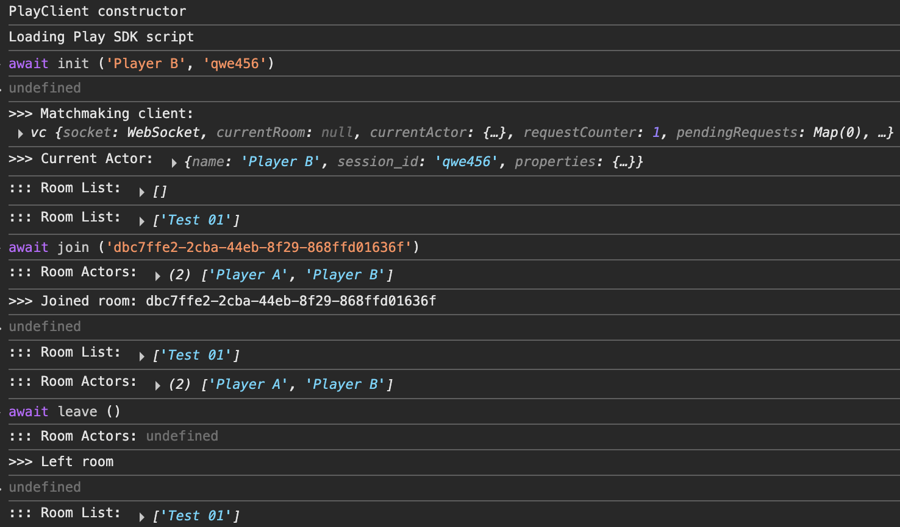

# PlayCanvas Matchmaking example: Basics (WIP)

### Pre-requisite: Create a World and App ID in VIVERSE Studio

In order to use VIVERSE SDKs you would need to create a World first and retrieve its App ID, which can be done with [VIVERSE Studio](https://studio.viverse.com/upload). This process is described in detail in [our documentation on VIVERSE Studio](https://app.gitbook.com/s/4pMiThqqrBzfvP8uy5am/publishing-with-your-viverse-account) — but for now you can simply create a new app and copy its App ID to get started.

> _**NOTE:** VIVERSE SDKs cannot be used with projects published via the PlayCanvas Create SDK extension, which do not have App IDs._

### Step 1: Create a new PlayCanvas project and add the VIVERSE SDK as an external script

Let's create a new blank PlayCanvas project or use an already created one that you have. Go to the SETTINGS > EXTERNAL SCRIPTS and add a new script there: [`https://www.viverse.com/static-assets/viverse-sdk/index.umd.cjs`](https://www.viverse.com/static-assets/viverse-sdk/index.umd.cjs). This will ensure the VIVERSE SDK is loaded first and your PlayCanvas logic has full access to its functionality.

### Step 2: Create a new script and initialize the SDK

For the purpose of this tutorial we will be using recently introduced [ESM scripts](https://developer.playcanvas.com/user-manual/scripting/fundamentals/esm-scripts/), although you can still follow it with the [Classic scripting](https://developer.playcanvas.com/user-manual/scripting/fundamentals/script-attributes/classic/) as well. Let's start with creating a new script called `main.mjs` and use built-in `initialize()` method to instantiate Play SDK client:

```javascript
// @ts-nocheck
import { Script, Entity, guid } from 'playcanvas';

// If Viverse SDK is set up correctly
// `viverse`should be available on window / globalThis
const { viverse } = globalThis;

export class Main extends Script
{
    static scriptName = 'Main';
    
    initialize ()
    {
        this.appId = 'ajhzug2zwb'; // replace with your App ID
        this.playClient = new viverse.Play ();
        
        console.log (`>>> Play client:`, this.playClient);
    }
}
```

<figure><figcaption></figcaption></figure>


If you're new to PlayCanvas Editor and scripting system - we would strongly recommend consulting with official [PlayCanvas Scripting Guide](https://developer.playcanvas.com/user-manual/scripting/) before going any further. From now on we assume you're familiar with how scripts are added to the project, parsed and attached to Entities.


Congrats with a great start! Now if you launch your PlayCanvas project — you will see Play SDK client initialized and logged into the console.

### Step 3: Initialize Matchmaking client and setup an Actor

The Play SDK client is just a starting point and doesn't do anything on its own. In order to make use of its matchmaking features we would need to initialize Matchmaking client first and associate some Actor with our user:

```javascript
// @ts-nocheck
import { Script, Entity, guid } from 'playcanvas';
const { viverse } = globalThis;

export class Main extends Script
{
    static scriptName = 'Main';
    
    initialize ()
    {
        this.appId = 'ajhzug2zwb'; // replace with your App ID
        this.playClient = new viverse.Play ();
        
        this.initMatchClient ();
    }
    
    async initMatchClient ()
    {
        this.matchClient = await this.playClient.newMatchmakingClient (this.appId);
        this.matchClient.on ('onConnect', async () =>
        {
            await this.matchClient.setActor
            ({
                name: 'Some Username', // non-unique username
                session_id: 'abc123', // some id string unique to your user
                properties: {a: 1, b: true} // additional data if any
            });
            
            console.log (`>>> Matchmaking client:`, this.matchClient);
            console.log (`>>> Current Actor:`, this.matchClient.currentActor);
        });
    }
}
```

<figure><figcaption></figcaption></figure>

There are a few gotchas to keep an eye for:

* Play SDK doesn't require users to be logged in with VIVERSE
* Trying to create an Actor immediately after Matchmaking Client instantiation will result in web socket error. That's why we need to subscribe to `onConnect` event - only then our Client is considered ready
* You don't have to create an Actor right after the Client is connected. But as you see later, it still has to be done before user attempts creating or joining the Room


Heads up! From now on we’ll be relying on **async / await** a lot. If you’d like a quick recap, please read [Async / Await JS basics](https://javascript.info/async-await)


### Step 4: Create a new Room and receive Room List updates

Now that we have Matchmaking client instantiated and Actor set up - we can create or join a Room. The Room is convenient abstraction that groups multiple Actors together for a shared game session. Typical gameplay events like updated player position or objects collision can only be sent and received by Actors within their currently shared Room. Actors from other Rooms would have no means to participate in our game session unless they leave their Room and join ours.

Let's start with a simple Room creation and subscribing to `onRoomListUpdate` event. For the sake of this example we create new Room automatically once Matchmaking client is ready:

```javascript
// @ts-nocheck
import { Script, Entity, guid } from 'playcanvas';
const { viverse } = globalThis;

export class Main extends Script
{
    static scriptName = 'Main';
    
    initialize () {...}
    
    async initMatchClient ()
    {
        this.matchClient = await this.playClient.newMatchmakingClient (this.appId);
        this.matchClient.on ('onRoomListUpdate', (rooms) => console.log (rooms));
        this.matchClient.on ('onConnect', async () =>
        {
            await this.matchClient.setActor ({...});
            await this.createNewRoom ();
        });
    }
    
    async createNewRoom ()
    {
        const {success, message, room} = await this.matchClient.createRoom
        ({
            name: `Someone's Room`, // non-unique room name
            mode: 'pvp', // any string identifying your game mode
            minPlayers: 1,
            maxPlayers: 4,
            properties: {} // custom room properties, optional
        });
        
        console.log (`>>> Created room:`, room);
    }
}
```

<figure><figcaption></figcaption></figure>

Here is what's happening:

* Once Matchmaking client is initilialized - we immediately receive `onRoomListUpdate` with the current list of available Rooms. In our case it's empty, but it's fine
* We request SDK to create a new Room for us, with specific parameters. Once the Room is created - we automatically join it, since any Room without Actors is marked empty and deleted immediately
* After Room is created - our `onRoomListUpdate`  handler prints an updated Rooms List with our new Room included here

That's almost it! In the next and final step we'll learn how to join and leave Rooms, receive updates about Actors in our current Room, and combine it all together into a small convenient test app.

### Step 5: Create, join and leave the Room and receive relevant updates

Now let's refactor our previous script and prepare 4 essential methods and 2 event handlers to work with Matchmaking client:

* ```javascript
  async initMatchClient (username, session)
  ```
* ```javascript
  async createRoom (name)
  ```
* ```javascript
  async joinRoom (id)
  ```
* ```javascript
  async leaveRoom ()
  ```
* ```javascript
  this.matchClient.on ('onRoomListUpdate', this.onRoomListUpdate.bind (this));
  ```
* ```javascript
  this.matchClient.on ('onRoomActorChange', this.onRoomActorChange.bind (this));
  ```

Each of them will be wrapping corresponding SDK method and printing results to the console. Once we have all of them prepared - the easiest way to test it all together is to attach methods to global window object. Here is what the final result could look like:

```javascript
// @ts-nocheck
import { Script, Entity, guid } from 'playcanvas';
const { viverse } = globalThis;

export class Main extends Script
{
    static scriptName = 'Main';
    
    initialize ()
    {
        this.appId = 'ajhzug2zwb';
        this.playClient = new viverse.Play ();
        
        // We're exposing our essential methods globally
        // So we can test all functionality in browser console
        // Without involving PlayCanvas UI system at this point
        
        window.init = this.initMatchClient.bind (this);
        window.create = this.createRoom.bind (this);
        window.join = this.joinRoom.bind (this);
        window.leave = this.leaveRoom.bind (this);
    }
    
    //-----------------------------------------------------------------------------//
    //          Essential Methods: init cleint, create / join / leave room         //
    //-----------------------------------------------------------------------------//
        
    async initMatchClient (username, session)
    {
        this.matchClient = await this.playClient.newMatchmakingClient (this.appId);
        this.matchClient.on ('onRoomListUpdate', this.onRoomListUpdate.bind (this));
        this.matchClient.on ('onRoomActorChange', this.onRoomActorChange.bind (this));
        this.matchClient.on ('onConnect', async () =>
        {
            await this.matchClient.setActor
            ({
                name: username,
                session_id: session,
                properties: {}
            });
            
            console.log (`>>> Matchmaking client:`, this.matchClient);
            console.log (`>>> Current Actor:`, this.matchClient.currentActor);
        });
    }
    
    async createRoom (name)
    {
        const {success, message, room} = await this.matchClient.createRoom
        ({
            name: name,
            mode: 'pvp',
            minPlayers: 1,
            maxPlayers: 4,
            properties: {}
        });
        
        if (success) console.log (`>>> Created room: ${room.id}`);
        else console.error (message);
    }
    
    async joinRoom (id)
    {
        const {success, message, room} = await this.matchClient.joinRoom (id);
        
        if (success) console.log (`>>> Joined room: ${room.id}`);
        else console.error (message);
    }

    async leaveRoom ()
    {
        const {success, message} = await this.matchClient.leaveRoom ();
        
        if (success) console.log (`>>> Left room`);
        else console.error (message);
    }
    
    //-----------------------------------------------------------------------------//
    //      Live Updates: all available rooms, all actors in the current room      //
    //-----------------------------------------------------------------------------//
    
    onRoomListUpdate (rooms)
    {
        console.log (`::: Room List:`, rooms?.map (room => room.name));
    }
    
    onRoomActorChange (actors)
    {
        console.log (`::: Room Actors:`, actors?.map (actor => actor.name));
    }
}
```

Now it's time to test! Launch your PlayCanvas app in two separate tabs and open browser console in both of them. Then try the following:

* Instantiate both Matchmaking clients by typing in `await init ('Player A', 'abc123')` and `await init ('Player B', 'qwe456')` respectively
* In the first tab, request to create a new Room:  `await create ('Room 01')` . It should log back a Room's `id` to you. Observe how the list of available Rooms is updated in both tabs
* In the second tab join this Room by its id:  `await join ('...')` . Observe how the list of Room's Actors is updated in both tabs now
* Leave current Room in any tab: `await leave ()` , and notice how Room's Actors list is updated again

<div><figure><figcaption></figcaption></figure> <figure><figcaption></figcaption></figure></div>
