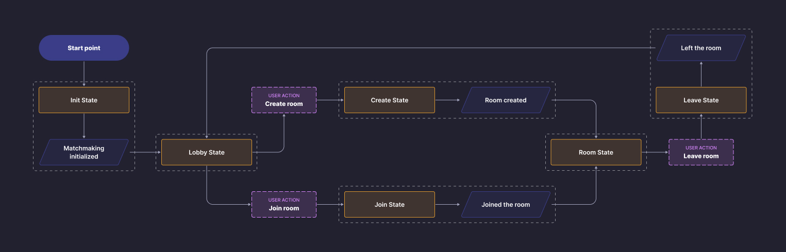
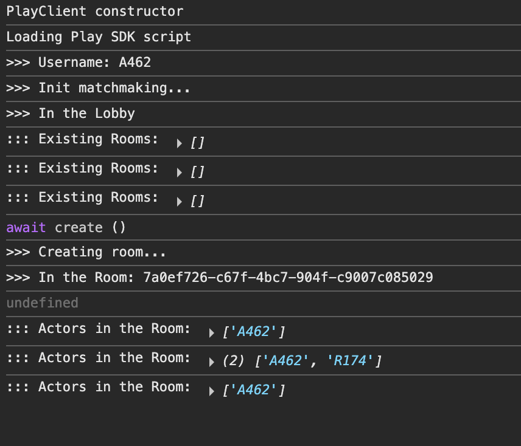
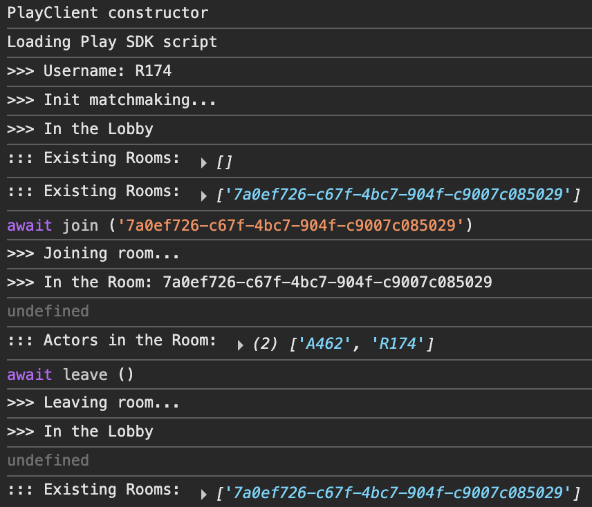
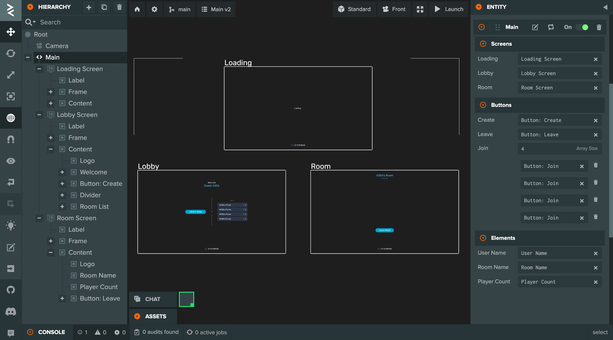

# PlayCanvas Matchmaking example: Part 02 - Advanced

### Prerequisite

This tutorial assumes you've completed [Part 01](playcanvas-matchmaking-example-part-01-basics.md) and already familiar with the basics of [VIVERSE Play SDK](../matchmaking-and-networking-sdk.md) / [Matchmaking](../matchmaking-and-networking-sdk.md#matchmaking-api) functionality. Please feel free to revisit those if you need a quick recap!

In the second part we'll focus on adding more juice to our application, facilitating architectural changes and integrating UI system. You can follow this tutorial by forking a dedicated [PlayCanvas Project](https://playcanvas.com/project/1381603/) with all the code and assets included.

### Chapter 1: App architecture and introduction to Async State Flow

As you might recall, we devised 4 essential methods to work with our Matchmaking Client — `initClient`, `createRoom`, `joinRoom` and `leaveRoom`, along with 2 event listeners — `onRoomListUpdate` and `onRoomActorChange` — to receive live updates about existing Rooms and connected Actors.

In this chapter, we'll \[...]

#### 1.1  Constructing the State Flow

First, let's introduce a concept of Application State - a single point in discreet space of all possible configurations that can meaningfully describe our application in any given moment. Application can only be in one State at a time, but it can instantly switch to another State once certain conditions are met.

Let's define 6 distinct States encompassing the entire scope of our application at different stages:

* `Init State` : initialize Matchmaking client, setup user's Actor, then go to Lobby State
* `Lobby State` : show available Rooms, handle user request to Create or Join the Room
* &#x20;`Create State` : ask SDK to create the Room, handle response, then go to Room State
* &#x20;`Join State` : ask SDK to join the Room, handle response, then go to Room State
* &#x20; `Room State` : show Actors currently in the Room, handle user request to Leave the Room
* &#x20;`Leave State` : ask SDK to leave the Room, handle response, then back to Lobby State

Now, if we organize these States in directional graph, along with conditions triggering State switches — we will end up with something called State Flow:

<figure><figcaption></figcaption></figure>

#### 1.2  Refactoring&#x20;

It's time to put our State Flow to implementation! Similar to how we defined 4 essential methods in the previous steps, let's create 6 methods each executing functionality of corresponding state:

* ```javascript
  async gotoInitState () // init Matchmaking, setup Actor --> Lobby State
  ```
* ```javascript
  async gotoLobbyState () // show Create and Join buttons ?.> Create | Join State
  ```
* ```javascript
  async gotoCreateState () // create the Room --> Room State
  ```
* ```javascript
  async gotoJoinState () // join the Room --> Room State
  ```
* ```javascript
  async gotoRoomState () // show connected Actors, Leave button ?.> Leave State
  ```
* ```javascript
  async gotoLeaveState () // leave the Room --> Lobby State
  ```

Once they're put together in a single script - you may end up with something like this:

```javascript
// @ts-nocheck
import { Script, guid } from 'playcanvas';
const { viverse } = globalThis;

export class Main extends Script
{
    static scriptName = 'Main';

    initialize ()
    {
        this.appId = 'ajhzug2zwb'; // replace with your App ID
        this.username = this.randomUsername ();
        this.playClient = new viverse.Play ();
        
        // We're exposing these 3 actions to global window object 
        // So we can create / join / leave the Room via browser console
        // Without setting up PlayCanvas UI at this point
        
        window.create = this.gotoCreateState.bind (this);
        window.join = this.gotoJoinState.bind (this);
        window.leave = this.gotoLeaveState.bind (this);
        
        this.gotoInitState ();
    }

    //----------------------------------------------------------------------------//
    //                                 State Flow                                 //
    //----------------------------------------------------------------------------//
    //          INIT -> LOBBY -> CREATE / JOIN -> ROOM -> LEAVE -> LOBBY          //
    //----------------------------------------------------------------------------//

    async gotoInitState ()
    {
        console.log ('>>> Username:', this.username);
        console.log ('>>> Init matchmaking...');

        // NOTE: Matchmaking Client has only .on() method to subscribe to events
        // We implement our own .off() to make our code look sleeker later on
        
        this.matchClient = await this.playClient.newMatchmakingClient (this.appId);
        this.matchClient.off = (event) => this.matchClient.eventListeners.delete (event);
        this.matchClient.on ('onConnect', async () =>
        {
            await this.matchClient.setActor
            ({
                name: this.username,
                session_id: guid.create (), // unique random string
                properties: {}
            });
            
            await this.gotoLobbyState ();
        });
    };

    async gotoLobbyState ()
    {
        console.log ('>>> In the Lobby');

        // Subscribing to Room List updates when entering the Lobby
        this.matchClient.on ('onRoomListUpdate', ((rooms) =>
            console.log (`::: Existing Rooms:`, rooms.map (room => room.id))));
        
        // Waiting for creating or joining the Room via console
        // >.. await create ()
        // >.. await join ('...')
    };

    async gotoCreateState ()
    {
        console.log ('>>> Creating room...');

        // Unsubscribing from Room List updates when leaving the Lobby
        this.matchClient.off ('onRoomListUpdate');

        let {success} = await this.matchClient.createRoom
        ({
            name: `${this.username}'s Room`, mode: 'pvp',
            minPlayers: 1, maxPlayers: 4, properties: {}
        });

        if (success) await this.gotoRoomState ();
        else await this.gotoLobbyState ();
    };

    async gotoJoinState (id)
    {
        console.log ('>>> Joining room...');

        // Unsubscribing from Room List updates when leaving the Lobby
        this.matchClient.off ('onRoomListUpdate');

        let {success} = await this.matchClient.joinRoom (id);

        if (success) await this.gotoRoomState ();
        else await this.gotoLobbyState ();
    };

    async gotoRoomState ()
    {
        console.log ('>>> In the Room:', this.matchClient.currentRoom.id);

        // Subscribing to Actor List updates when entering the Room
        this.matchClient.on ('onRoomActorChange', ((actors) =>
            console.log (`::: Actors in the Room:`, actors.map (actor => actor.name))));
        
        // Waiting for leaving the Room via console
        // >.. await leave ()
    };

    async gotoLeaveState ()
    {
        console.log ('>>> Leaving room...');

        // Unsubscribing from Actor List updates when leaving the Room
        this.matchClient.off ('onRoomActorChange');

        await this.matchClient.leaveRoom ();
        await this.gotoLobbyState ();
    };

    //----------------------------------------------------------------------------//
    //                                   Utils                                    //
    //----------------------------------------------------------------------------//

    randomUsername ()
    {
        let username = '';
        username += 'ABCDEFGHIJKLMNOPQRSTUVWXYZ' [Math.floor (Math.random () * 26)];
        for (let i = 0; i < 3; i++)
            username += '0123456789' [Math.floor (Math.random () * 10)];
        return username;
    }
}
```

Notice a few things:

* As we [mentioned](playcanvas-matchmaking-example-part-01-basics.md#step-4-create-a-new-room-and-subscribe-to-room-list-updates) in Part 01, Play SDK doesn't require users to be logged in with VIVERSE. So we created a simple method `randomUsername ()`  to generate usernames for all our guests
* At the same time we're using PlayCanvas built-in [guid](https://app.gitbook.com/u/b1o5AUm04xR3caBWZx1XiI42C0a2) helper to generate unique random strings for our user sessions
* Once Matchmaking client is ready and Actor is set up, Init State transitions to Lobby State automatically
* In Lobby State we subscribe to `onRoomListUpdate` and then stay idle until user decides to create or join the Room via our globally exposed methods `create ()` and `join ()`&#x20;
* Create and Join states are transitional and just call corresponding Play SDK methods. Then depending on API response — app transitions either to Room State (success) or back to Lobby State (error)
* Also notice that we unsubscribe from `onRoomListUpdate` in Create and Join states since we don't want to receive those updates when no longer in the Lobby
* In Room State we subscribe to `onRoomActorChange` and then stay idle until user decides to leave the Room via globally exposed `leave ()` method
* Finally, the Leave State is also transitional — we unsubscribe from `onRoomActorChange`  and request Play SDK to leave current room. After that we end up in a Lobby again, and then cycle continues

#### 1.3  Testing

Alright, time to give a test run to this new refactored architecture! As previously, let's launch our PlayCanvas project in two or more separate tabs and use globally exposed `create ()`, `join ()` and `leave ()` methods to trigger corresponding States. If you did everything correctly you would see something like this:

<div><figure><figcaption></figcaption></figure> <figure><figcaption></figcaption></figure></div>

Great progress for now! In the next chapter, we'll finally move away from console testing and \[...integrate PlayCanvas UI system].

### Chapter 2: Integrating PlayCanvas UI system

TODO

<figure><figcaption></figcaption></figure>

```javascript
import { Script, Entity, guid } from 'playcanvas';
const { viverse } = globalThis;

/** @interface */
class Screens
{
    /** @title Loading @type {Entity} */ loading;
    /** @title Lobby @type {Entity} */  lobby;
    /** @title Room @type {Entity} */   room;
}

export class Main extends Script
{
    static scriptName = 'Main';

    /** @attribute @title Screens @type {Screens} */  screens;

    initialize () {...}
    
    //----------------------------------------------------------------------------//
    //                                 State Flow                                 //
    //----------------------------------------------------------------------------//
    
    async gotoInitState ()
    {
        this.showScreen ('loading');
        // ... rest of the code
        // [Initialization complete] -> Lobby State
    };

    async gotoLobbyState ()
    {
        this.showScreen ('lobby');
        // ... rest of the code
        // [On user action] -> Create State | Join State
    };

    async gotoCreateState ()
    {
        this.showScreen ('loading');
        // ... rest of the code
        // [Room creation complete] -> Room State
    };

    async gotoJoinState (id)
    {
        this.showScreen ('loading');
        // ... rest of the code
        // [Room joining complete] -> Room State
    };

    async gotoRoomState ()
    {
        this.showScreen ('room');
        // ... rest of the code
        // [On user action] -> Leave State
    };

    async gotoLeaveState ()
    {
        this.showScreen ('loading');
        // ... rest of the code
        // [Room leaving complete] -> Lobby State
    };

    //----------------------------------------------------------------------------//
    //                                   Utils                                    //
    //----------------------------------------------------------------------------//

    randomUsername ()
    {
        let username = '';
        username += 'ABCDEFGHIJKLMNOPQRSTUVWXYZ' [Math.floor (Math.random () * 26)];
        for (let i = 0; i < 3; i++)
            username += '0123456789' [Math.floor (Math.random () * 10)];
        return username;
    }
    
    showScreen (id)
    {
        this.screens.loading.enabled = (id === 'loading');
        this.screens.lobby.enabled = (id === 'lobby');
        this.screens.room.enabled = (id === 'room');
    }
}
```

### Chapter 3: Populating UI elements and wiring buttons to user actions

TODO

<figure><figcaption></figcaption></figure>

```javascript
// @ts-nocheck
import { Script, Entity, guid } from 'playcanvas';
const { viverse } = globalThis;

/** @interface */
class Screens
{
    /** @title Loading @type {Entity} */ loading;
    /** @title Lobby @type {Entity} */  lobby;
    /** @title Room @type {Entity} */   room;
}

/** @interface */
class Buttons
{
    /** @title Create @type {Entity} */ create;
    /** @title Leave @type {Entity} */  leave;
    /** @title Join @type {Entity[]} */ join;
}

/** @interface */
class Elements
{
    /** @title User Name @type {Entity} */  username;
    /** @title Room Name @type {Entity} */  roomname;
    /** @title Player Count @type {Entity} */ counter;
}

export class Main extends Script
{
    static scriptName = 'Main';

    /** @attribute @title Screens @type {Screens} */  screens;
    /** @attribute @title Buttons @type {Buttons} */  buttons;
    /** @attribute @title Elements @type {Elements} */  elements;

    initialize () {...}

    //----------------------------------------------------------------------------//
    //                                 State Flow                                 //
    //----------------------------------------------------------------------------//
    
    async gotoInitState ()
    {
        this.showScreen ('loading');

        // ... rest of the code
        // [Initialization complete] -> Lobby State
    }

    async gotoLobbyState ()
    {
        this.showScreen ('lobby');
        
        // Display current username in Lobby screen
        this.elements.username.element.text = `Guest ${this.username}`;
        
        // Wire Create button to switch app state to Create
        this.buttons.create.element.off ('click');
        this.buttons.create.element.on ('click', async () =>
        {
            await this.gotoCreateState ();
        });

        // Update Join buttons each time the Room List is updated
        // Wire each Join button to Join state with respective room id
        this.hideJoinButtons ();
        this.matchClient.on ('onRoomListUpdate', (rooms) =>
        {
            this.showJoinButtons (rooms, async (room) =>
            {
                await this.gotoJoinState (room.id);
            });
        });
    }

    async gotoCreateState ()
    {
        this.showScreen ('loading');
        
        // ... rest of the code
        // [Room creation complete] -> Room State
    }

    async gotoJoinState (id)
    {
        this.showScreen ('loading');
        
        // ... rest of the code
        // [Room joining complete] -> Room State
    }

    async gotoRoomState ()
    {
        this.showScreen ('room');

        // Display current room name in Room Screen
        this.elements.roomname.element.text = this.matchClient.currentRoom.name;
        
        // Update player counter each time the Actor List is changed
        this.matchClient.on ('onRoomActorChange', (actors) =>
        {
            this.elements.counter.element.text = `${actors.length}  PLAYER`;
            this.elements.counter.element.text += actors.length > 1 ? 'S' : '';
        });

        // Wire Leave button to switch app state to Leave
        this.buttons.leave.element.off ('click');
        this.buttons.leave.element.on ('click', async () =>
        {
            await this.gotoLeaveState ();
        });
    }
    
    async gotoLeaveState ()
    {
        this.showScreen ('loading');

        // ... rest of the code
        // [Room leaving complete] -> Lobby State
    }

    //----------------------------------------------------------------------------//
    //                                   Utils                                    //
    //----------------------------------------------------------------------------//
    
    randomUsername () {...}

    showScreen (id) {...}

    hideJoinButtons ()
    {
        for (let button of this.buttons.join)
            button.enabled = false;
    }

    showJoinButtons (rooms, callback)
    {
        this.hideJoinButtons ();

        for (let i = 0; i < rooms.length; i++)
        {
            let room = rooms[i];
            let button = this.buttons.join[i];
            
            // For simplicity our Lobby screen has only 4 Join Buttons instantiated
            // So only first 4 Rooms will be parsed and available for joining
            // The 5th and subsequent Rooms will be ignored
            
            if (button)
            {
                button.enabled = true;
                button.findByName ('Room Name').element.text = room.name;
                button.findByName ('Counter').element.text = room.actors.length;

                button.element.off ('click');
                button.element.on ('click', async () => await callback (room));
            }
        }
    }
}

```
