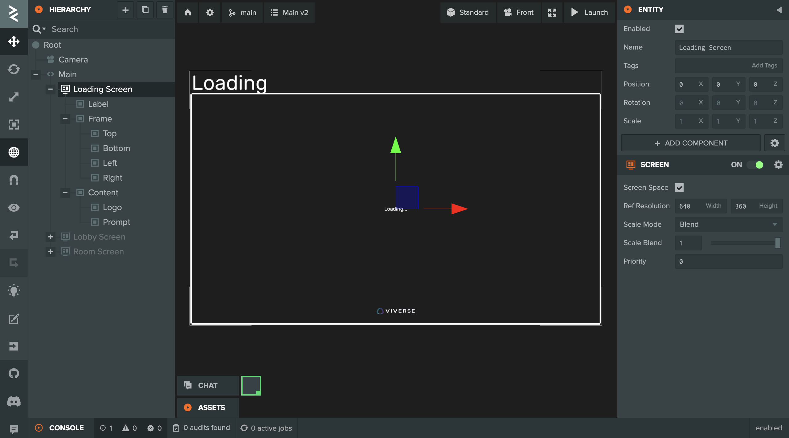
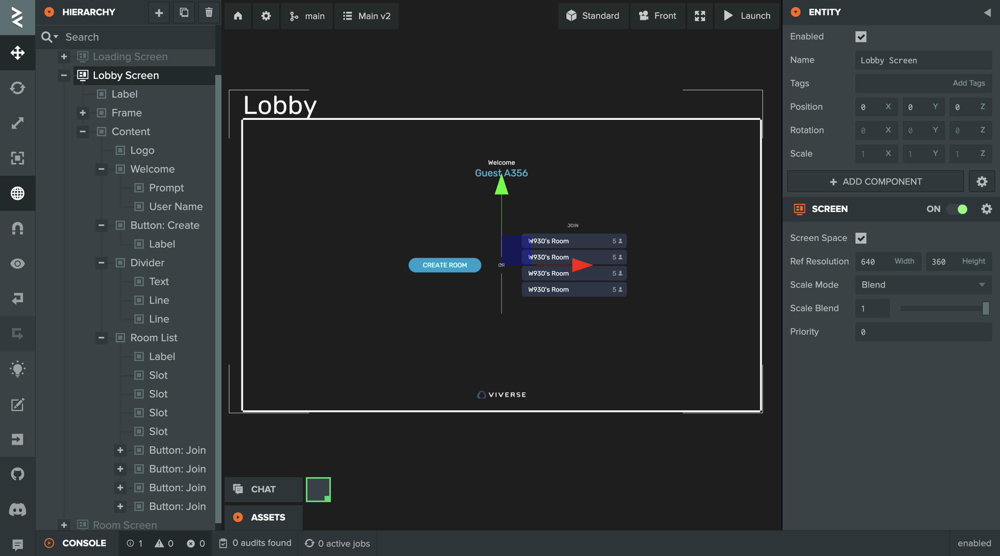
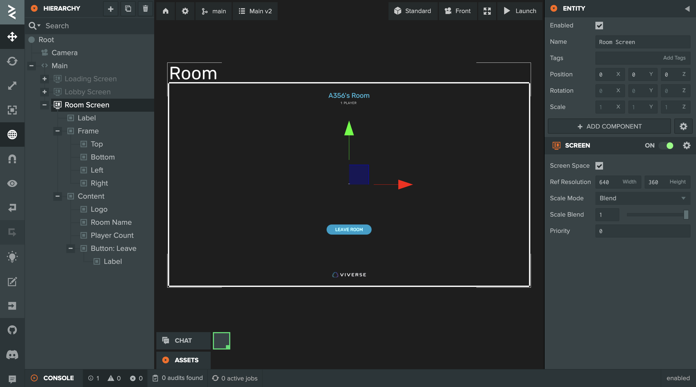
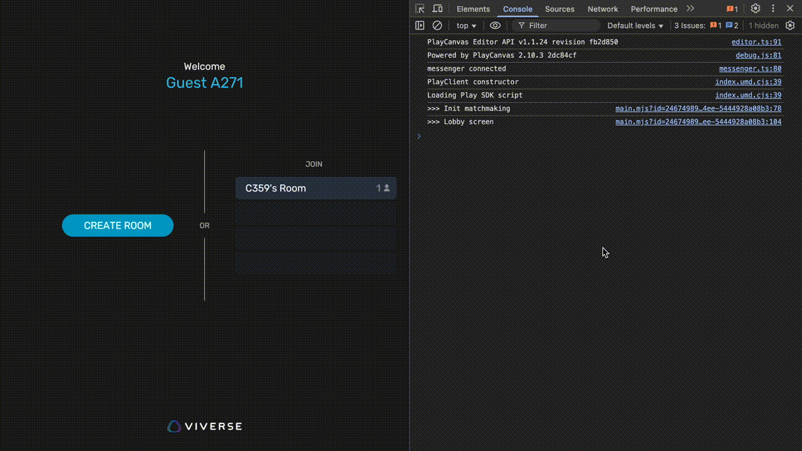

# PlayCanvas Matchmaking example: Part 02 - Advanced

### Prerequisites

This tutorial assumes you've completed [Part 01](playcanvas-matchmaking-example-part-01-basics.md) and already familiar with the basics of [VIVERSE Play SDK](../matchmaking-and-networking-sdk.md) / [Matchmaking](../matchmaking-and-networking-sdk.md#matchmaking-api) functionality. Please feel free to revisit those if you need a quick recap!

In the second part, we'll focus on adding more juice to our application, exploring architectural changes and integrating the UI system. You can follow this tutorial by forking a dedicated [PlayCanvas Project](https://playcanvas.com/project/1381603/) with all the code and assets included.

### Chapter 1: App architecture and Async State Flow

As you might recall, we devised 4 essential methods to work with our Matchmaking Client — `initClient`, `createRoom`, `joinRoom` and `leaveRoom`, along with 2 event listeners — `onRoomListUpdate` and `onRoomActorChange` — to receive live updates about existing Rooms and connected Actors. In this chapter, we'll revisit that code once again and reorganize it into something more robust and future-proof.

#### 1.1  Constructing State Flow

First, let's introduce a concept of Application State - a single point in discreet space of all possible configurations that can meaningfully describe our application in any given moment. Application can only be in one State at a time, but it can instantly switch to another State once certain conditions are met.

Let's define 6 distinct States encapsulating the entire scope of our application at different stages:

* `Init State` : initialize Matchmaking client, setup user's Actor, then go to Lobby State
* `Lobby State` : show available Rooms, handle user request to Create or Join the Room
* &#x20;`Create State` : ask SDK to create the Room, handle response, then go to Room State
* &#x20;`Join State` : ask SDK to join the Room, handle response, then go to Room State
* &#x20; `Room State` : show Actors currently in the Room, handle user request to Leave the Room
* &#x20;`Leave State` : ask SDK to leave the Room, handle response, then back to Lobby State

Now, if we organize these States in a closed directional graph, along with conditions triggering State switches — we will end up with something colloquially called State Flow:

<figure><figcaption></figcaption></figure>

#### 1.2  Implementing State Flow&#x20;

It's time to move our State Flow into implementation! Similar to how we defined 4 essential methods in the previous steps, let's refactor them into 6 new methods — each responsible for functionality of corresponding State:

* ```javascript
  async gotoInitState () // init Matchmaking, setup Actor --> Lobby State
  ```
* ```javascript
  async gotoLobbyState () // show Create and Join buttons ?.> Create | Join State
  ```
* ```javascript
  async gotoCreateState () // create new Room --> Room State
  ```
* ```javascript
  async gotoJoinState () // join the Room --> Room State
  ```
* ```javascript
  async gotoRoomState () // show connected Actors, Leave button ?.> Leave State
  ```
* ```javascript
  async gotoLeaveState () // leave current Room --> Lobby State
  ```

Once we put them all together in a single script — we will end up with something like this:

```javascript
// @ts-nocheck
import { Script, guid } from 'playcanvas';
const { viverse } = globalThis;

export class Main extends Script
{
    static scriptName = 'Main';

    initialize ()
    {
        this.appId = 'ajhzug2zwb'; // replace with your App ID
        this.username = this.randomUsername ();
        this.playClient = new viverse.Play ();
        
        // We're exposing these 3 actions to global window object 
        // So we can create / join / leave the Room via browser console
        // Without setting up PlayCanvas UI at this point
        
        window.create = this.gotoCreateState.bind (this);
        window.join = this.gotoJoinState.bind (this);
        window.leave = this.gotoLeaveState.bind (this);
        
        this.gotoInitState ();
    }

    //----------------------------------------------------------------------------//
    //                                 State Flow                                 //
    //----------------------------------------------------------------------------//
    //          INIT -> LOBBY -> CREATE / JOIN -> ROOM -> LEAVE -> LOBBY          //
    //----------------------------------------------------------------------------//

    async gotoInitState ()
    {
        console.log ('>>> Username:', this.username);
        console.log ('>>> Init matchmaking...');

        // NOTE: Matchmaking Client has only .on() method to subscribe to events
        // We implement our own .off() to make our code look sleeker later on
        
        this.matchClient = await this.playClient.newMatchmakingClient (this.appId);
        this.matchClient.off = (event) => this.matchClient.eventListeners.delete (event);
        this.matchClient.on ('onConnect', async () =>
        {
            await this.matchClient.setActor
            ({
                name: this.username,
                session_id: guid.create (), // unique random string
                properties: {}
            });
            
            await this.gotoLobbyState ();
        });
    }

    async gotoLobbyState ()
    {
        console.log ('>>> In the Lobby');

        // Subscribing to Room List updates when entering the Lobby
        this.matchClient.on ('onRoomListUpdate', ((rooms) =>
            console.log (`::: Existing Rooms:`, rooms.map (room => room.id))));
        
        // Waiting for creating or joining the Room via console
        // >.. await create ()
        // >.. await join ('...')
    }

    async gotoCreateState ()
    {
        console.log ('>>> Creating room...');

        // Unsubscribing from Room List updates when leaving the Lobby
        this.matchClient.off ('onRoomListUpdate');

        let {success} = await this.matchClient.createRoom
        ({
            name: `${this.username}'s Room`, mode: 'pvp',
            minPlayers: 1, maxPlayers: 4, properties: {}
        });

        if (success) await this.gotoRoomState ();
        else await this.gotoLobbyState ();
    }

    async gotoJoinState (id)
    {
        console.log ('>>> Joining room...');

        // Unsubscribing from Room List updates when leaving the Lobby
        this.matchClient.off ('onRoomListUpdate');

        let {success} = await this.matchClient.joinRoom (id);

        if (success) await this.gotoRoomState ();
        else await this.gotoLobbyState ();
    }

    async gotoRoomState ()
    {
        console.log ('>>> In the Room:', this.matchClient.currentRoom.id);

        // Subscribing to Actor List updates when entering the Room
        this.matchClient.on ('onRoomActorChange', ((actors) =>
            console.log (`::: Actors in the Room:`, actors.map (actor => actor.name))));
        
        // Waiting for leaving the Room via console
        // >.. await leave ()
    }

    async gotoLeaveState ()
    {
        console.log ('>>> Leaving room...');

        // Unsubscribing from Actor List updates when leaving the Room
        this.matchClient.off ('onRoomActorChange');

        await this.matchClient.leaveRoom ();
        await this.gotoLobbyState ();
    }

    //----------------------------------------------------------------------------//
    //                                   Utils                                    //
    //----------------------------------------------------------------------------//

    randomUsername ()
    {
        let username = '';
        username += 'ABCDEFGHIJKLMNOPQRSTUVWXYZ' [Math.floor (Math.random () * 26)];
        for (let i = 0; i < 3; i++)
            username += '0123456789' [Math.floor (Math.random () * 10)];
        return username;
    }
}
```

Notice a few things here:

* As we [mentioned](playcanvas-matchmaking-example-part-01-basics.md#step-4-create-a-new-room-and-subscribe-to-room-list-updates) in Part 01, Play SDK doesn't require users to be logged in with VIVERSE. So we created a simple method `randomUsername ()`  to generate usernames for all our guests
* At the same time we're using PlayCanvas built-in [guid](https://app.gitbook.com/u/b1o5AUm04xR3caBWZx1XiI42C0a2) helper to create unique random strings for our user sessions
* Once Matchmaking client is ready and Actor is set up, the Init State transitions to the Lobby State automatically
* In the Lobby State we subscribe to `onRoomListUpdate` and then stay idle until user decides to create or join the Room via our globally exposed methods `create ()` and `join ()`&#x20;
* Create and Join states are transitional and just call corresponding Play SDK methods. Then depending on API response — our app switches either to the Room State (success) or back to the Lobby State (error)
* Also notice that we unsubscribe from `onRoomListUpdate` in Create and Join states since we don't want to receive Room List updates when no longer in the Lobby
* While in the Room State, we subscribe to `onRoomActorChange` and then stay idle until user decides to leave the Room via globally exposed `leave ()` method
* And finally, the Leave State is also transitional — we unsubscribe from `onRoomActorChange`  and request Play SDK to leave current room. After that we end up in a Lobby again, and then cycle repeats

#### 1.3  Testing in multiple tabs

Alright, time to test-drive our new architecture! As previously, let's launch our PlayCanvas project in two or more separate tabs and use globally exposed `create ()`, `join ()` and `leave ()` methods to trigger corresponding States. If you did everything correctly you would see something like this:

<div><figure><figcaption></figcaption></figure> <figure><figcaption></figcaption></figure></div>

Nice progress so far! In the next chapter, we'll finally move beyond console testing and take a brief look at what PlayCanvas UI system has to offer.

### Chapter 2: PlayCanvas UI system and final results

One of the strongest advantages of PlayCanvas engine is its visual editor which allows assembling scenes from imported assets in [WYSIWYG](https://en.wikipedia.org/wiki/WYSIWYG) fashion. And while it's technically possible to preassemble scenes in 3D apps like Blender and then export / import them in GLTF format, this idea falls apart once we try to implement a decent UI of any complexity.

In this chapter, we’ll get to know the PlayCanvas UI system and use it to build a simple, screen-based UI for our project.


From now on we assume you have basic familiarity with PlayCanvas UI system and its essential components like Screen, Element (Group / Image / Text) and Button. If you’d like a quick recap, please read [PlayCanvas UI User Manual](https://developer.playcanvas.com/user-manual/user-interface/user-interface-basics/)


#### 2.1  Assembling UI screens

Our application has 6 possible states, but only 2 of them are steady - Lobby and Room. The other 4 states are transient - they always resolve into one of those two. For the purpose of this tutorial we can cover our entire UI functionality with just 3 screens:

* **Lobby** : display a list of Rooms that user can join, along with Create button
* **Room** : display a list of currently connected Actors, along with Leave button
* **Loading** : show spinner any time the user is somewhere between the Lobby and the Room



<figure><figcaption></figcaption></figure>



<figure><figcaption></figcaption></figure>



<figure><figcaption></figcaption></figure>



If you explore our [PlayCanvas Project](https://playcanvas.com/project/1381603/) used in this tutorial, you may notice that UI screens there have specific structure — they consist of Label text, Frame group and Content group, but only contents of the Content group are visible during rendering. There is no magic here — once you look closely you'll see that both Label and Frame's contents are positioned outside of Screen's \[0, 0, 1, 1] space, hence they never appear during rendering but still exist in 3D world. This is purely cosmetic touch — to make our Screens look more like Figma frames in the Editor, which may be quite user-friendly for designers familiar with that tool.

#### 2.2  Mapping UI screens to States

We have all required screens now, but our app is still displaying all them simultaneously. To make it show only one Screen depending on current State, we need to link our screens to Script Attributes, and create a simple `showScreen` method switching them on and off.

Let's put this idea into practise:

```javascript
import { Script, Entity, guid } from 'playcanvas';
const { viverse } = globalThis;

/** @interface */
class Screens
{
    /** @title Loading @type {Entity} */ loading;
    /** @title Lobby @type {Entity} */  lobby;
    /** @title Room @type {Entity} */   room;
}

export class Main extends Script
{
    static scriptName = 'Main';

    /** @attribute @title Screens @type {Screens} */  screens;

    initialize () {...}
    
    //----------------------------------------------------------------------------//
    //                                 State Flow                                 //
    //----------------------------------------------------------------------------//
    
    async gotoInitState ()
    {
        this.showScreen ('loading');
        
        // ... rest of the code
        // [Initialization complete] -> Lobby State
    }

    async gotoLobbyState ()
    {
        this.showScreen ('lobby');
        
        // ... rest of the code
        // [On user action] -> Create State | Join State
    }

    async gotoCreateState ()
    {
        this.showScreen ('loading');
        
        // ... rest of the code
        // [Room creation complete] -> Room State
    }

    async gotoJoinState (id)
    {
        this.showScreen ('loading');
        
        // ... rest of the code
        // [Room joining complete] -> Room State
    }

    async gotoRoomState ()
    {
        this.showScreen ('room');
        
        // ... rest of the code
        // [On user action] -> Leave State
    }

    async gotoLeaveState ()
    {
        this.showScreen ('loading');
        
        // ... rest of the code
        // [Room leaving complete] -> Lobby State
    }

    //----------------------------------------------------------------------------//
    //                                   Utils                                    //
    //----------------------------------------------------------------------------//

    randomUsername () {...}
    
    showScreen (id)
    {
        this.screens.loading.enabled = (id === 'loading');
        this.screens.lobby.enabled = (id === 'lobby');
        this.screens.room.enabled = (id === 'room');
    }
}
```

Here is a breakdown of what's happening:

* We're using [ESM Script Attributes](https://developer.playcanvas.com/user-manual/scripting/fundamentals/script-attributes/esm/) which rely on [JSDoc](https://jsdoc.app/) tags / annotations to define custom attributes exposed to PlayCanvas Editor
* To link UI screens to our script, we create an [interface-like](https://developer.playcanvas.com/user-manual/scripting/fundamentals/script-attributes/esm/#interface-attributes) class `Screens` with `loading`, `lobby` and `room` fields and define our attribute with this custom complex type:\
  `/** @attribute @title Screens @type {Screens} */ screens`&#x20;
* After that we implement a simple `showScreen (id)` method which enables only one Screen with provided `id`, while disabling any other screens
* And finally we add a call to `showScreen` with corresponding `id` at the start of every State

<figure><figcaption></figcaption></figure>


You don't have to create complex interface-like attribute to link these 3 screens to your script. You could achieve similar results just by creating 3 separate attributes with Entity type instead. But our approach allows grouping Screens together in the Inspector, which is a nice convenience, especially when we decide to add new attributes later on.


#### 2.3  Dynamic UI elements and using buttons to switch States

Our app can now show a dedicated Screen when switching to particular State, but UI elements in those screens are still not reactive, neither buttons are clickable. To fix this, we'll need to link a few more entities to our script as well:

* **Lobby**: Username, Create button and a list of Join buttons
* **Room**: Room name, Player Counter and Leave button

If we group those into Buttons and Elements interface attributes, we \[...]

```javascript
// @ts-nocheck
import { Script, Entity, guid } from 'playcanvas';
const { viverse } = globalThis;

/** @interface */
class Screens
{
    /** @title Loading @type {Entity} */ loading;
    /** @title Lobby @type {Entity} */  lobby;
    /** @title Room @type {Entity} */   room;
}

/** @interface */
class Buttons
{
    /** @title Create @type {Entity} */ create;
    /** @title Leave @type {Entity} */  leave;
    /** @title Join @type {Entity[]} */ join;
}

/** @interface */
class Elements
{
    /** @title User Name @type {Entity} */  username;
    /** @title Room Name @type {Entity} */  roomname;
    /** @title Player Count @type {Entity} */ counter;
}

export class Main extends Script
{
    static scriptName = 'Main';

    /** @attribute @title Screens @type {Screens} */  screens;
    /** @attribute @title Buttons @type {Buttons} */  buttons;
    /** @attribute @title Elements @type {Elements} */  elements;

    initialize () {...}

    //----------------------------------------------------------------------------//
    //                                 State Flow                                 //
    //----------------------------------------------------------------------------//
    
    async gotoInitState ()
    {
        this.showScreen ('loading');

        // ... rest of the code
        // [Initialization complete] -> Lobby State
    }

    async gotoLobbyState ()
    {
        this.showScreen ('lobby');
        
        // Display current username in Lobby screen
        this.elements.username.element.text = `Guest ${this.username}`;
        
        // Wire Create button to switch app state to Create
        this.buttons.create.element.off ('click');
        this.buttons.create.element.on ('click', async () =>
        {
            await this.gotoCreateState ();
        });

        // Update Join buttons each time the Room List is updated
        // Wire each Join button to Join state with respective room id
        this.hideJoinButtons ();
        this.matchClient.on ('onRoomListUpdate', (rooms) =>
        {
            this.showJoinButtons (rooms, async (room) =>
            {
                await this.gotoJoinState (room.id);
            });
        });
    }

    async gotoCreateState ()
    {
        this.showScreen ('loading');
        
        // ... rest of the code
        // [Room creation complete] -> Room State
    }

    async gotoJoinState (id)
    {
        this.showScreen ('loading');
        
        // ... rest of the code
        // [Room joining complete] -> Room State
    }

    async gotoRoomState ()
    {
        this.showScreen ('room');

        // Display current room name in Room Screen
        this.elements.roomname.element.text = this.matchClient.currentRoom.name;
        
        // Update player counter each time the Actor List is changed
        this.matchClient.on ('onRoomActorChange', (actors) =>
        {
            this.elements.counter.element.text = `${actors.length}  PLAYER`;
            this.elements.counter.element.text += actors.length > 1 ? 'S' : '';
        });

        // Wire Leave button to switch app state to Leave
        this.buttons.leave.element.off ('click');
        this.buttons.leave.element.on ('click', async () =>
        {
            await this.gotoLeaveState ();
        });
    }
    
    async gotoLeaveState ()
    {
        this.showScreen ('loading');

        // ... rest of the code
        // [Room leaving complete] -> Lobby State
    }

    //----------------------------------------------------------------------------//
    //                                   Utils                                    //
    //----------------------------------------------------------------------------//
    
    randomUsername () {...}

    showScreen (id) {...}

    hideJoinButtons ()
    {
        for (let button of this.buttons.join)
            button.enabled = false;
    }

    showJoinButtons (rooms, callback)
    {
        this.hideJoinButtons ();

        for (let i = 0; i < rooms.length; i++)
        {
            let room = rooms[i];
            let button = this.buttons.join[i];
            
            // For simplicity our Lobby screen has only 4 Join Buttons instantiated
            // So only first 4 Rooms will be parsed and available for joining
            // The 5th and subsequent Rooms will be ignored
            
            if (button)
            {
                button.enabled = true;
                button.findByName ('Room Name').element.text = room.name;
                button.findByName ('Counter').element.text = room.actors.length;

                button.element.off ('click');
                button.element.on ('click', async () => await callback (room));
            }
        }
    }
}

```

\[...]

* Similar to Screens, we organized our UI into Buttons and Elements and linked those entities to corresponding Script Attributes. Also note that we're using array of Entities for Join button since we're anticipating to have multiple Rooms available for joining in our Lobby
*

#### 2.3  Further improvements and testing


<figure><figcaption></figcaption></figure>
