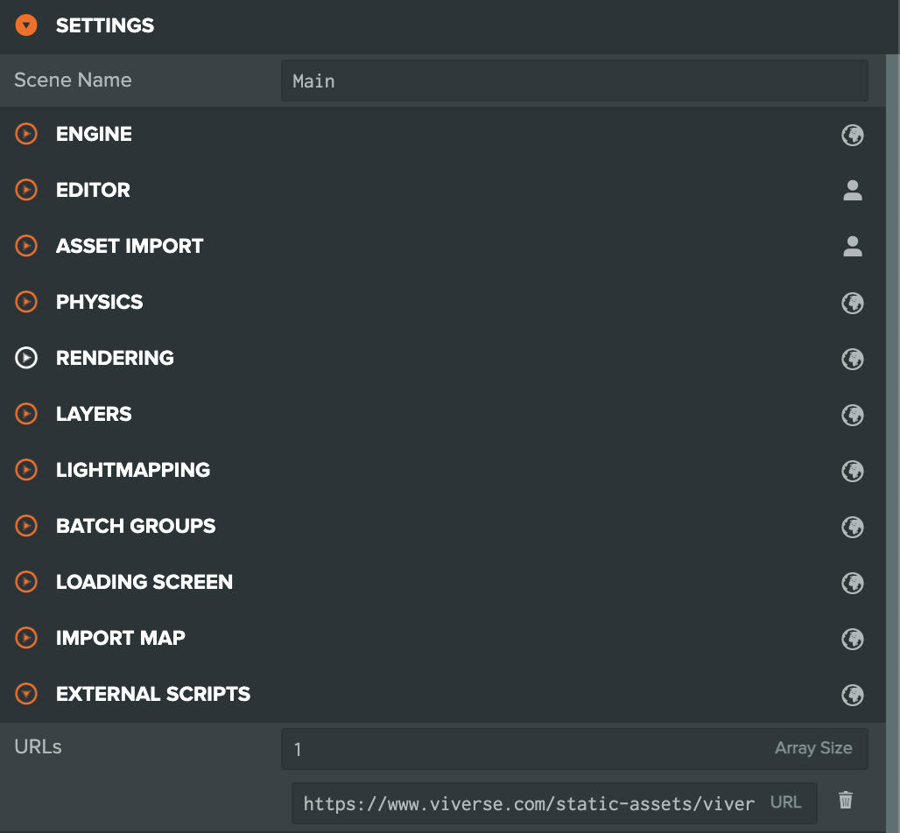
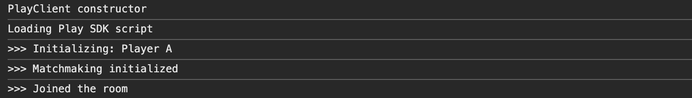
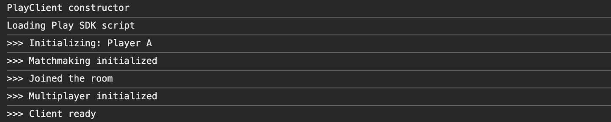

# PlayCanvas Networking example: Part 01 - Basics

***

## About

Welcome to Part 01 of the VIVERSE Play SDK Networking tutorial for PlayCanvas! In this chapter we will cover all the basics to get you started with multiplayer functionality:

* Configure new PlayCanvas project for the VIVERSE SDKs
* Get to know the VIVERSE Play SDK and its Matchmaking and Multiplayer Clients
* Create and join the Room where multiplayer session would take place
* Initialize multiplayer session and exchange data between Players

## Prerequisites

In order to use VIVERSE SDKs you need to create a World first and retrieve its App ID, which can be done with [VIVERSE Studio](https://studio.viverse.com/upload). This process is described in detail in [our documentation on VIVERSE Studio](https://app.gitbook.com/s/4pMiThqqrBzfvP8uy5am/publishing-with-your-viverse-account) — but for now you can simply create a new app and copy its App ID to get started.

> _**NOTE:** VIVERSE SDKs cannot be used with projects published via the_ [_PlayCanvas Create SDK extension_](https://docs.viverse.com/playcanvas-sdk/playcanvas-extension-setup)_, which do not have App IDs._

<div><figure><figcaption></figcaption></figure> <figure><figcaption></figcaption></figure></div>

## Step 1: Setup PlayCanvas project and add VIVERSE SDK

Let's create a new blank PlayCanvas project or use an already existing one. Go to the `SETTINGS` > `EXTERNAL SCRIPTS` and add a new script there: [`https://www.viverse.com/static-assets/viverse-sdk/index.umd.cjs`](https://www.viverse.com/static-assets/viverse-sdk/index.umd.cjs). This will ensure the VIVERSE SDK is loaded first and your PlayCanvas logic has full access to its functionality:

<figure><figcaption></figcaption></figure>

## Step 2: Create new scripts and initialize the SDK

For the purpose of this tutorial we will be using recently introduced [ESM scripts](https://developer.playcanvas.com/user-manual/scripting/fundamentals/esm-scripts/), although you can still follow it with the [Classic scripting](https://developer.playcanvas.com/user-manual/scripting/fundamentals/script-attributes/classic/) as well. We will start with setting up a couple new classes:

* `main.mjs` : defines Main class which would serve as an entry point of our application and instantiate a new Client. Main is extending PlayCanvas Script class and should be attached to some entity to work properly
* `client.mjs` : defines Client class which would encapsulate all necessary functionality to create / join the room, start multiplayer session and send / receive messages between peers. Client is a typical ES6 class with a constructor and default export


If you're new to PlayCanvas Editor and scripting system - we would strongly recommend consulting with official [PlayCanvas Scripting Guide](https://developer.playcanvas.com/user-manual/scripting/) before going any further. From now on we assume you're familiar with how scripts are added to the project, parsed and attached to Entities.


At this stage, let's proceed with [instantiating Play SDK client](../matchmaking-and-networking-sdk.md#initialize-the-playclient-instance) in the Client's constructor:



```javascript
// @ts-nocheck
import { Script } from 'playcanvas';
import Client from './client.mjs';

export class Main extends Script
{
    static scriptName = 'Main';

    initialize ()
    {
        let client = new Client ();
    }
}
```



```javascript
// @ts-nocheck
const { viverse } = globalThis;

export default class Client
{
    appId = '5snkdrvvv8'; // replace with your App ID
    play = null;

    constructor ()
    {
        this.play = new viverse.Play ();
        console.log ('>>> Play SDK initialized:', this.play);
    }
}
```



<figure><figcaption></figcaption></figure>

Congratulations with a great start! Now if you launch your PlayCanvas project — you will see Play SDK client initialized and logged into the console. Please note that App ID is not required at this point, but we will definitely need it later!

## Step 3: Initialize Matchmaking client and setup the Room

Now let's modify our Client so that it sets up a Room where multiplayer session will take place. For this functionality we will need to add a few extra steps:

* Initialize new Matchmaking client
* Look for currently available rooms
* If no rooms are available - create a new Room
* If the Room is already created - join the Room

> _To refresh your knowledge of VIVERSE Matchmaking API please feel free to consult with our_ [_Matchmaking API documentation_](../matchmaking-and-networking-sdk.md#matchmaking-api) _and take a look at_ [_PlayCanvas Matchmaking Example_](playcanvas-matchmaking-example-part-01-basics.md) _code!_


Heads up! From now on we’ll be relying on **async / await** a lot. If you’d like a quick recap, please read [Async / Await JS basics](https://javascript.info/async-await)




```javascript
// @ts-nocheck
import { Script } from 'playcanvas';
import Client from './client.mjs';

export class Main extends Script
{
    static scriptName = 'Main';

    initialize ()
    {
        this.initClient ('Player A');
    }
    
    async initClient (username)
    {
        let client = new Client (username);
        await client.initialize ();
        return client;
    }
}
```



```javascript
// @ts-nocheck
import { guid } from 'playcanvas';
const { viverse } = globalThis;

export default class Client
{
    appId = '5snkdrvvv8';
    username = null;
    play = null;
    matchmaking = null;

    constructor (username)
    {
        this.play = new viverse.Play ();
        this.username = username;
    }
    
    //-------------------------------------------------------------------//
    //                          Initialization                           //
    //-------------------------------------------------------------------//
    
    async initialize ()
    {
        console.log ('>>> Initializing:', this.username);

        await this.initMatchmaking ();
        console.log ('>>> Matchmaking initialized');

        await this.createJoinRoom ();
        console.log ('>>> Joined the room');
    }
    
    async initMatchmaking ()
    {
        this.matchmaking = await this.play.newMatchmakingClient (this.appId);
        return new Promise (resolve => this.matchmaking.on ('onConnect', resolve));
    }

    async createJoinRoom ()
    {
        await this.matchmaking.setActor
        ({
            name: this.username,
            session_id: guid.create (),
            properties: {}
        });

        let {rooms} = await this.matchmaking.getAvailableRooms ();
        let {room} = rooms && rooms[0] ?
            await this.matchmaking.joinRoom (rooms[0].id) :
            await this.matchmaking.createRoom ({name: 'Room', mode: 'test', maxPlayers: 1000});
    }
}
```



<figure><figcaption></figcaption></figure>

Here is what's happening:

* The Client class defines `async initialize ()` which would be responsible for setting up our Multiplayer client and creating / joining the Room
* Inside initializion method we call `await initMatchmaking ()` which instantiates new [Matchmaking client](../matchmaking-and-networking-sdk.md#matchmaking-api) with provided App ID, and returns a promise when [the client is connected](../matchmaking-and-networking-sdk.md#onconnect-event). Listening to `onConnect` here is crucial since trying to create or join the Room before that would result in an error
* After Matchmaking client is connected — we call `await createJoinRoom ()` which [sets up an Actor](../matchmaking-and-networking-sdk.md#setup-actor-info) with desired username and randomly generated session id, [scans for available rooms](../matchmaking-and-networking-sdk.md#get-available-rooms) and then [creates](../matchmaking-and-networking-sdk.md#create-and-configure-a-room) / [joins](../matchmaking-and-networking-sdk.md#join-room-by-roomid) the Room depending on result of that scan
* And finally in the Main class we create a new instance of that Client with username `Player A` and call `await client.initialize ()`. If you did everything correctly — you should see Client instance logging various initializations steps into the console

Great progress so far! In the next step we will improve our Client even further, so it would be able to spin up an actual multiplayer session for the current Room

## Step 4: Initialize Multiplayer client and subscribe to events

We have our Room created, but we still don't have any means to exchange game-specific events between Actors in that Room. To make it possible we would need to integrate [Multiplayer API](../matchmaking-and-networking-sdk.md#multiplayer-apis) first, which could be done in just two simple steps:

* Initialize new Multiplayer client for the current Room
* Subscribe to multiplayer-specific events

Let's modify our Client class to incorporate these new changes:



```javascript
// @ts-nocheck
import { Script } from 'playcanvas';
import Client from './client.mjs';

export class Main extends Script
{
    static scriptName = 'Main';

    initialize ()
    {
         this.initClient ('Player A');
    }

    async initClient (username)
    {
        let client = new Client (username);
        await client.initialize ();
        return client;
    }
}
```



```javascript
// @ts-nocheck
import { guid } from 'playcanvas';
const { viverse } = globalThis;

export default class Client
{
    appId = '5snkdrvvv8';
    username = null;
    play = null;
    matchmaking = null;
    multiplayer = null;

    constructor (username)
    {
        this.username = username;
        this.play = new viverse.Play ();
    }

    async initialize ()
    {
        console.log ('>>> Initializing:', this.username);

        await this.initMatchmaking ();
        console.log ('>>> Matchmaking initialized');

        await this.createJoinRoom ();
        console.log ('>>> Joined the room');

        await this.initMultiplayer ();
        console.log ('>>> Multiplayer initialized');

        this.multiplayer.general.onMessage (this.handleMessage.bind (this));
        this.multiplayer.actionsync.onCompetition (this.handleAction.bind (this));
        console.log ('>>> Client ready');
    }

    //-------------------------------------------------------------------//
    //                          Initialization                           //
    //-------------------------------------------------------------------//
    
    async initMatchmaking ()
    {
        this.matchmaking = await this.play.newMatchmakingClient (this.appId);
        return new Promise (resolve => this.matchmaking.on ('onConnect', resolve));
    }

    async createJoinRoom ()
    {
        await this.matchmaking.setActor
        ({
            name: this.username,
            session_id: guid.create (),
            properties: {}
        });

        let {rooms} = await this.matchmaking.getAvailableRooms ();
        let {room} = rooms && rooms[0] ?
            await this.matchmaking.joinRoom (rooms[0].id) :
            await this.matchmaking.createRoom ({name: 'Room', mode: 'test', maxPlayers: 1000});
    }

    async initMultiplayer ()
    {
        let room = this.matchmaking.getCurrentRoom ();
        this.multiplayer = await this.play.newMultiplayerClient (room.id, this.appId);
        await this.multiplayer.init ();
        return new Promise (resolve => this.multiplayer.onConnected (resolve));
    }
    
    //-------------------------------------------------------------------//
    //                             Handlers                              //
    //-------------------------------------------------------------------//
    
    handleMessage (data)
    {
        console.log (this.username, 'received message:', data);
    }

    handleAction (data)
    {
        console.log (this.username, 'received action:', data);
    }
}
```



<figure><figcaption></figcaption></figure>

This is what we've added so far:

* We still have our `async initialize ()` as the main initialization routine, but we've added one extra step at the end of it — `await initMultiplayer ()`&#x20;
* `async initMultiplayer ()` instantiates new [Multiplayer client](../matchmaking-and-networking-sdk.md#initialize-multiplayer-client) with current Room ID and App ID and returns a promise when [the client is connected](../matchmaking-and-networking-sdk.md#connect-event). Similar to Matchmaking, listening to `onConnected` is crucial since web sockets need some time to settle
* After Multiplayer client is connected, we subscribe it to incoming [messages](../matchmaking-and-networking-sdk.md#onmessage) and [actions / competition](../matchmaking-and-networking-sdk.md#oncompetition) via corresponding methods `handleMessage (data)` and `handleAction (data)`. Messages and actions are two main data structures that Multiplayer clients of different peers can exchange with each other, and we'll see them in action a bit later, during our final testing
* Note that Multiplayer client is using `.onConnected (callback)` signature while Matchmaking client relies on `.on ('onConnect', callback)` one. This is temporary inconsistency that might be resolved in the future

Alright, our Client is all set and ready to go! In the next and the final step, we'll test it all together via browser console, see how messages are sent between peers, how actions work and how competition is resolved by Play SDK servers.

## Step 5: Final modifications and testing

### 5.1  Preparing app for testing

We're almost good to go about testing our multiplayer! But before we proceed any further, let's expose our `Main :: async initClient ()` globally by attaching it to the window object. Here is what the final result could look like:



```javascript
// @ts-nocheck
import { Script } from 'playcanvas';
import Client from './client.mjs';

export class Main extends Script
{
    static scriptName = 'Main';

    initialize ()
    {
        // We're exposing our initClient method globally
        // So we can test all functionality in browser console
        // Without involving PlayCanvas UI system at this point
        
        window.init = this.initClient.bind (this);
    }

    async initClient (username)
    {
        let client = new Client (username);
        await client.initialize ();
        return client;
    }
}
```



### 5.2  Broadcasting and receiving messages

Now we can finally proceed to testing! Let's launch our PlayCanvas app in a new tab and open browser console. Then try the following:

* Instantiate two players in a sequence:
  * ```javascript
    let player1 = await init ('Player A')
    ```
  * ```javascript
    let player2 = await init ('Player B')
    ```
* Send message from `player1` to all players in the Room:
  * ```javascript
    player1.multiplayer.general.sendMessage ({...}) // arbitrary data object
    ```
* Observe how `player2` logs the received message:

<figure><figcaption></figcaption></figure>

> _**NOTE:** For the purpose of this tutorial we're testing our app in a single tab, but you can also launch it in multiple tabs or even on different devices! All multplayer functionality should still work as expected_

### 5.3  Actions and competition

Alright, broadcasting data between peers works beautifully, but what if player wants to trigger an event that should affect all players? What if multiple players are trying to trigger that event at the same time, but only one player should be decided as a winner?

This is what [actions and competition](../matchmaking-and-networking-sdk.md#actionsync) were designed for. A typical example is collecting an item — when player moves across let's say a powerup, it sends a [competition request](../matchmaking-and-networking-sdk.md#competition) to VIVERSE Play SDK servers. If no other player sent that same request during the last server update — the server [sends a confirmation](../matchmaking-and-networking-sdk.md#oncompetition) to everyone in the room that this powerup was collected by this player. But if multiple players came across that powerup at the same time — the server decides the winner by choosing the one whose action arrived the earliest, and then notifies everyone in the room.

Let's see it in practise:

* First log peer ids for both players in your room:
  * ```javascript
    player1.multiplayer.peerId // --> '....'
    ```
  * ```javascript
    player2.multiplayer.peerId // --> '....'
    ```
* Now trigger some action by both players simultaneously. Please note that all three params should match between actions to participate in the same competition run! Sending two actions with different params will simply result in two separate competition runs — one for each action:
  * ```javascript
    player1.multiplayer.actionsync.competition ('action', 'message', 'id')
    player2.multiplayer.actionsync.competition ('action', 'message', 'id')
    ```
* After both actions are triggered simultaneously — observe how both players are notified about competition results. Notice that successor refers to peer id of a player that won the competiton:

<figure><figcaption></figcaption></figure>

## Wrapping up

And that's it! Now you can use essential Multiplayer functionality from VIVERSE Play SDK in your custom projects. You can initialize Multiplayer client for the current Room, broadcast and receive Messages between Players, and send Actions that would be resolved by the server via the process of Competition.

In the second part of this tutorial we'll revisit our multipalyer app and redesign it to be more robust and production-ready. Stay tuned!
