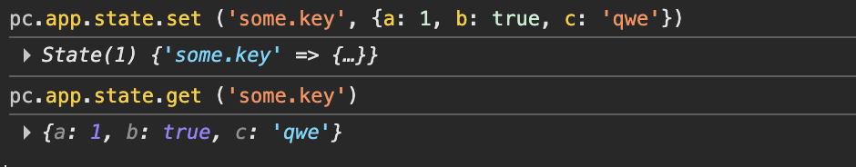
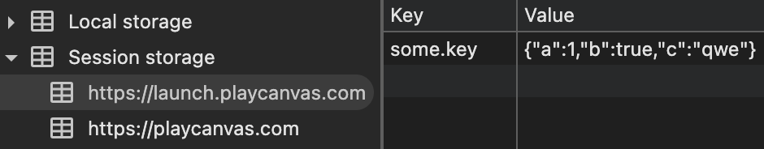
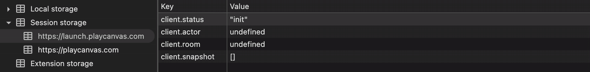
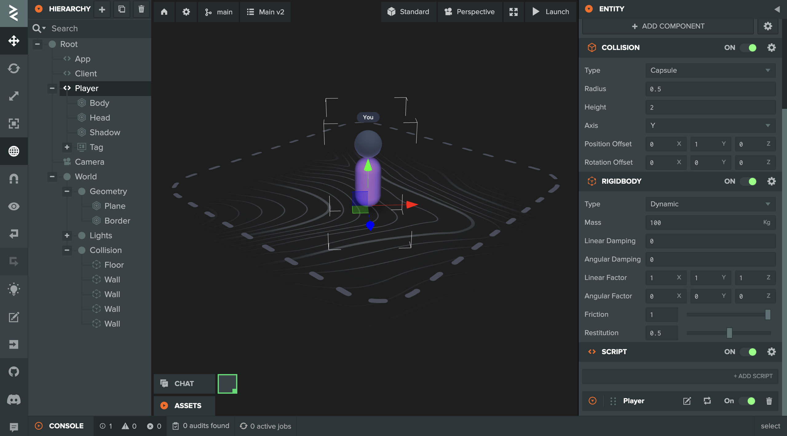
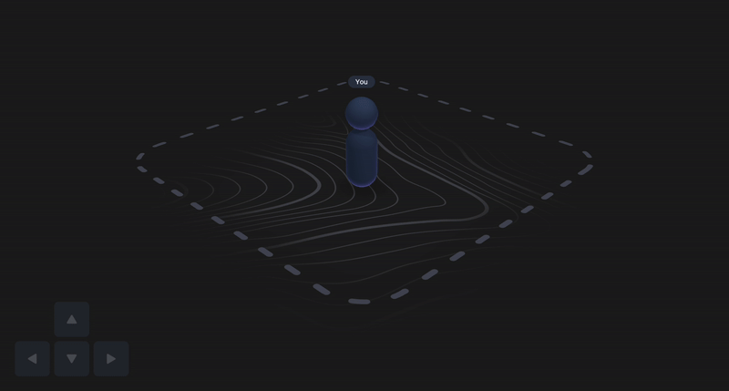
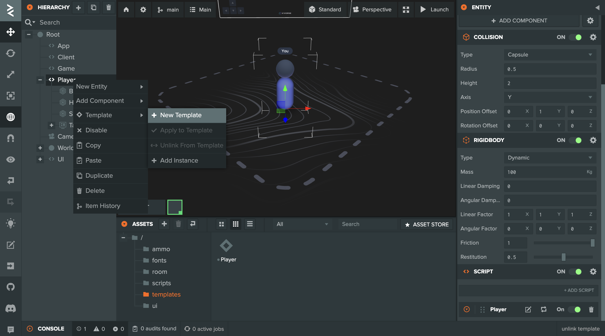
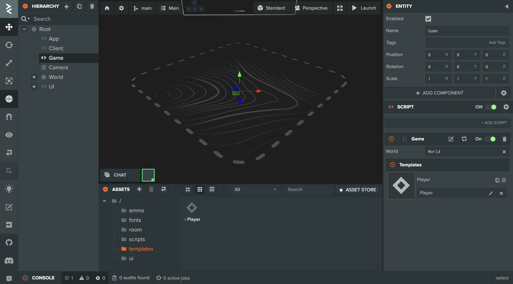
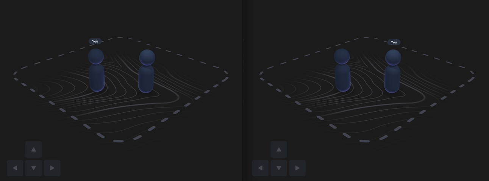

# PlayCanvas Networking example: Part 02 - Advanced

***

## About

Welcome to Part 02 of the VIVERSE Play SDK Networking tutorial for PlayCanvas! In this chapter we will cover multiple advanced topics:

* Explore the concept of Application State and Data Flow, and why they might be useful
* Refactor our Application and Networking Client to fit our new architecture
* Implement local Player driven by keyboard input and Ammo physics
* Implement remote Players and link their updates to messages from remote peers
* Test it all together in a minimal multiplayer example project

## Prerequisites

This tutorial assumes you've completed [Part 01](playcanvas-networking-example-part-01-basics.md) and already familiar with the basics of [VIVERSE Play SDK](../matchmaking-and-networking-sdk.md) / [Networking](../matchmaking-and-networking-sdk.md#multiplayer-apis) functionality. Please feel free to revisit those if you need a quick recap!

In the second part, we'll focus on adding more complexity to our application, incorporating architectural changes and exploring key multiplayer concepts like snapshots and local / remote entities. You can follow this tutorial by forking a dedicated [PlayCanvas Project](https://playcanvas.com/project/1400968/) with all the code and assets included.

## Step 1: Application State and Data Flow architecture&#x20;

In our previous [Matchmaking Tutorial](playcanvas-matchmaking-example-part-02-advanced.md#step-1-app-architecture-and-async-state-flow) we've introduced a concept of Application State — a single point in discreet space of all possible configurations that can meaningfully describe our application in any given moment. In this section, we will expand on that concept, giving our Application State an actual structured form, and binding it all together with [Data Flow architecture](https://en.wikipedia.org/wiki/Dataflow_programming):

*   For starters, let's assume we have Script A that has internal state which can be represented by a key / value Map of arbitrary values. For example it could be something like this:

    ```javascript
    {
        'some.id':    'qwe123',
        'status':     'loaded',
        'move_dir':    {x: 0, y: 1, z: 2},
    }
    ```
* Now let's say we have Script B which relies on some of those variables to modify its own state. For example, it might not display anything until Script A's `status` is `loaded` , or might use its `move_dir` to decide where to show hint UI

The scripts in that example form an [Execution Graph](https://en.wikipedia.org/wiki/Node_graph_architecture), which might look familiar to [Unreal Blueprints](https://dev.epicgames.com/documentation/en-us/unreal-engine/blueprints-visual-scripting-in-unreal-engine) or [Unity Visual Scripting](https://unity.com/features/unity-visual-scripting). The important difference is that Unreal's / Unity's nodes usually represent atomic operations, while nodes in our graph are complex scripts encapsulating significant parts of application's functionality - i.e. Networking, Input, Game, Player, UI, etc.

But in order for our Execution Graph to pass data from Script A to Script B and further down the line, we might want to introduce a global Store which would contain important state variables of all our scripts, available for setting and getting during execution pass (i.e. frame update):

<figure><figcaption></figcaption></figure>

Let's implement that as the main framework of our application:

* `app.mjs` : defines App class which would serve as an entry point of our app and create a new State instance. App is extending PlayCanvas Script class and should be attached to some entity in scene hierarchy
* `state.mjs` : defines State class which would be responsible for managing global state of our application. It's based on standard Map, but implements a simple shallow cloning mechanism where it's applicable, to mitigate possible issues when various scripts are mutating State objects after setting / getting them



```javascript
// @ts-nocheck
import { Script } from 'playcanvas';
import State from './state.mjs';


export class App extends Script
{
    static scriptName = 'App';

    initialize ()
    {
        this.app.state = new State ();
    }

    postUpdate (dt)
    {
        this.app.state.log ();
    }
}
```



```javascript
// @ts-nocheck
export default class State extends Map
{
    constructor (...args)
    {
        return super (...args);
    }

    set (key, value)
    {
        if (value === undefined || value === null)
            return super.set (key, value);
        else if (typeof value.clone === 'function')
            return super.set (key, value.clone ()); // Used for Vec2, Vec3, etc
        else if (value instanceof Map)
            return super.set (key, value); // Passing Maps as is, without cloning
        else if (Array.isArray (value))
            return super.set (key, [...value]); // Cloning arrays on write
        else if (value instanceof Object)
            return super.set (key, {...value}); // Cloning objects on write
        else
            return super.set (key, value);
    }

    get (key)
    {
        let value = super.get (key);

        if (value === undefined || value === null)
            return value;
        else if (typeof value.clone === 'function')
            return value.clone (); // Used for Vec2, Vec3, Entity, etc
        else if (value instanceof Map)
            return value; // Returning Maps as is, without cloning
        else if (Array.isArray (value))
            return [...value]; // Cloning arrays on read
        else if (value instanceof Object)
            return {...value}; // Cloning objects on read
        else
            return value;
    }
    
    // Simple solution for inspecting and debugging current app state
    // Writing all internal variables and their values into session storage
    // Chrome > Dev Tools > Application > Session Storage
    
    log ()
    {
        for (let [key, value] of this.entries ())
            if (value instanceof Map)
                window.sessionStorage.setItem (key, JSON.stringify ([...value.values ()]))
            else
                window.sessionStorage.setItem (key, JSON.stringify (value));
    }
}
```



That's an interesting start, but how does it work in practice? To see it in action, let's launch our project and open browser console:

*   Write some data to the global State:

    ```javascript
    pc.app.state.set ('some.key', {a: 1, b: true, c: 'qwe})
    ```
*   Now read that data:

    ```javascript
    pc.app.state.get ('some.key') // {a: 1, b: true, c: 'qwe}
    ```
* Open `Dev Tools` > `Application` > `Session Storage` and observe how Application State is updated in real time each time you write something here:

<div><figure><figcaption></figcaption></figure> <figure><figcaption></figcaption></figure></div>

Wonderful! With this architecture in place, we can now proceed with structuring our application around key functionality chunks — like Networking, Player and Game.

## Step 2: Networking implementation

First of all, let's borrow a `client.mjs` script that we created in [Part 01](playcanvas-networking-example-part-01-basics.md), and refactor it to fit our new architecture. The new Client will have four internal variables exposed to other scripts via our global application State:

* `status` — indicates current initialization progress and can be `init` -> `matchmaking` -> `room` -> `multiplayer` -> `ready`
* `actor` — data related to current user's Actor. Will be updated internally by Matchmaking client (no need to listen to special events for this)
* `room` — data related to current Room and the list of Actors in it. Also will be updated by Matchmaking client automatically
* `snapshot` — a Map collecting all relevant information about entities in the current Room, both local and remote. We'll expand on that a bit later



```javascript
// @ts-nocheck
import { Script, guid } from 'playcanvas';
const { viverse } = globalThis;


export class Client extends Script
{
    static scriptName = 'Client';

    initialize ()
    {
        this.appId = '5snkdrvvv8';
        this.play = new viverse.Play ();

        // We create `data` object to store internal variables
        // That we are going to expose via global State
        // We do that purely for stylistic reasons
        // You can just define them as `this._xyz` if you prefer

        this.data =
        {
            status: 'init',
            actor: null,
            room: null,
            snapshot: new Map ()
        };
    }

    postInitialize ()
    {
        // We populate State with our internal vars during postInitialize
        // So we could see them in Session Storage right away
        // It's optional but a good practice for consistency
    
        this.app.state.set ('client.status', this.data.status);
        this.app.state.set ('client.actor', this.data.actor);
        this.app.state.set ('client.room', this.data.room);
        this.app.state.set ('client.snapshot', this.data.snapshot);

        this.initClient ();
    }

    async initClient ()
    {
        this.data.status = 'matchmaking';
        await this.initMatchmaking ();

        this.data.status = 'room';
        await this.createJoinRoom ();

        this.data.status = 'multiplayer';
        await this.initMultiplayer ();

        this.multiplayer.general.onMessage (this.handleMessageIn.bind (this));
        this.app.on ('client:send', this.handleMessageOut, this);

        this.data.status = 'ready';
    }

    //------------------------------------------------------------------------//
    //                                Handlers                                //
    //------------------------------------------------------------------------//
    
    handleMessageIn (data)
    {
        // All incoming messages are expected to have `id` field
        // Which is id of an entity that this update should correspond to
    
        if (data.id)
            this.data.snapshot.set (data.id, data);
    }

    handleMessageOut (data)
    {
        // All outgoing messages are expected to have `id` field
        // Which is id of an entity that this update corresponds to
    
        if (data.id)
        {
            this.multiplayer.general.sendMessage (data);
            this.data.snapshot.set (data.id, data);
        }
    }

    //------------------------------------------------------------------------//
    //                                 Update                                 //
    //------------------------------------------------------------------------//
    
    update (dt)
    {
        this.data.actor = this.matchmaking?.getCurrentActor ();
        this.data.room = this.matchmaking?.getCurrentRoom ();

        // Deletes all snapshot entries that correspond to disconnected users
        // Not important for now, we'll expand on that later in this tutorial

        let ids = this.data.room?.actors.map (actor => actor.session_id) || [];
        for (let [key, data] of this.data.snapshot.entries ())
            if (!ids.includes (data.owner))
                this.data.snapshot.delete (key);

        // At the end of each Client's update
        // We copy its internal variables to the global State
        // So that other scripts can use them inside their updates
        
        this.app.state.set ('client.status', this.data.status);
        this.app.state.set ('client.actor', this.data.actor);
        this.app.state.set ('client.room', this.data.room);
        this.app.state.set ('client.snapshot', this.data.snapshot);
    }

    //------------------------------------------------------------------------//
    //                                 Utils                                  //
    //------------------------------------------------------------------------//
    
    async initMatchmaking ()
    {
        this.matchmaking = await this.play.newMatchmakingClient (this.appId);
        return new Promise (resolve => this.matchmaking.on ('onConnect', resolve));
    }

    async createJoinRoom () an inter
    {
        await this.matchmaking.setActor
        ({
            name: '',    // we don't need usernames for this tutorial
            session_id: guid.create (),
            properties: {}
        });

        let {rooms} = await this.matchmaking.getAvailableRooms ();
        let {room} = rooms && rooms[0] ?
            await this.matchmaking.joinRoom (rooms[0].id) :
            await this.matchmaking.createRoom ({name: 'Room', mode: 'test', maxPlayers: 1000});
    }

    async initMultiplayer ()
    {
        let room = this.matchmaking.getCurrentRoom ();
        this.multiplayer = await this.play.newMultiplayerClient (room.id, this.appId);
        await this.multiplayer.init ();
        return new Promise (resolve => this.multiplayer.onConnected (resolve));
    }
}
```



Let's see what's happening inside our new refactored Client:

* We still have original initialization routine borrowed from the previous version, but now it's updating `status` each time the Client reaches certain initialization stage
* At the same time, we're now extending it from PlayCanvas Script class, so we can rely on built-in `update ()` method to write all necessary internal variables to our global State, where they will be processed by other scripts down the line (which we introduce later in this tutorial)
* And finally, we're setting up handlers for incoming and outgoing messages, tightly integrating them with `snapshot` updates:
  * Each time a new message arrives from remote peer — its data is merged into corresponding `snapshot` entry under `data.id` key. If no entry exists — it's created first&#x20;
  * Each time some local entity broadcasts a message to remote peers via our Client — the message's `data` is also merged into corresponding entry as well
  * This way the `snapshot` map always stores the latest data about all multiplayer entities in the current Room — to its best ability

Once we have both `app.mjs` and `client.mjs` parsed and attached to some entities in scene hierarchy, we can proceed to testing!

Let's open a new tab, navigate to Session Storage inspector as described in the previous step, and enter our project's launch URL. If you did everything correctly — you should see Client's state changing in real time as it passes through different initialization stages:

<figure><figcaption></figcaption></figure>

Great progress so far! In the next steps we will start populating our scene with entities, so our Client has something to work with.

## Step 3: Local Player and Input handling

We have Networking sorted out, but our world is still empty. To bring it to life, we should create a simple Scene first and populate it with Player entity that we can control with WASD keys:

* Since we're going to use physics for player movement and collision — we need to import [Ammo](https://developer.playcanvas.com/user-manual/editor/interface/settings/physics/) library into our project first
* Once Ammo is set up — we can proceed with adding basic geometry and [static colliders](https://developer.playcanvas.com/tutorials/collision-and-triggers/) into our world. For the purpose of this tutorial we would need just a horizontal Floor and a few Walls so that our Player doesn't fall over the edge
* And finally we can add a Player entity with its own script, and [Collision](https://developer.playcanvas.com/user-manual/scenes/components/collision/) and [Rigidbody](https://developer.playcanvas.com/user-manual/scenes/components/rigidbody/) components as illustrated below:

<figure><figcaption></figcaption></figure>

And here is what our first iteration of `player.mjs` script could look like:



```javascript
// @ts-nocheck
import { Script, Vec2, Vec3 } from 'playcanvas';
import { KEY_UP, KEY_DOWN, KEY_LEFT, KEY_RIGHT} from 'playcanvas';
import { KEY_W, KEY_S, KEY_A, KEY_D } from 'playcanvas';


export default class Player extends Script
{
    static scriptName = 'Player';

    initialize () {}

    //------------------------------------------------------------------------//
    //                                 Update                                 //
    //------------------------------------------------------------------------//
    
    update (dt)
    {
        let inputdir = this.processInput ();
        let movedir = new Vec3 (inputdir.x, 0, -inputdir.y);
        let mass = this.entity.rigidbody.mass;
        let force = movedir.clone ().mulScalar (20 * mass);
        
        this.entity.rigidbody.applyForce (force.x, force.y, force.z);
    }

    //------------------------------------------------------------------------//
    //                                 Utils                                  //
    //------------------------------------------------------------------------//
    
    processInput ()
    {
        let dir = new Vec2 ();

        if (this.app.keyboard.isPressed (KEY_W) || this.app.keyboard.isPressed (KEY_UP))
            dir.y += 1;
        if (this.app.keyboard.isPressed (KEY_S) || this.app.keyboard.isPressed (KEY_DOWN))
            dir.y -= 1;
        if (this.app.keyboard.isPressed (KEY_A) || this.app.keyboard.isPressed (KEY_LEFT))
            dir.x -= 1;
        if (this.app.keyboard.isPressed (KEY_D) || this.app.keyboard.isPressed (KEY_RIGHT))
            dir.x += 1;

        return dir.normalize ();
    }
}
```



This initial implementation is pretty simple:

* With each update, we are using PlayCanvas [Keyboard](https://api.playcanvas.com/engine/classes/Keyboard.html) utility to check for pressed keys, and construct a 2D vector for our desired movement direction
* Then we apply force in that direction, and let Ammo physics do the rest

With a strong force and high enough friction the player movement turns out to be quite fun — let' take a look!

<figure><figcaption></figcaption></figure>

## Step 4: Remote Players and Multiplayer testing

Alright, we have Networking Client ready and local Player implemented, but there are still no remote Players in our world. To make our project truly multiplayer, we need to introduce a few more modifications:

* `game.mjs` : this will be crucial part of our application, serving as a [Factory](https://www.patterns.dev/vanilla/factory-pattern/) and Container for our Entities — both local and remote ones:
  * With each Client's `snapshot` update our Game will go through its child Entities, and create new ones / destroy existing ones if there is any mismatch between a current list of Snapshot entries and Game's list of children. The instantiation is done via [Templates (Prefabs)](https://developer.playcanvas.com/tutorials/importing-first-model-and-animation/#adding-the-model-template-to-the-scene) — we will discuss them a bit later
  * Also, the Game is responsible for instantiating a local Player if it can't be found in Snapshot as well (which would happen exactly once by design)
  *   For the purpose of this tutorial our Game is designed to handle only Player entities — whose Snapshot entries could be defined like this:

      ```javascript
      {
          id: string,      // unique entity ID
          type: 'player',
          owner: string,   // reference to Actor (i.e. User) controlling this entity
          position: [x, y, z],
          velocity: [x, y, z]
      }
      ```
* `player.mjs` : a refactored version of our original Player which now supports both local and remote variations:
  * Local Player updates its position and velocity based on keyboard input and physics, as we implemented it in the previous step. It also fires a `client:send` event to write its current position / velocity into Snapshot entry and broadcast this recent update to all remote peers
  * Remote Players update their positions and velocities based on corresponding Snapshot entries, which in turn are regularly updated by our Networking Client (based on messages coming from corresponding remote peers)



```javascript
// @ts-nocheck
import { Script, Asset, guid } from 'playcanvas';


/** @interface */ class Templates
{
    /** @title Player @type {Asset} @resource template */ player;
}

export class Game extends Script
{
    static scriptName = 'Game';

    /** @attribute @title Templates @type {Templates} */ templates;

    initialize () {}

    //------------------------------------------------------------------------//
    //                                 Update                                 //
    //------------------------------------------------------------------------//
    
    update (dt)
    {
        let status = this.app.state.get ('client.status');
        let actor = this.app.state.get ('client.actor');
        let snapshot = this.app.state.get ('client.snapshot');

        // Game shouldn't do anything until our Client is ready
        
        if (status !== 'ready')
            return;

        // Create new Entity
        // If updated snapshot features new entry
        
        for (let [key, data] of snapshot.entries ())
            if (!this.entity.findByName (key))
                this.createEntity (data);
        
        // Destroy existing Entity
        // If updated snapshot no longer has corresponding entry
        // (i.e. it was deleted by Client when associated user disconnected)

        for (let entity of this.entity.children)
            if (!snapshot.get (entity.name))
                this.destroyEntity (entity);

        // We've created convenience method to find Snapshot entries by params
        // Here we are looking for local Player entry in the Snapshot
        // The Player is considered local if its owner is our current Actor
        // If it's not instantiated yet -- the Game should create it first
        // Then it becomes our Local Player controllable by WASD keys

        let player = this.find (snapshot, {owner: actor.session_id, type: 'player'})[0];
        if (!player)
        {
            let data =
            {
                id: guid.create (),
                type: 'player',
                owner: actor.session_id,
                position: [-5 + 10 * Math.random (), 0, 0], // randomized respawn
                velocity: [0, 0, 0]
            };

            this.createEntity (data);
            this.app.fire ('client:send', data);
        } 
    }

    //------------------------------------------------------------------------//
    //                                 Utils                                  //
    //------------------------------------------------------------------------//
    
    createEntity (data)
    {
        switch (data.type)
        {
            case 'player':
                // All entities are instantiated from corresponding Templates
                let player = this.templates.player.resource.instantiate ();
                
                // Entity's name should match its unique id in Snapshot entry
                // This way its easy to find Entities for entires and vice versa
                player.name = data.id;
                 
                // Convenient way to pass custom data to our Entity after creation
                player.script?.get ('Player')?.setup (data);
                
                // Finally don't forget to add new Entity to Game's children
                this.entity.addChild (player);
                break;
        }
    }

    destroyEntity (entity)
    {
        entity.destroy ();
    }

    find (snapshot, params)
    {
        let result = [];
        for (let entry of snapshot.values ())
            if (Object.entries (params).every (([key, value]) => entry[key] === value))
                result.push (entry);

        return result;
    }
}
```



```javascript
// @ts-nocheck
import { Script, Vec2, Vec3 } from 'playcanvas';
import { KEY_UP, KEY_DOWN, KEY_LEFT, KEY_RIGHT} from 'playcanvas';
import { KEY_W, KEY_S, KEY_A, KEY_D } from 'playcanvas';


export default class Player extends Script
{
    static scriptName = 'Player';

    initialize () {}

    // Our Player is instantiated from Template by Game factory
    // So this custom method is used to pass custom data after instantiation
    // I.e. entity.script.get ('Player').setup (data)
    
    setup (data)
    {
        this.entity.rigidbody.teleport (...data.position);
        this.entity.rigidbody.linearVelocity = new Vec3 (...data.velocity);
    }

    //------------------------------------------------------------------------//
    //                                 Update                                 //
    //------------------------------------------------------------------------//
    
    update (dt)
    {
        let actor = this.app.state.get ('client.actor');
        let snapshot = this.app.state.get ('client.snapshot');
        
        // Player finds its own Snapshot entry to proceed with self-updating
        let data = snapshot.get (this.entity.name);
        if (!data)
            return;

        // The Player is considered local if its owner is our current Actor
        if (data.owner === actor.session_id)
            this.updateLocal (data);
        else
            this.updateRemote (data);
    }

    updateLocal (data)
    {
        let inputdir = this.processInput ();
        let movedir = new Vec3 (inputdir.x, 0, -inputdir.y);
        let mass = this.entity.rigidbody.mass;
        let force = movedir.clone ().mulScalar (20 * mass);
        this.entity.rigidbody.applyForce (force.x, force.y, force.z);

        this.app.fire ('client:send',
        {
            ...data,
            position: this.entity.getPosition ().toArray (),
            velocity: this.entity.rigidbody.linearVelocity.toArray ()
        });
    }

    updateRemote (data)
    {
        this.entity.rigidbody.teleport (...data.position);
        this.entity.rigidbody.linearVelocity = new Vec3 (...data.velocity);
    }

    //------------------------------------------------------------------------//
    //                                 Utils                                  //
    //------------------------------------------------------------------------//
    
    processInput ()
    {
        let dir = new Vec2 ();

        if (this.app.keyboard.isPressed (KEY_W) || this.app.keyboard.isPressed (KEY_UP))
            dir.y += 1;
        if (this.app.keyboard.isPressed (KEY_S) || this.app.keyboard.isPressed (KEY_DOWN))
            dir.y -= 1;
        if (this.app.keyboard.isPressed (KEY_A) || this.app.keyboard.isPressed (KEY_LEFT))
            dir.x -= 1;
        if (this.app.keyboard.isPressed (KEY_D) || this.app.keyboard.isPressed (KEY_RIGHT))
            dir.x += 1;

        return dir.normalize ();
    }
}
```



Before we proceed to testing, let's prepare our Player's [Template](https://developer.playcanvas.com/tutorials/importing-first-model-and-animation/#adding-the-model-template-to-the-scene), so our Game could instantiate it for each peer currently connected to the room:

* Right click on Player entity > `Template` > `New Template`
* Drag created Template to our Game's `Templates / Player` attribute
* You can delete existing Player entity from the scene now — we won't need it

<div><figure><figcaption></figcaption></figure> <figure><figcaption></figcaption></figure></div>

And that's it! Now we can launch our project in two separate tabs, place them side by side, and finally see our multiplayer game in action!

<figure><figcaption></figcaption></figure>

## Wrapping up

And just like that, we're finally reaching the grand finale of this tutorial! Let's summarize what we've learned so far:

* We've structured our Application around shared State and Data Flow architecture
* We've refactored our Networking Client to calculate snapshot each update, and expose its internal variables via global State to other scripts
* We have created Player Entity that can be used both for local and remote instances, along with Game serving as a Factory and Container
* And finally, we've tied it all together into minimal multiplayer example

Congratulations with finishing such a long read! Please feel free to fork our dedicated [PlayCanvas Project](https://playcanvas.com/project/1400968/) or [test it live](https://app.gitbook.com/u/NfjV1SHjz6ZcIbnXVUey1X416C33).
