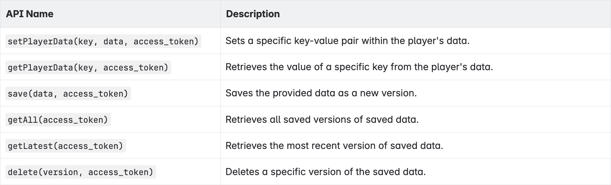
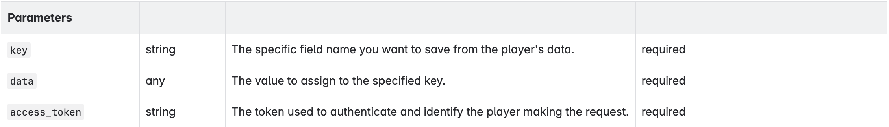
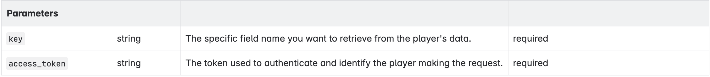
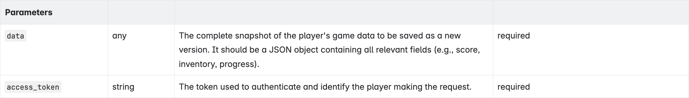
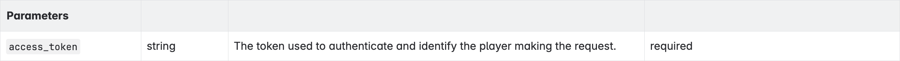
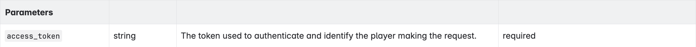
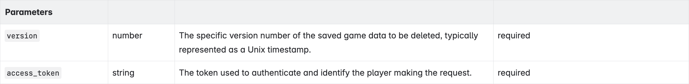

# Storage SDK

***

> **BEFORE GETTING STARTED:** you must [authenticate with VIVERSE](login-and-authentication-for-the-sdk/), including App ID creation in VIVERSE Studio, before requesting Play SDK services.

## Initialize the \`storageClient\` instance

Before using any Storage SDK features, you must initialize the client instance. This global reference ensures that the Storage SDK is available throughout your application.

```
globalThis.storageClient = new globalThis.viverse.storage();
```

## Cloud Save API

The cloudsave API must then be initialized individually.

```
globalThis.cloudSaveClient = await storageClient.newCloudSaveClient(appId);
```

<figure><figcaption></figcaption></figure>

### Set Player Data

Call setPlayerData() with a specific key-value pair within the player's data.

<figure><figcaption></figcaption></figure>

Example code:

```
const keyA = 'coins';
const dataA = 100;
cloudSaveClient.setPlayerData(keyA, dataA, access_token);

const keyB = 'data';
const dataB = { "level": 10, "stages": { "1": { "score": 20 } } };
cloudSaveClient.setPlayerData(keyB, dataB, access_token);

// Possible return values:
// {
//    "success": true
// }
//     or
// {
//     "success": false,
//     "message": "error message"
// }
```

### Get Player Data

Retrieves the value of a specific key from the player's data.

<figure><figcaption></figcaption></figure>

Example code:

```
const key = 'coins';
cloudSaveClient.getPlayerData(key, access_token).then((res) => {
  console.log(res)
})

// Possible return values:
// 100
```

```
const key = 'data';
cloudSaveClient.getPlayerData(key, access_token).then((res) => {
  console.log(${JSON.stringify(res)})
})

// Possible return values:
// {
//     "level": 10,
//     "stages": {
//         "1": {
//             "score": 20
//         }
//     }
// }
```

```
const key = 'new';
cloudSaveClient.getPlayerData(key, access_token).then((res) => {
  console.log(res)
})

// Possible return values:
// null
```

### Save

Saves the provided data as a new version.

<figure><figcaption></figcaption></figure>

Example code:

```
const dataB = { "level": 10, "stages": { "1": { "score": 20 } } };
cloudSaveClient.save(data, access_token);

// Possible return values:
// {
//     "success": true
// }
// {
//     "success": false,
//     "error": "error message"
// }
```

### Get All

Retrieves all saved versions of saved data.

<figure><figcaption></figcaption></figure>

Example code:

```
cloudSaveClient.getAll(access_token);

// Possible return values:
// [
//     {
//         "user_id": "4d0e91a3-f279-4616-b720-50fdab315bf4",
//         "app_id": "app_id",
//         "data": {
//             "level": 10,
//             "stages": {
//                 "1": {
//                     "score": 20
//                 }
//             }
//         },
//         "version": 1752564108,
//         "created_at": "2025-07-15T07:21:48.312Z"
//     }
// ]
```

### Get Latest

Retrieves the most recent version of saved data.

<figure><figcaption></figcaption></figure>

Example code:

```
cloudSaveClient.getLatest(access_token);

// Possible return values:
// {
//     "user_id": "4d0e91a3-f279-4616-b720-50fdab315bf4",
//     "app_id": "app_id",
//     "data": {
//         "level": 10,
//         "stages": {
//             "1": {
//                 "score": 20
//             }
//         }
//     },
//     "version": 1752564108,
//     "created_at": "2025-07-15T07:21:48.312Z"
// }
```

### Delete

Deletes a specific version of the saved data.

<figure><figcaption></figcaption></figure>

Example code:

```
const version = 1752564108;
cloudSaveClient.delete(version, access_token);

// Possible return values:
// {
//   "message":"App data deleted successfully"
// }
// {
//   "error":"Invalid version"
// }
```
